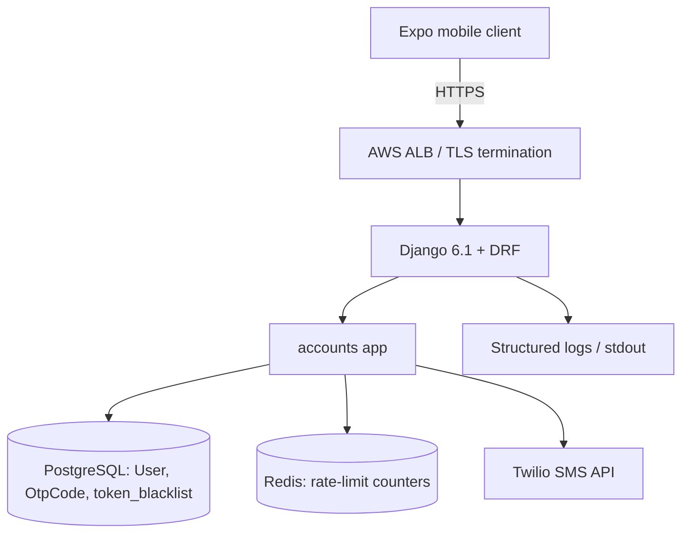

# Architecture: OTP-Based Phone Authentication (Backend)

**ID:** ARCH-001
**Type:** architecture
**Feature:** FEAT-001
**Version:** 1
**Status:** ready
**Date:** 2026-09-12

---

## Context

The Spot Rides backend (`backend/` — Django 6.1 + DRF, PostgreSQL, `python-decouple`) currently exposes a single unauthenticated endpoint (`GET /api/health/` in `backend/config/urls.py`) and has no user model tailored to the product. FEAT-001 introduces the first authentication layer: a passwordless phone-number + Twilio-SMS OTP flow that issues `djangorestframework-simplejwt` (SimpleJWT) access/refresh token pairs and creates a custom `User` model keyed on the E.164 phone number.

Approved resolutions for the previously open questions:

- **OQ-02** Redis is available in production; rate limiting is Redis-backed.
- **OQ-03** SimpleJWT refresh rotation + blacklist are enabled on day one.
- **OQ-04** SMS destinations are restricted to India (`+91`) at launch, configurable via `OTP_COUNTRY_ALLOWLIST=IN`.
- **OQ-07** AWS-style managed hosting; HTTPS terminated at the load balancer; secrets via env or AWS Secrets Manager.
- **OQ-09** Low launch load (<20 rps p95) — right-size accordingly, do not preclude scaling later.

## Current State

- `backend/config/settings.py` uses `python-decouple` (`config(...)`, `Csv`), DRF is installed with `AllowAny` default permissions, Postgres is the sole datastore, and no `AUTH_USER_MODEL` is set (Django defaults to `auth.User`).
- `backend/config/urls.py` wires only `admin/` and `api/health/`.
- `backend/requirements.txt` contains: Django 6.1, DRF 3.18, corsheaders 4.9, psycopg2-binary 2.9.12, python-decouple 3.8. No SimpleJWT / Twilio / Redis dependencies yet.
- `backend/.env.example` documents only DB + Django basics.
- No custom apps exist under `backend/` (only the `config/` project package and a `.gitkeep`), so introducing an `AUTH_USER_MODEL` now is safe — no prior migrations depend on `auth.User`.

## Proposed Solution

Introduce a single new Django app **`accounts`** (created via `python manage.py startapp accounts` inside `backend/`) that owns:

1. A custom `User` model extending `AbstractBaseUser` + `PermissionsMixin`, using `phone_number` (E.164, unique, indexed) as `USERNAME_FIELD`. Password is stored `set_unusable_password()`. `AUTH_USER_MODEL = "accounts.User"` is set before initial migration.
2. An `OtpCode` model persisted in Postgres storing a **hashed** OTP (HMAC-SHA256 with server-side pepper), TTL, attempts counter, consumed/invalidated flags, request IP, and request id. Persistence lives in Postgres (not Redis) because FEAT-001's audit/observability requirements (FR-16, NFR-OBS-01, NFR-PRIV-02) demand durable, queryable records; Redis is used only for rate-limit counters.
3. A `services/otp.py` module encapsulating OTP generation (`secrets.randbelow(10**6)`), hashing, verification (constant-time via `hmac.compare_digest`), lifecycle transitions, and dev-mode override.
4. A `services/twilio_client.py` thin wrapper around the Twilio Python SDK — synchronous send (single call, ~500 ms typical; acceptable at <20 rps and honours NFR-PERF-01's 2000 ms p95). Twilio call is issued **inside a Postgres transaction** wrapping the `OtpCode.create()`; if the SDK raises, the transaction rolls back so no OTP row is persisted (satisfies FR-15 / AC-11). Rate-limit counters are decremented on Twilio failure using a compensating Redis `DECR`.
5. A `services/rate_limit.py` Redis token-bucket / fixed-window limiter using `django-redis` and atomic `INCR` + `EXPIRE` on well-known keys. Custom limiter (not DRF's built-in throttle classes) because we need three composed windows per phone (30s / 1h / 24h) plus per-IP verify limits, which DRF's default throttling does not express cleanly.
6. A `serializers.py` layer performing E.164 normalization (via `phonenumbers`) and country allowlist enforcement at validation time.
7. `views.py` (function-based DRF views or thin `APIView` subclasses) for `/api/auth/otp/request/`, `/api/auth/otp/verify/`, `/api/auth/logout/`, `/api/auth/me/`. Refresh is delegated to SimpleJWT's built-in `TokenRefreshView` mounted at `/api/auth/token/refresh/`.
8. A management command `purge_expired_otps` (invoked hourly by an OS-level cron / EventBridge / Celery-beat if introduced later) implementing NFR-PRIV-02.
9. Settings additions: SimpleJWT config, DRF `DEFAULT_AUTHENTICATION_CLASSES` set to `JWTAuthentication`, Redis via `CACHES`, Twilio + OTP + country env keys via `decouple.config`.
10. URL wiring: `path("api/auth/", include("accounts.urls"))` in `backend/config/urls.py`.

The design keeps a single new app, uses stock Django + DRF patterns, adds no new infrastructure beyond Twilio + Redis (both already available), and preserves existing conventions (`decouple.config`, `/api/` prefix, PostgreSQL).

## Diagram



## Module Layout

```
backend/
  config/
    settings.py          # modified (see Settings Changes)
    urls.py              # modified: include('accounts.urls') under api/auth/
  accounts/              # NEW app
    __init__.py
    apps.py
    admin.py             # register User (staff-restricted), OtpCode read-only
    models.py            # User, UserManager, OtpCode
    managers.py          # PhoneUserManager (create_user / create_superuser)
    serializers.py       # OtpRequestSerializer, OtpVerifySerializer, LogoutSerializer, UserSerializer
    views.py             # OtpRequestView, OtpVerifyView, LogoutView, MeView
    urls.py              # /otp/request/, /otp/verify/, /token/refresh/, /logout/, /me/
    services/
      __init__.py
      otp.py             # generate, hash, verify, invalidate, dev-mode
      twilio_client.py   # send_sms(phone, body); raises SmsDispatchError
      rate_limit.py      # RedisRateLimiter with per-phone + per-IP buckets
      phone.py           # normalize_to_e164(raw, default_region), country_allowed(e164)
    throttles.py         # (thin adapter if we ever expose to DRF throttling)
    exceptions.py        # AuthDomainError, SmsDispatchError, RateLimited, OtpExpired, OtpInvalidated
    logging.py           # mask_phone(), hash_phone_for_logs()
    management/
      commands/
        purge_expired_otps.py
    migrations/
      0001_initial.py    # User + OtpCode
```

## Components

| ID | Name | Responsibility | Changes |
|----|------|---------------|---------|
| COMP-001 | `accounts` Django app | Owns the auth domain: User model, OTP lifecycle, endpoints, admin. | New |
| COMP-002 | `accounts.models.User` | Custom AbstractBaseUser; `USERNAME_FIELD = phone_number`; unique E.164 identifier. | New |
| COMP-003 | `accounts.models.OtpCode` | Persistent record of issued OTPs: hash, TTL, attempts, consumed/invalidated, request metadata. | New |
| COMP-004 | `accounts.services.otp` | OTP generation (CSPRNG), HMAC-SHA256 hashing with pepper, constant-time verify, resend / invalidation rules, dev-mode override. | New |
| COMP-005 | `accounts.services.twilio_client` | Thin wrapper around Twilio Python SDK; synchronous `send_sms`; timeouts + error mapping. | New |
| COMP-006 | `accounts.services.rate_limit` | Redis-backed limiter (INCR + EXPIRE) with per-phone and per-IP windows. | New |
| COMP-007 | `accounts.services.phone` | `phonenumbers`-based E.164 normalization + country allowlist check. | New |
| COMP-008 | `accounts.views` | DRF views for request / verify / logout / me. | New |
| COMP-009 | SimpleJWT `TokenRefreshView` | Standard refresh endpoint (with rotation + blacklist). | Reused (library) |
| COMP-010 | SimpleJWT `token_blacklist` app | Refresh-token blacklist storage + migrations. | New (dependency) |
| COMP-011 | `backend/config/settings.py` | Wire INSTALLED_APPS, DRF auth, SIMPLE_JWT, CACHES (Redis), env keys, AUTH_USER_MODEL. | Modified |
| COMP-012 | `backend/config/urls.py` | Include `accounts.urls` under `/api/auth/`. | Modified |
| COMP-013 | `purge_expired_otps` management command | Periodic purge of consumed/expired OTPs (NFR-PRIV-02). | New |

## Data Model

### `accounts_user`

Custom user, primary identifier is phone number (E.164). No password.

| Column | Type | Constraints |
|--------|------|-------------|
| id | BigAutoField (PK) | |
| phone_number | VARCHAR(16) | UNIQUE, NOT NULL, indexed (implicit via unique) |
| is_active | BOOLEAN | default true |
| is_staff | BOOLEAN | default false |
| is_superuser | BOOLEAN | default false |
| date_joined | TIMESTAMPTZ | default now() |
| last_login | TIMESTAMPTZ NULL | set by SimpleJWT / auth backend on successful verify |
| password | VARCHAR(128) | unusable placeholder (`set_unusable_password()`) |

Manager: `PhoneUserManager` implementing `create_user(phone_number, **extra)` and `create_superuser(phone_number, password=None, **extra)` (superuser retains a real password for admin login).

`USERNAME_FIELD = "phone_number"`, `REQUIRED_FIELDS = []`.

### `accounts_otpcode`

Persistent OTP record; **plaintext code is never stored**.

| Column | Type | Constraints |
|--------|------|-------------|
| id | BigAutoField (PK) | |
| phone_number | VARCHAR(16) | indexed |
| code_hash | VARCHAR(64) | HMAC-SHA256 hex digest of the 6-digit code + pepper |
| created_at | TIMESTAMPTZ | default now(), indexed |
| expires_at | TIMESTAMPTZ | NOT NULL |
| consumed_at | TIMESTAMPTZ NULL | set on successful verify |
| attempts | SMALLINT | default 0, max 5 |
| invalidated | BOOLEAN | default false; true after 5 failed attempts, superseded issuance, or logout of the issuing session |
| request_ip | INET NULL | captured for abuse analytics (OQ-10 default: yes, retained 24h with OTP row) |
| request_id | VARCHAR(40) | correlation id for logs |

Indexes:

- `idx_otpcode_phone_active` on `(phone_number, invalidated, consumed_at)` — supports "find latest active OTP for phone".
- `idx_otpcode_expires_at` on `expires_at` — supports purge command.

Partial-unique invariant (enforced at write time via `select_for_update` + `invalidate_prior_active_for_phone()` inside the request transaction, per FR-10 and the "Concurrent OTP requests" edge case): at most one row per `phone_number` with `invalidated=false AND consumed_at IS NULL AND expires_at > now()`.

### `token_blacklist_*` (from `rest_framework_simplejwt.token_blacklist`)

Provided by SimpleJWT migrations; no customization.

### Rate-limit storage — Redis

Not in Postgres. See Rate Limiting section for the key schema.

### Justification: Postgres for OTPs, Redis for rate limits

OTP records must be durable and queryable for audit (FR-16, NFR-OBS-01, NFR-PRIV-02). Rate-limit counters are ephemeral, high-write, TTL-bound, and per-key atomic — a natural fit for Redis `INCR`/`EXPIRE`. Mixing the two ensures we do not lose audit rows to a Redis flush and we do not burden Postgres with the hot counter path.

## API Contracts

All paths under `/api/auth/`. `Content-Type: application/json`. Error responses share the shape `{"error": "<code>", "detail": "<human message>", "retry_after": <int seconds, optional>}`.

| Method | Path | Purpose | Auth |
|--------|------|---------|------|
| POST | /api/auth/otp/request/ | Issue a new OTP to a phone number. | Public |
| POST | /api/auth/otp/verify/ | Verify OTP; return JWT pair; upsert user. | Public |
| POST | /api/auth/token/refresh/ | Exchange refresh for new access (rotates refresh). | Refresh token |
| POST | /api/auth/logout/ | Blacklist a refresh token. | Refresh token in body |
| GET  | /api/auth/me/ | Return current user's minimal profile. | Bearer access |

### POST /api/auth/otp/request/

Request:
```json
{ "phone_number": "+919812345678" }
```

`200 OK`:
```json
{ "detail": "otp_sent", "expires_in": 300, "resend_available_in": 30 }
```

Errors:
- `400 invalid_phone_number` — parse or E.164 failure.
- `400 country_not_allowed` — E.164 country code not in `OTP_COUNTRY_ALLOWLIST` (default: `IN`).
- `429 rate_limited` — per-phone or per-IP window exceeded; response includes `retry_after`.
- `502 sms_dispatch_failed` — Twilio raised; no OTP row persisted, rate-limit counter compensated.
- `503 auth_unavailable` — Twilio creds or Redis missing on boot (AC-15).

### POST /api/auth/otp/verify/

Request:
```json
{ "phone_number": "+919812345678", "code": "123456" }
```

`200 OK`:
```json
{
  "access": "<jwt>",
  "refresh": "<jwt>",
  "is_new_user": true,
  "user": { "id": 42, "phone_number": "+919812345678" }
}
```

Errors:
- `400 no_active_otp` — no active OTP for this phone.
- `400 code_expired` — OTP present but past `expires_at`.
- `400 invalid_code` — wrong code, attempts incremented.
- `429 too_many_attempts` — attempts >= 5, OTP invalidated; client must request a new one.
- `429 rate_limited` — per-IP verify window exceeded.

### POST /api/auth/token/refresh/

Standard SimpleJWT contract. Body: `{"refresh": "<jwt>"}`. Response: `{"access": "<jwt>", "refresh": "<jwt-rotated>"}`. Reuse of a rotated refresh returns `401`.

### POST /api/auth/logout/

Body: `{"refresh": "<jwt>"}`. Success: `205 Reset Content`. Adds the token to `token_blacklist`. Errors: `400 invalid_refresh` if malformed / already blacklisted.

### GET /api/auth/me/

Header: `Authorization: Bearer <access>`. `200 OK`:
```json
{ "id": 42, "phone_number": "+919812345678", "date_joined": "2026-09-12T10:00:00Z" }
```
`401 not_authenticated` if header missing / invalid.

## OTP Lifecycle

1. **Generation.** `secrets.randbelow(10**6)`, zero-padded to 6 digits. Never logged.
2. **Hashing.** `hmac.new(pepper, code.encode(), sha256).hexdigest()` where `pepper = decouple.config("OTP_PEPPER").encode()`. Pepper is a server-side secret distinct from `SECRET_KEY`.
3. **Storage.** Only `code_hash` is written to `accounts_otpcode`. `expires_at = created_at + 5 min`.
4. **Supersession.** On new request for a phone, prior active OTPs are marked `invalidated=true` in the same transaction via `select_for_update` (FR-10, race-safe).
5. **Verification.** Load latest active OTP for phone (`invalidated=false AND consumed_at IS NULL AND expires_at > now()`). If none: `no_active_otp`. If expired: `code_expired` (row remains for audit; not consumed). Constant-time compare `hmac.compare_digest(stored_hash, hash(submitted))`.
   - On success: set `consumed_at`, upsert user (get_or_create on `phone_number`), issue JWT pair.
   - On failure: `attempts += 1`. If `attempts >= 5`: `invalidated = true`, return `too_many_attempts`; otherwise `invalid_code`.
6. **Resend cooldown.** 30 s per-phone bucket in Redis. Successful `otp/request/` sets a 30 s key that blocks the next request; response includes `resend_available_in=30`.
7. **Dev-mode override.** If `DEBUG=True AND OTP_DEV_MODE=True AND code == OTP_DEV_FIXED_CODE`: skip Twilio dispatch on request; accept the fixed code on verify (still respects attempt counter, still requires a prior request). No effect if `DEBUG=False` (hard-coded guard in `services.otp`).

## Rate Limiting Design

Library: `django-redis` (backend for Django `CACHES`) with direct low-level client access via `django_redis.get_redis_connection("default")` from `services/rate_limit.py`. DRF built-in throttles are not used because they cannot express three composed windows plus per-IP verify limits atomically.

Algorithm: fixed-window `INCR` + `EXPIRE`; a Lua script (`INCR ...; EXPIRE key ttl NX`) makes the increment + TTL setup atomic in one round trip. On limit hit the limiter returns `(False, retry_after_seconds)` where `retry_after_seconds = TTL(key)`.

### Key schema

All keys are namespaced `rl:` and hashed for privacy in Redis (phone numbers are PII):

```
rl:otp_req:phone:{sha256(phone)}:30s          TTL 30s   limit 1
rl:otp_req:phone:{sha256(phone)}:1h           TTL 3600  limit 5
rl:otp_req:phone:{sha256(phone)}:24h          TTL 86400 limit 10
rl:otp_req:ip:{ip}:1h                         TTL 3600  limit 30      (defence in depth)
rl:otp_verify:ip:{ip}:10m                     TTL 600   limit 20      (NFR-SEC-08)
rl:otp_verify:phone:{sha256(phone)}:otp:{otp_id}  attempts counter (mirror of DB attempts, defensive)
```

Compensating action on Twilio failure: `DECR` the three per-phone request counters so the caller isn't penalized for infrastructure failure (FR-15). The 30 s cooldown key is deleted.

Fallback: If Redis is unavailable at request time, the limiter returns `503 auth_unavailable` rather than fail-open (secure default). Boot-time check confirms connectivity via a `system check`.

## JWT Configuration

`djangorestframework-simplejwt` with rotation + blacklist enabled.

```python
from datetime import timedelta

SIMPLE_JWT = {
    "ACCESS_TOKEN_LIFETIME": timedelta(minutes=15),
    "REFRESH_TOKEN_LIFETIME": timedelta(days=30),
    "ROTATE_REFRESH_TOKENS": True,
    "BLACKLIST_AFTER_ROTATION": True,
    "UPDATE_LAST_LOGIN": True,
    "ALGORITHM": "HS256",
    "SIGNING_KEY": config("JWT_SIGNING_KEY"),   # distinct from SECRET_KEY (NFR-SEC-06)
    "AUTH_HEADER_TYPES": ("Bearer",),
    "USER_ID_FIELD": "id",
    "USER_ID_CLAIM": "user_id",
    "TOKEN_OBTAIN_SERIALIZER": None,            # we mint tokens manually in verify view
}
```

Access token payload: `{iss, iat, exp, jti, token_type: "access", user_id, phone_number}` (phone_number added as a custom claim via `RefreshToken.for_user(user); token["phone_number"] = user.phone_number`).

Key management: `JWT_SIGNING_KEY` is a separate env var (not derived from `SECRET_KEY`) so it can be rotated independently. HS256 is chosen over RS256 for launch simplicity; a future ADR can move to RS256 if third-party token verification is needed.

## Twilio Integration

- **Client wrapper:** `services/twilio_client.py` exposes `send_otp_sms(phone_e164: str, code: str) -> None` and raises `SmsDispatchError` on any Twilio-side failure. Internal only: never leaks Twilio error codes/messages to HTTP responses.
- **Sync vs async:** synchronous. Rationale: at <20 rps and 300–800 ms Twilio latency, sync is well under NFR-PERF-01's 2000 ms p95 budget and avoids introducing Celery/broker infra for v1. If load grows, the wrapper's single call site can be swapped for a task queue behind the same interface.
- **Client construction:** `twilio.rest.Client(TWILIO_ACCOUNT_SID, TWILIO_AUTH_TOKEN, http_client=TwilioHttpClient(timeout=5))`. A 5 s HTTP timeout keeps p95 bounded.
- **Retries:** none inside the request path (Twilio SDK's default is fine); user-visible resend covers transient failures.
- **Message content:** `f"Your Spot Rides code is {code}. It expires in 5 minutes."` — no PII beyond the code; brand-safe.
- **Credential env vars:** `TWILIO_ACCOUNT_SID`, `TWILIO_AUTH_TOKEN`, `TWILIO_FROM_NUMBER` (or `TWILIO_MESSAGING_SERVICE_SID`; wrapper prefers the messaging service SID if set).
- **Failure isolation:** on `SmsDispatchError`, the surrounding DB transaction rolls back (no OTP row persisted), rate-limit counters are compensated, and the response is a generic `502 sms_dispatch_failed` (never Twilio's error code — that goes only to logs, NFR-OBS-03).
- **Dev mode:** if `DEBUG=True AND OTP_DEV_MODE=True`, the wrapper's `send_otp_sms` is short-circuited to a no-op that logs `otp_dev_dispatch_skipped`. Hard guard: raises `RuntimeError` if `OTP_DEV_MODE` is truthy while `DEBUG=False`.
- **Boot check:** Django `system check` warns (dev) / errors (prod, `DEBUG=False`) if any of the required Twilio env vars are unset; missing config triggers `503 auth_unavailable` at the endpoint (AC-15).

## Country Allowlist Enforcement

Enforced in `serializers.OtpRequestSerializer.validate_phone_number`, after `phonenumbers` parsing and E.164 normalization, before any DB write or Redis call.

- Env var: `OTP_COUNTRY_ALLOWLIST` (CSV of ISO 3166-1 alpha-2 codes), default `IN`. Read via `config("OTP_COUNTRY_ALLOWLIST", default="IN", cast=Csv())`.
- Empty allowlist (`OTP_COUNTRY_ALLOWLIST=`) is treated as "no restriction" (opt-out for future expansion). A boot-time check logs a warning if empty in production.
- On mismatch: `400 country_not_allowed` with `detail="Phone numbers from this country are not supported yet."`.
- The check uses `phonenumbers.region_code_for_number(parsed)` on the parsed E.164 value, not string-prefix matching, so it correctly handles shared calling codes (e.g. `+1` covers US and CA).

## Frontend / Backend Responsibilities

Backend (this feature):

- All auth logic, OTP generation/verification, JWT issuance, blacklisting, rate limiting, Twilio dispatch.
- E.164 normalization is server-side authoritative; frontend hints (`default_region`) are ignored — the serializer defaults to `IN` for numbers without `+`.
- Response codes and error taxonomy are the contract the frontend depends on.

Frontend (out of scope for FEAT-001, but design must not preclude):

- Collects raw phone input, optionally formats it, posts to `/otp/request/`.
- Displays a countdown from `resend_available_in`.
- Posts code to `/otp/verify/`, stores `access` + `refresh` in secure storage.
- Silently refreshes on 401 via `/token/refresh/`.
- Calls `/logout/` on sign-out.

## Failure Modes

| Scenario | Behaviour |
|----------|-----------|
| Twilio raises during `send_otp_sms` | DB transaction rolls back; Redis counters compensated; response `502 sms_dispatch_failed`. |
| Twilio credentials missing on boot | `system check` errors in prod; endpoint returns `503 auth_unavailable`. |
| Redis unreachable | Rate limiter refuses to serve; endpoint returns `503 auth_unavailable` (fail-closed for security). |
| Two concurrent `otp/request/` for same phone | `select_for_update` on prior active OTP inside a transaction serializes them; loser sees the winner's row as prior-active and supersedes it — behavior is deterministic and never sends 2 SMS. |
| Two concurrent `otp/verify/` where one succeeds | `select_for_update` on the OTP row; second call sees `consumed_at` set and returns `no_active_otp`. |
| Postgres unavailable | Django default: 500 to client; SimpleJWT refresh also fails. Out of scope for special handling. |
| Client submits expired code | `400 code_expired`; row not consumed, remains for audit until purge. |
| User keeps stale access token after logout | Access token remains valid until its 15-min expiry (documented trade-off of stateless JWT); refresh is blacklisted immediately. |
| SMS never arrives | User resends after 30 s; new request supersedes prior OTP. |
| Attacker spams distinct phones from one IP | Per-IP `otp_req` window (30/h) caps abuse. |
| Attacker brute-forces verify across many phones | Per-IP verify window (20/10min, NFR-SEC-08) caps attempts. |

## Security Considerations

- **PII handling:** phone numbers are PII. In logs they are replaced with a masked form (`+91******78`, last 2 digits) plus a SHA-256 hash for correlation. A logging filter (`accounts.logging.PhoneRedactionFilter`) wraps the app logger. Redis keys use SHA-256 of the E.164 phone, not the raw phone, so a Redis snapshot never leaks PII.
- **OTP never logged:** the `services.otp` module treats the raw code as a local variable that never enters any logger, print, or exception message. Only the `code_hash` (opaque) appears in DB and logs. Enforced by test AC-12.
- **Hashing:** HMAC-SHA256 with server-side pepper (`OTP_PEPPER`, 32 bytes base64 in env). Pepper is separate from `SECRET_KEY` and `JWT_SIGNING_KEY` so rotating one does not force rotating the others.
- **Constant-time verify:** `hmac.compare_digest` on hex digests (NFR-SEC-02).
- **Enumeration mitigation:** `otp/request/` responds identically for new and returning phone numbers (NFR-SEC-05). No response field indicates account existence. `is_new_user` is only revealed after successful verify (proof of possession).
- **Brute force:** FR-09 (5 attempts per OTP) + NFR-SEC-08 (per-IP verify cap in Redis) + FR-08 (per-phone request caps).
- **HTTPS:** enforced at ALB. Django sets `SECURE_PROXY_SSL_HEADER = ("HTTP_X_FORWARDED_PROTO", "https")` in prod. `SESSION_COOKIE_SECURE`, `CSRF_COOKIE_SECURE`, `SECURE_HSTS_SECONDS` set in prod (added in settings).
- **Secrets:** all sensitive values loaded via `decouple.config`. Deploy path: env vars supplied by AWS Secrets Manager -> ECS task definition / systemd EnvironmentFile. Never committed. `backend/.env.example` documents placeholders only.
- **CORS/CSRF:** auth endpoints are stateless JSON APIs consumed by the Expo app. DRF's `JWTAuthentication` does not use the session cookie, so CSRF is not enforced on these views (DRF's `SessionAuthentication` is not in `DEFAULT_AUTHENTICATION_CLASSES`). `CORS_ALLOW_ALL_ORIGINS = True` remains dev-only; production must set a specific `CORS_ALLOWED_ORIGINS` list — flagged as a deployment task, not part of this feature.
- **Admin exposure:** `UserAdmin` restricted to staff; `OtpCodeAdmin` is read-only (no create/edit) and `code_hash` is displayed but never the raw code (never stored). Admin access itself is behind Django's staff auth.
- **JWT signing key rotation:** documented ADR path — bump `JWT_SIGNING_KEY`, existing access tokens invalidate at their 15-min expiry, refresh flow forces re-verify (users still logged in via refresh will silently rotate).

## Settings Changes

Additions to `backend/config/settings.py` (diff-style; existing content untouched unless noted):

```python
# --- new imports ---
from datetime import timedelta

# --- INSTALLED_APPS: add ---
INSTALLED_APPS = [
    # ...existing...
    'rest_framework',
    'corsheaders',
    # NEW
    'rest_framework_simplejwt',
    'rest_framework_simplejwt.token_blacklist',
    'accounts',
]

# --- AUTH_USER_MODEL (new) ---
AUTH_USER_MODEL = 'accounts.User'

# --- REST_FRAMEWORK: extend ---
REST_FRAMEWORK = {
    'DEFAULT_PERMISSION_CLASSES': [
        'rest_framework.permissions.IsAuthenticated',   # secure default; auth views override with AllowAny
    ],
    'DEFAULT_AUTHENTICATION_CLASSES': [
        'rest_framework_simplejwt.authentication.JWTAuthentication',
    ],
    'EXCEPTION_HANDLER': 'accounts.exceptions.auth_exception_handler',
}

# --- SIMPLE_JWT (new) ---
SIMPLE_JWT = {
    'ACCESS_TOKEN_LIFETIME': timedelta(minutes=15),
    'REFRESH_TOKEN_LIFETIME': timedelta(days=30),
    'ROTATE_REFRESH_TOKENS': True,
    'BLACKLIST_AFTER_ROTATION': True,
    'UPDATE_LAST_LOGIN': True,
    'ALGORITHM': 'HS256',
    'SIGNING_KEY': config('JWT_SIGNING_KEY'),
    'AUTH_HEADER_TYPES': ('Bearer',),
    'USER_ID_FIELD': 'id',
    'USER_ID_CLAIM': 'user_id',
}

# --- CACHES: Redis via django-redis (new) ---
CACHES = {
    'default': {
        'BACKEND': 'django_redis.cache.RedisCache',
        'LOCATION': config('REDIS_URL', default='redis://127.0.0.1:6379/0'),
        'OPTIONS': {
            'CLIENT_CLASS': 'django_redis.client.DefaultClient',
        },
    }
}

# --- OTP + Twilio + Auth env keys (new) ---
OTP_PEPPER = config('OTP_PEPPER')                                     # server-side HMAC pepper
OTP_LENGTH = 6                                                        # hardcoded per FR-06
OTP_TTL_SECONDS = 300                                                 # hardcoded per FR-07
OTP_RESEND_COOLDOWN_SECONDS = 30
OTP_MAX_ATTEMPTS = 5
OTP_DEV_MODE = config('OTP_DEV_MODE', default=False, cast=bool)
OTP_DEV_FIXED_CODE = config('OTP_DEV_FIXED_CODE', default='000000')
OTP_COUNTRY_ALLOWLIST = config('OTP_COUNTRY_ALLOWLIST', default='IN', cast=Csv())

TWILIO_ACCOUNT_SID = config('TWILIO_ACCOUNT_SID', default='')
TWILIO_AUTH_TOKEN = config('TWILIO_AUTH_TOKEN', default='')
TWILIO_FROM_NUMBER = config('TWILIO_FROM_NUMBER', default='')
TWILIO_MESSAGING_SERVICE_SID = config('TWILIO_MESSAGING_SERVICE_SID', default='')

# --- Production hardening (only takes effect when DEBUG=False) ---
if not DEBUG:
    SECURE_PROXY_SSL_HEADER = ('HTTP_X_FORWARDED_PROTO', 'https')
    SESSION_COOKIE_SECURE = True
    CSRF_COOKIE_SECURE = True
    SECURE_HSTS_SECONDS = 31536000
    SECURE_HSTS_INCLUDE_SUBDOMAINS = True
    SECURE_HSTS_PRELOAD = True
```

Additions to `backend/.env.example` (additive; existing keys unchanged):

```
# JWT
JWT_SIGNING_KEY=change-me-distinct-from-secret-key

# OTP
OTP_PEPPER=change-me-32-bytes-base64
OTP_DEV_MODE=False
OTP_DEV_FIXED_CODE=000000
OTP_COUNTRY_ALLOWLIST=IN

# Twilio
TWILIO_ACCOUNT_SID=
TWILIO_AUTH_TOKEN=
TWILIO_FROM_NUMBER=
TWILIO_MESSAGING_SERVICE_SID=

# Redis
REDIS_URL=redis://127.0.0.1:6379/0
```

## URL Routing Changes

`backend/config/urls.py` becomes:

```python
from django.contrib import admin
from django.urls import path, include
from rest_framework.decorators import api_view
from rest_framework.response import Response
from rest_framework.permissions import AllowAny


@api_view(['GET'])
def health(request):
    return Response({'status': 'ok', 'service': 'spot-rides-api'})
health.cls.permission_classes = [AllowAny]  # health remains public despite new global IsAuthenticated default

urlpatterns = [
    path('admin/', admin.site.urls),
    path('api/health/', health),
    path('api/auth/', include('accounts.urls')),
]
```

`backend/accounts/urls.py`:

```python
from django.urls import path
from rest_framework_simplejwt.views import TokenRefreshView
from .views import OtpRequestView, OtpVerifyView, LogoutView, MeView

urlpatterns = [
    path('otp/request/', OtpRequestView.as_view()),
    path('otp/verify/', OtpVerifyView.as_view()),
    path('token/refresh/', TokenRefreshView.as_view()),
    path('logout/', LogoutView.as_view()),
    path('me/', MeView.as_view()),
]
```

Each auth view sets `permission_classes = [AllowAny]` except `MeView` (`IsAuthenticated`) and `LogoutView` (`AllowAny` — the refresh in the body is the credential).

## Observability

- **Structured log events** (JSON, via stdlib logging + a simple `JsonFormatter`):
  - `otp.request.received` — fields: `request_id`, `phone_masked`, `phone_hash`, `ip`, `country`.
  - `otp.request.rate_limited` — `phone_hash`, `bucket`, `retry_after`.
  - `otp.request.dispatched` — `phone_hash`, `otp_id`, `duration_ms`.
  - `otp.request.sms_failed` — `phone_hash`, `twilio_error_code`, `duration_ms`.
  - `otp.verify.received` — `phone_hash`, `otp_id`.
  - `otp.verify.success` — `phone_hash`, `user_id`, `is_new_user`, `duration_ms`.
  - `otp.verify.failure` — `phone_hash`, `reason` (`invalid_code`|`code_expired`|`no_active_otp`|`too_many_attempts`), `attempts`.
  - `token.refresh.success` / `token.refresh.rejected`.
  - `logout.success`.
- **Log redaction filter** applied to the `accounts` logger prevents raw phones or codes from leaking (AC-12).
- **Metrics** (counters, log-derivable at launch; a Prometheus exporter can be added later): `otp_requests_total`, `otp_verify_success_total`, `otp_verify_failure_total{reason}`, `sms_dispatch_failure_total`, `rate_limit_hits_total{bucket}`, `auth_me_calls_total`.
- **Traces:** request id (`X-Request-ID` header propagated or generated) is attached to every log line and to the `OtpCode.request_id` column so a DB row can be correlated with logs.
- **Alerts (v1, best-effort):** `sms_dispatch_failure_total` > 1% over 15 min; `rate_limit_hits_total{bucket=phone-24h}` spike (possible abuse); `auth_unavailable` responses > 0.

## Performance

- **Expected load:** <20 rps p95 at launch (OQ-09).
- **Latency budgets:** NFR-PERF-01 (request 2000 ms p95), NFR-PERF-02 (verify 300 ms p95), NFR-PERF-03 (refresh 150 ms p95). Sync Twilio call fits within request budget; verify is a single indexed Postgres read + hash compare + JWT sign; refresh is pure SimpleJWT.
- **Scalability:** stateless views + Redis-backed limiter + Postgres OTP table with narrow indexes scale horizontally by adding gunicorn/uvicorn workers behind ALB. Twilio has generous per-account throughput; if a queue is needed later, `send_otp_sms` is a single call site to swap for a Celery task.

## Migration / Rollout

- **Required:** true.
- **Strategy:** because no prior user-related migrations exist, add `AUTH_USER_MODEL = 'accounts.User'` before running any migration. Order: (1) install deps + write app; (2) `python manage.py makemigrations accounts` (produces `0001_initial` with User + OtpCode); (3) `python manage.py migrate` (runs accounts + `token_blacklist`); (4) deploy backend; (5) verify `/api/health/` still 200 and `/api/auth/otp/request/` returns `503 auth_unavailable` if Twilio creds not yet set; (6) set env vars; (7) smoke test with a real Indian phone.
- **Rollback:** revert deploy; run `python manage.py migrate accounts zero` and `python manage.py migrate token_blacklist zero` to drop new tables. Because no other feature depends on `accounts.User` yet, this is safe. Remove `AUTH_USER_MODEL` from settings.

## Dependencies (Python packages)

Add to `backend/requirements.txt`:

```
djangorestframework-simplejwt==5.3.1
twilio==9.3.0
phonenumbers==8.13.50
django-redis==5.4.0
redis==5.0.8
```

`python-decouple` (3.8) already present; no bump needed.

## Deferred / Non-blocking Open Questions

- **OQ-01 (config vs hardcoded OTP length/expiry):** hardcoded per FR-06/FR-07 in `settings.py` as constants (`OTP_LENGTH=6`, `OTP_TTL_SECONDS=300`). Revisit if per-env tuning is needed.
- **OQ-05 (welcome/analytics hook on `is_new_user`):** deferred. Recommended default: emit a `otp.verify.success` log with `is_new_user=true` — downstream systems can consume the log stream until a real event bus is introduced.
- **OQ-06 (admin impersonation):** confirmed non-goal for v1. Django admin retains password-based login for staff; no "sign in as user" tooling built.
- **OQ-08 (voice-call OTP fallback):** deferred. Non-goal in v1. The `twilio_client` wrapper's single-method surface (`send_otp_sms`) can be extended to `send_otp_voice` later without touching views.
- **OQ-10 (retain requesting IP on OTP records):** default **yes**, retained for the OTP row's lifetime (max 24 h post-expiry, then purged with the row by `purge_expired_otps`). This bounds retention under NFR-PRIV-02 while enabling per-IP abuse analysis. Column: `request_ip INET NULL`.

## Risks

| ID | Description | Severity | Mitigation |
|----|-------------|---------|-----------|
| RISK-001 | Twilio outage / suspension makes auth unavailable. Single SMS provider = single point of failure. | high | Generic `502 sms_dispatch_failed` with client retry UX; wrapper interface allows adding a second provider later without endpoint changes; monitoring alert on `sms_dispatch_failure_total`. |
| RISK-002 | Redis unavailability fails all auth (fail-closed). | medium | Choose fail-closed deliberately for security; run Redis in HA (multi-AZ ElastiCache) in prod; boot-time connectivity check surfaces problems early. |
| RISK-003 | JWT signing key leak forces mass logout. | medium | `JWT_SIGNING_KEY` distinct from `SECRET_KEY` and `OTP_PEPPER` so each can rotate independently; short (15 min) access token lifetime bounds blast radius. Rotation documented. |
| RISK-004 | India-only allowlist blocks legitimate roaming users. | low | Allowlist is env-driven (`OTP_COUNTRY_ALLOWLIST`), widened without a code change; product can add markets by env update. |
| RISK-005 | Sync Twilio call on request path could exceed 2000 ms during Twilio latency spikes at higher rps. | medium | 5 s HTTP timeout caps worst-case; wrapper is a single swap-out for a Celery task if rps grows past ~50; monitored via `otp.request.dispatched.duration_ms` p95. |
| RISK-006 | Enumeration via timing on `otp/request/` (existing vs new user path lengths differ). | low | Request path treats new/returning identically (no DB read of user table before responding); response body identical (NFR-SEC-05). |

## Decisions

| ID | Decision | Rationale | Alternatives Considered |
|----|----------|----------|------------------------|
| DEC-001 | Single new Django app named `accounts`. | Standard Django convention for user + auth; scope-appropriate; avoids over-decomposition. | `auth_otp` (too narrow; user model belongs here too); split `users` + `otp` (unnecessary abstraction for a single feature). |
| DEC-002 | Custom User with `phone_number` as `USERNAME_FIELD`, no password. | Product identity is phone; passwordless is a hard requirement (FEAT-001 Problem). Introducing before any migration exists is cheap. | Extend default `auth.User` with a profile model (would leak `username` semantics into API); OneToOne profile with default user (same downside). |
| DEC-003 | Persist OTPs in Postgres; put rate-limit counters in Redis. | OTPs need auditability + durability (FR-16, NFR-PRIV-02); counters are hot, ephemeral, TTL-bound — Redis is the right tool. | All-Redis (loses audit trail); all-Postgres (hot-path DB contention + no atomic INCR/TTL). |
| DEC-004 | HMAC-SHA256(pepper, code) for OTP hashing, constant-time compare. | Fast, cryptographically sound for short-lived secrets, well-supported in stdlib. | bcrypt/argon2 (excess cost for a 5-min secret with attempt caps); plain SHA-256 without pepper (rainbow-table risk if DB leaks). |
| DEC-005 | Custom Redis limiter (INCR+EXPIRE Lua) instead of DRF built-in throttles. | Need composed windows (30s/1h/24h) + per-IP + compensating decrement on Twilio failure — DRF throttles cannot express this atomically. | DRF `SimpleRateThrottle` (insufficient composition); django-ratelimit (single-window focus, no compensation). |
| DEC-006 | Synchronous Twilio call inside the request path. | At <20 rps and 5 s timeout, well within NFR-PERF-01; avoids introducing Celery for v1. | Celery task (infra bloat for launch); background thread (unbounded, unsafe under gunicorn). |
| DEC-007 | SimpleJWT with `ROTATE_REFRESH_TOKENS=True` + `BLACKLIST_AFTER_ROTATION=True` from day one. | Matches user resolution to OQ-03; provides logout semantics (FR-04) and reuse detection (AC-08). | No rotation (worse security posture); rotation without blacklist (reuse undetectable). |
| DEC-008 | India-only launch allowlist, env-driven. | Matches user resolution to OQ-04; caps fraud/Twilio spend; expandable without code change. | Hardcoded allowlist (redeploy to change); no allowlist (unbounded international spend). |
| DEC-009 | `JWT_SIGNING_KEY` and `OTP_PEPPER` are distinct env vars, both separate from `SECRET_KEY`. | Independent rotation per NFR-SEC-06; blast-radius isolation. | Reuse `SECRET_KEY` (rotation forces log-out for all users + rotates OTP pepper simultaneously). |
| DEC-010 | Redis unreachable = fail-closed (`503 auth_unavailable`). | Rate limits are a security control; failing open would let attackers bypass them by causing Redis pressure. | Fail-open (unsafe); in-memory fallback (per-worker, ineffective under gunicorn). |

## Assumptions

- No existing users or user-dependent migrations in the codebase (verified: `backend/` contains only `config/` project package pre-feature), so introducing a custom `AUTH_USER_MODEL` is safe now.
- Redis (single instance in dev, ElastiCache multi-AZ in prod) is provisioned by ops before the deploy; a connection URL is available.
- HTTPS is terminated at the ALB; Django trusts `X-Forwarded-Proto` from it.
- Twilio account is provisioned with either a sender number or a Messaging Service SID; DLT registration for Indian carriers is a deployment/ops task (not a code concern).
- `phonenumbers`'s bundled metadata is sufficient for India; upgrades happen via package bumps.
- Log ingestion pipeline (CloudWatch / any) will parse JSON-formatted stdout — the app only writes structured logs to stdout, no direct sinks.

## Open Decisions

- None blocking. Deferred items are captured under "Deferred / Non-blocking Open Questions" (OQ-01, OQ-05, OQ-06, OQ-08, OQ-10) with recommended defaults.
