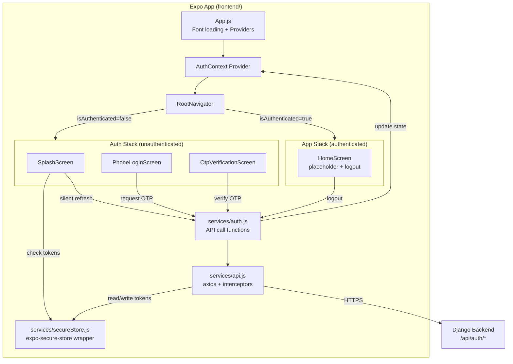

# Architecture: Frontend Authentication Screens

**ID:** ARCH-002
**Type:** architecture
**Feature:** FEAT-002
**Version:** 1
**Status:** ready
**Date:** 2026-10-04

---

## Context

The Spot Rides Expo/React Native frontend (`frontend/`) is currently a bare Expo SDK 57 template with a single `App.js` rendering default placeholder text. There are no screens, no navigation, no API layer, no state management, and no authentication flow. The backend auth API (FEAT-001 / ARCH-001) is fully built and operational, exposing five endpoints under `/api/auth/` with an envelope response format. FEAT-002 requires building the first three screens (Splash, Phone Login, OTP Verification), a navigation skeleton, secure token storage, an auth state context, and an API client with automatic token refresh -- establishing the foundation for all subsequent frontend features.

## Current State

- **Expo SDK 57** with React 19.2, React Native 0.86.3.
- `frontend/App.js` is the default Expo template (single View with Text).
- `frontend/package.json` has only four dependencies: `expo`, `expo-status-bar`, `react`, `react-native`.
- No `screens/`, `components/`, `services/`, `navigation/`, `context/`, or `config/` directories exist.
- `frontend/app.json` has basic Expo config with EAS project ID and Android/iOS icons.
- The backend wraps all responses in an envelope: `{ success: bool, message: string|null, data: any|null, error: { code, detail, fields, retry_after }|null, meta: { request_id, timestamp } }`. Body-less status codes (204, 205) return empty responses.

## Proposed Solution

Build a minimal, convention-following frontend auth layer consisting of:

1. **Three screens** (Splash, PhoneLogin, OtpVerification) in `frontend/screens/`, plus a placeholder HomeScreen for the authenticated hand-off point.
2. **React Navigation** (native-stack) with conditional stack rendering based on auth state -- an AuthStack for unauthenticated users and an AppStack for authenticated users.
3. **An axios-based API client** (`frontend/services/api.js`) that handles envelope unwrapping, Bearer token injection, and automatic 401-triggered token refresh with request queuing.
4. **A React Context provider** (`frontend/context/AuthContext.js`) managing global auth state: authentication status, user object, tokens, and actions (signIn, signOut).
5. **Secure token storage** via `expo-secure-store`, wrapping the platform keychain (iOS) and EncryptedSharedPreferences (Android).
6. **A theme module** (`frontend/config/theme.js`) centralizing all Stitch design system tokens.
7. **Reusable components** (PrimaryButton, PhoneInput, OtpInput) in `frontend/components/` encapsulating design system compliance and shared behavior.

The design uses no state management library (Context + useReducer is sufficient for auth-only state), no custom native modules, and no patterns beyond what the Expo managed workflow supports.

## Diagram



## Directory Structure

```
frontend/
  App.js                          # Entry: load fonts, wrap with AuthProvider + NavigationContainer
  app.json                        # Expo config (unchanged)
  .env                            # EXPO_PUBLIC_API_BASE_URL (gitignored)
  .env.example                    # Documented placeholder for the env var
  config/
    theme.js                      # Stitch design tokens (colors, spacing, typography, radii)
    constants.js                  # App constants (splash timeout, storage keys, dial code)
  services/
    api.js                        # Axios instance + interceptors (envelope, auth, refresh)
    auth.js                       # Auth API functions (requestOtp, verifyOtp, refresh, logout, getMe)
    secureStore.js                # expo-secure-store read/write/delete helpers
  context/
    AuthContext.js                # React Context + useReducer for auth state
  navigation/
    RootNavigator.js              # Renders AuthStack or AppStack based on auth state
  screens/
    SplashScreen.js               # Branding + silent token check
    PhoneLoginScreen.js           # +91 phone input + Send OTP
    OtpVerificationScreen.js      # 6-digit code + Verify + resend timer
    HomeScreen.js                 # Placeholder authenticated screen with logout
  components/
    PrimaryButton.js              # 52px tall, 14px radius, loading spinner variant
    PhoneInput.js                 # +91 fixed prefix + 10-digit numeric input
    OtpInput.js                   # 6 visual digit boxes over a hidden TextInput
  assets/
    (existing icons unchanged)
```

This follows CLAUDE.md conventions: screens in `frontend/screens/`, components in `frontend/components/`.

## Components

| ID | Name | Responsibility | Changes |
|----|------|---------------|---------|
| COMP-001 | `App.js` | Entry point: loads Inter font via expo-font, renders AuthProvider wrapping NavigationContainer wrapping RootNavigator. Shows nothing until fonts are loaded. | Modified (rewritten) |
| COMP-002 | `config/theme.js` | Exports all Stitch design tokens as a flat object: colors, typography (font family, sizes, weights), spacing scale, radii, component dimensions (button height, input height, touch target). Single source of truth for the design system. | New |
| COMP-003 | `config/constants.js` | Exports app constants: SPLASH_MIN_DISPLAY_MS (2000), secure store key names, dial code (+91), OTP length (6). | New |
| COMP-004 | `services/api.js` | Creates and exports a configured axios instance. Request interceptor: attaches `Authorization: Bearer <token>` header. Response interceptor: unwraps envelope (returns `response.data.data` on success, throws structured error on failure). 401 interceptor: triggers token refresh, queues concurrent failing requests, retries on success, forces logout on failure. | New |
| COMP-005 | `services/auth.js` | Exports async functions: `requestOtp(phone)`, `verifyOtp(phone, code)`, `refreshToken(refreshJwt)`, `logout(refreshJwt)`, `getMe()`. Each calls the appropriate endpoint and returns the unwrapped data. | New |
| COMP-006 | `services/secureStore.js` | Thin wrapper around expo-secure-store: `getTokens()`, `setTokens(access, refresh)`, `clearTokens()`, `getUser()`, `setUser(user, isNewUser)`, `clearAll()`. Handles JSON serialization for the user object. | New |
| COMP-007 | `context/AuthContext.js` | React Context with useReducer. State shape: `{ isAuthenticated, isLoading, user, isNewUser, accessToken }`. Actions: `SIGN_IN`, `SIGN_OUT`, `SET_ACCESS_TOKEN`, `RESTORE_SESSION`, `LOADING_COMPLETE`. Provider exposes state + `signIn()`, `signOut()`, `restoreSession()` action dispatchers. | New |
| COMP-008 | `navigation/RootNavigator.js` | Reads auth state from AuthContext. If `isLoading` is true, renders nothing (splash handles its own display). If `isAuthenticated`, renders AppStack (HomeScreen). Otherwise renders AuthStack (SplashScreen -> PhoneLoginScreen -> OtpVerificationScreen). Uses `@react-navigation/native-stack`. | New |
| COMP-009 | `screens/SplashScreen.js` | Displays Spot Rides logo and app name centered on canvas background. On mount, starts a 2-second minimum timer AND checks secure store for a refresh token. If token found, attempts silent refresh via `POST /api/auth/token/refresh/`. After both the timer and the auth check complete: if refresh succeeded, calls `restoreSession()` (navigates to AppStack automatically); if no token or refresh failed, clears stored tokens and navigates to PhoneLoginScreen. | New |
| COMP-010 | `screens/PhoneLoginScreen.js` | Renders PhoneInput (with fixed +91) and PrimaryButton ("Send OTP"). Local state: phone (string), error (string), loading (bool). Validates 10-digit input. On submit: calls `requestOtp("+91" + phone)`. On success: navigates to OtpVerificationScreen passing `{ phone, resendAvailableIn }`. On error: maps backend error codes to user-facing messages (FR-08). Uses KeyboardAvoidingView. | New |
| COMP-011 | `screens/OtpVerificationScreen.js` | Receives `{ phone, resendAvailableIn }` via route params. Renders masked phone display, OtpInput, PrimaryButton ("Verify"), resend countdown timer, and "Edit number" back link. On verify: calls `verifyOtp("+91" + phone, code)`. On success: stores tokens + user via secureStore, calls `signIn()` on AuthContext. On error: maps codes to messages (FR-13), clears input on invalid_code/too_many_attempts. Resend timer: countdown from `resendAvailableIn`, enables "Resend Code" button at zero, calls `requestOtp` again on tap. | New |
| COMP-012 | `screens/HomeScreen.js` | Placeholder authenticated screen. Displays "Welcome" message with the user's phone number from AuthContext. Includes a logout button that calls `signOut()`. Serves as the hand-off point for future features. | New |
| COMP-013 | `components/PrimaryButton.js` | Pressable styled per Stitch: 52px height, 14px border radius, #2563EB fill, white text, Inter font. Props: `title`, `onPress`, `loading` (shows ActivityIndicator), `disabled`. Minimum touch target 48x48. Accessibility label from title. | New |
| COMP-014 | `components/PhoneInput.js` | Horizontal row: non-editable "+91" label with Indian flag emoji, bordered TextInput for 10 digits. Props: `value`, `onChangeText`, `error`. Numeric keyboard, max length 10, strips non-digits. 50px height, 12px border radius per Stitch. | New |
| COMP-015 | `components/OtpInput.js` | Hidden TextInput (numeric, maxLength 6) with 6 visual digit boxes rendered above. Each box shows one digit, active box has primary-color border. Handles paste (full 6 digits), backspace, auto-focus. Props: `value`, `onChangeText`, `error`, `onComplete` (called when 6 digits entered). | New |

## Data Model

No database changes on the frontend. Data is stored in two locations:

### Secure Storage (expo-secure-store, device keychain/keystore)

| Key | Value | Purpose |
|-----|-------|---------|
| `spot_rides_access_token` | JWT string | Access token for Authorization header |
| `spot_rides_refresh_token` | JWT string | Refresh token for silent re-auth |
| `spot_rides_user` | JSON string: `{"id": 42, "phone_number": "+919812345678"}` | Cached user profile |
| `spot_rides_is_new_user` | `"true"` or `"false"` | Flag from initial verification |

Notes:
- `expo-secure-store` has a 2048-byte value limit. JWT tokens are typically 300-800 bytes, well within this limit.
- All keys use a `spot_rides_` prefix to avoid collisions with future features or third-party libraries.
- On logout or auth failure, all four keys are deleted atomically (best-effort; individual deletes with error swallowing).

### In-Memory State (AuthContext)

```
{
  isAuthenticated: boolean,   // true when valid tokens are present
  isLoading: boolean,         // true during initial splash auth check
  user: {                     // from /api/auth/otp/verify/ or /api/auth/me/
    id: number,
    phone_number: string
  } | null,
  isNewUser: boolean,         // from verify response; false after first session
  accessToken: string | null  // kept in memory for the axios interceptor
}
```

The refresh token is NOT kept in React state -- it is read from secure store only when needed (for refresh or logout calls). This minimizes the window of exposure.

## API Contracts (Frontend Perspective)

The frontend consumes the backend envelope format. The API client (COMP-004) handles envelope unwrapping transparently so that service functions (COMP-005) and screens receive bare data payloads.

### Envelope Unwrapping Logic

```
Response Interceptor:
  if response.data.success === true:
    return response.data.data        // bare payload
  else:
    throw ApiError({
      code:        response.data.error.code,
      detail:      response.data.error.detail,
      message:     response.data.message,
      fields:      response.data.error.fields,
      retryAfter:  response.data.error.retry_after,
      httpStatus:  response.status
    })
```

### Consumed Endpoints

| Method | Path | Purpose | Auth | Frontend Caller |
|--------|------|---------|------|-----------------|
| POST | `/api/auth/otp/request/` | Send OTP SMS | None | PhoneLoginScreen, OtpVerificationScreen (resend) |
| POST | `/api/auth/otp/verify/` | Verify OTP, get JWT pair | None | OtpVerificationScreen |
| POST | `/api/auth/token/refresh/` | Refresh access token | Refresh token in body | SplashScreen (silent), api.js interceptor (automatic) |
| POST | `/api/auth/logout/` | Blacklist refresh token | Bearer access | HomeScreen (via AuthContext.signOut) |
| GET | `/api/auth/me/` | Get user profile | Bearer access | Not used in FEAT-002; available for future features |

### Request/Response Shapes (After Envelope Unwrapping)

**requestOtp(phone)**
- Request body: `{ "phone_number": "+919812345678" }`
- Returns: `{ "detail": "otp_sent", "expires_in": 300, "resend_available_in": 30 }`
- Errors thrown: `invalid_phone_number`, `rate_limited` (with `retryAfter`), `sms_dispatch_failed`

**verifyOtp(phone, code)**
- Request body: `{ "phone_number": "+919812345678", "code": "123456" }`
- Returns: `{ "access": "<jwt>", "refresh": "<jwt>", "is_new_user": true, "user": { "id": 42, "phone_number": "+919812345678" } }`
- Errors thrown: `invalid_code`, `code_expired`, `no_active_otp`, `too_many_attempts`

**refreshToken(refreshJwt)**
- Request body: `{ "refresh": "<jwt>" }`
- Returns: `{ "access": "<jwt>", "refresh": "<jwt>" }` (envelope-wrapped by backend)
- Errors: 401 with `not_authenticated` code (expired/blacklisted refresh)

**logout(refreshJwt)**
- Request body: `{ "refresh": "<jwt>" }`
- Returns: no body (HTTP 205 Reset Content)
- Errors: `invalid_refresh` (but client ignores and clears local state regardless)

### Error Code to User Message Mapping

| Error Code | HTTP Status | User-Facing Message | Screen Action |
|-----------|-------------|---------------------|---------------|
| `invalid_phone_number` | 400 | "Please enter a valid phone number" | Show inline error on PhoneLogin |
| `rate_limited` | 429 | "Too many attempts. Please try again in {retry_after} seconds." | Show inline error |
| `sms_dispatch_failed` | 502 | "Unable to send SMS. Please try again." | Show inline error, allow retry |
| `invalid_code` | 400 | "Incorrect code. Please try again." | Clear OTP input |
| `code_expired` | 400 | "Code has expired. Please request a new one." | Highlight resend button |
| `no_active_otp` | 400 | "No active code found. Please request a new one." | Navigate back to PhoneLogin or highlight resend |
| `too_many_attempts` | 429 | "Too many incorrect attempts. Please request a new code." | Clear OTP input, enable resend |
| (network error) | N/A | "Connection failed. Please check your internet and try again." | Show inline error, allow retry |

## Token Refresh Interceptor Design

The interceptor in `services/api.js` handles automatic token refresh on 401 responses. Critical design considerations:

### Flow

```
1. Axios response interceptor catches a 401 error.
2. Check: is the failing request itself a refresh or logout call?
   - Yes -> Do not retry. Reject immediately (prevents infinite loop).
3. Check: is a refresh already in progress? (module-level `isRefreshing` flag)
   - Yes -> Queue this request's retry promise. Return the promise.
   - No -> Set isRefreshing = true. Continue to step 4.
4. Read the refresh token from secure store.
   - If no refresh token exists -> Force logout. Reject all queued requests.
5. Call POST /api/auth/token/refresh/ with the refresh token.
   - On success:
     a. Store the new access + refresh tokens in secure store.
     b. Update the in-memory access token (AuthContext).
     c. Retry the original failed request with the new access token.
     d. Resolve all queued request promises (retry each with new token).
     e. Set isRefreshing = false.
   - On failure:
     a. Clear all tokens from secure store.
     b. Reset auth state (forces navigation to login).
     c. Reject all queued request promises.
     d. Set isRefreshing = false.
```

### Race Condition Handling

- A module-level `isRefreshing` boolean and a `failedRequestQueue` array prevent multiple simultaneous refresh calls.
- When `isRefreshing` is true, subsequent 401 errors enqueue their retry callbacks rather than triggering another refresh.
- The queue is processed (resolved or rejected) after the single refresh attempt completes.

### Circular Dependency Prevention

- The refresh call itself uses the same axios instance but targets a known path (`/api/auth/token/refresh/`). The 401 interceptor checks the request URL and skips retry for refresh/logout endpoints.
- The `signOut` dispatch is provided to `api.js` during initialization (the AuthContext passes a callback when it mounts). This avoids importing AuthContext into the api module.

## Navigation Architecture

### Stack Structure

```
RootNavigator (no header)
  |
  |-- [isAuthenticated = false] AuthStack (native-stack)
  |     |-- SplashScreen (initial route, no header)
  |     |-- PhoneLoginScreen (no header)
  |     |-- OtpVerificationScreen (no header, back enabled)
  |
  |-- [isAuthenticated = true] AppStack (native-stack)
        |-- HomeScreen (placeholder)
```

### Conditional Rendering (Not Stack Switching)

The RootNavigator does not use a single NavigationContainer with auth guards. Instead, it conditionally renders either the AuthStack or AppStack based on `isAuthenticated` from AuthContext. This means:

- When auth state changes from false to true (successful login), React Navigation automatically resets the navigation state -- the user cannot swipe back to the login screens.
- When auth state changes from true to false (logout or token expiry), the AuthStack renders fresh with SplashScreen as initial route. The navigator is configured to skip the splash and go directly to PhoneLoginScreen via `initialRouteName` override when the transition is due to an explicit logout (not an app launch).

### Screen Transitions

- SplashScreen -> PhoneLoginScreen: `navigation.replace('PhoneLogin')` (no back gesture)
- PhoneLoginScreen -> OtpVerificationScreen: `navigation.navigate('OtpVerification', { phone, resendAvailableIn })` (back enabled)
- OtpVerificationScreen -> (auth state change): signIn triggers conditional re-render to AppStack

### Route Params

| Route | Params | Source |
|-------|--------|--------|
| SplashScreen | none | initial route |
| PhoneLoginScreen | none | (phone state is local) |
| OtpVerificationScreen | `{ phone: string, resendAvailableIn: number }` | passed from PhoneLoginScreen on successful OTP request |
| HomeScreen | none | user data from AuthContext |

## Frontend / Backend Responsibilities

**Frontend (this feature):**
- Collect raw 10-digit phone input, prepend "+91", POST to backend.
- Display countdown from `resend_available_in` returned by backend.
- Send 6-digit code to backend for verification.
- Store JWT tokens in secure storage (keychain/keystore).
- Attach Bearer token to authenticated requests.
- Intercept 401 responses and attempt token refresh automatically.
- Clear local state on logout (even if backend call fails).
- Map backend error codes to user-facing messages.
- Enforce visual design system tokens (colors, sizes, fonts).

**Backend (FEAT-001, already built):**
- All auth logic, OTP generation/verification, JWT issuance/rotation/blacklisting.
- E.164 normalization and validation (frontend sends "+91" + digits, backend validates).
- Rate limiting (per-phone and per-IP).
- SMS dispatch via Twilio.
- Envelope wrapping of all responses.

## API Base URL Configuration

The API base URL is configured via the Expo-supported `EXPO_PUBLIC_` environment variable mechanism (available since Expo SDK 49):

- **File:** `frontend/.env` (gitignored)
- **Variable:** `EXPO_PUBLIC_API_BASE_URL`
- **Access:** `process.env.EXPO_PUBLIC_API_BASE_URL` in JavaScript
- **Fallback:** `http://localhost:8000` if the variable is not set
- **Template:** `frontend/.env.example` documents the variable with a placeholder value

This is consumed in `config/constants.js`:
```
API_BASE_URL = process.env.EXPO_PUBLIC_API_BASE_URL || 'http://localhost:8000'
```

The axios instance in `services/api.js` uses `API_BASE_URL` as its `baseURL`. All endpoint paths are relative (e.g., `/api/auth/otp/request/`).

## Font Loading

The Inter font is loaded at app startup using `expo-font` and `@expo-google-fonts/inter`:

- `App.js` calls `useFonts` from `@expo-google-fonts/inter` to load `Inter_400Regular`, `Inter_500Medium`, `Inter_600SemiBold`, and `Inter_700Bold`.
- While fonts are loading, `App.js` keeps the native splash screen visible via `expo-splash-screen`'s `SplashScreen.preventAutoHideAsync()`.
- Once fonts are loaded, the native splash screen is hidden and the app renders.
- The custom SplashScreen (branding screen) is a separate React component, distinct from the native splash screen.

## Dependencies

| Package | Version | Rationale |
|---------|---------|-----------|
| `@react-navigation/native` | `^7.x` | Navigation framework (DEC-001). |
| `@react-navigation/native-stack` | `^7.x` | Native stack navigator for screen transitions. |
| `react-native-screens` | `~4.x` | Required peer dependency for React Navigation with Expo SDK 57. |
| `react-native-safe-area-context` | `~5.x` | Required peer dependency for React Navigation with Expo SDK 57. |
| `expo-secure-store` | `~14.x` | Secure token storage using platform keychain/keystore (FR-16). |
| `expo-font` | `~13.x` | Font loading API. |
| `@expo-google-fonts/inter` | `latest` | Inter font files (design system requirement). |
| `expo-splash-screen` | `~0.30.x` | Control native splash screen visibility during font loading. |
| `axios` | `^1.7.x` | HTTP client with built-in interceptor support (DEC-002). |

All packages are Expo-managed-workflow compatible. Exact compatible versions should be resolved via `npx expo install <package>` which pins Expo-SDK-compatible versions automatically.

**Install command:**
```
npx expo install @react-navigation/native @react-navigation/native-stack react-native-screens react-native-safe-area-context expo-secure-store expo-font @expo-google-fonts/inter expo-splash-screen axios
```

## Screen Designs

### SplashScreen (COMP-009)

**Layout:** Full-screen, canvas background (#F8FAFC). Spot Rides logo (from assets) and app name text centered vertically and horizontally.

**State:** None visible to user. Internally: `authCheckComplete` (bool), `minTimerComplete` (bool).

**Behavior:**
1. On mount, simultaneously:
   a. Start a 2000ms timer (`SPLASH_MIN_DISPLAY_MS` from constants).
   b. Read `spot_rides_refresh_token` from secure store.
2. If refresh token exists: call `POST /api/auth/token/refresh/`.
   - Success: store new tokens, load user from stored `spot_rides_user`, mark authenticated.
   - Failure: clear all stored tokens.
3. If no refresh token: skip refresh attempt.
4. Wait until BOTH the timer AND the auth check are complete.
5. If authenticated: call `restoreSession()` on AuthContext (triggers AppStack render).
6. If not authenticated: `navigation.replace('PhoneLogin')`.

**Edge cases:**
- Network timeout during refresh: treat as failure, navigate to login.
- Secure store read failure: treat as no token, navigate to login.

### PhoneLoginScreen (COMP-010)

**Layout:** Canvas background. Top section: "Welcome" heading, "Enter your mobile number to get started" subtext. Middle: PhoneInput component. Error message area (red text, hidden when no error). Bottom: PrimaryButton ("Send OTP"). KeyboardAvoidingView wraps content.

**State:** `phone` (string, max 10 chars), `error` (string | null), `isLoading` (bool).

**Behavior:**
1. PrimaryButton is disabled when `phone.length !== 10` or `isLoading`.
2. On button press:
   a. Set `isLoading = true`, clear error.
   b. Call `requestOtp("+91" + phone)`.
   c. On success: navigate to OtpVerificationScreen with `{ phone, resendAvailableIn: response.resend_available_in }`.
   d. On error: set error message based on error code (see Error Mapping table).
   e. Set `isLoading = false`.
3. PhoneInput restricts to numeric characters and max 10 digits.

### OtpVerificationScreen (COMP-011)

**Layout:** Canvas background. Top: back arrow (navigates to PhoneLogin, preserving phone). "Verify your number" heading. Masked phone display: "Code sent to +91 *** *** {last4}". OtpInput (6 boxes). Error message area. PrimaryButton ("Verify"). Resend timer text / Resend button. KeyboardAvoidingView wraps content.

**Route Params:** `{ phone: string, resendAvailableIn: number }`

**State:** `code` (string, max 6 chars), `error` (string | null), `isLoading` (bool), `resendTimer` (number, seconds), `isResending` (bool).

**Behavior:**
1. On mount: start countdown timer from `resendAvailableIn`.
2. Timer decrements every second. While > 0: show "Resend code in {N}s" (disabled). At 0: show "Resend Code" button (enabled).
3. PrimaryButton ("Verify") disabled when `code.length !== 6` or `isLoading`.
4. Auto-submit is NOT implemented (architect decision -- manual submit avoids surprising the user on paste of partial input and avoids accidental submission of auto-filled codes from other apps).
5. On Verify press:
   a. Set `isLoading = true`, clear error.
   b. Call `verifyOtp("+91" + phone, code)`.
   c. On success:
      - Call `secureStore.setTokens(access, refresh)`.
      - Call `secureStore.setUser(user, is_new_user)`.
      - Call `authContext.signIn({ user, isNewUser: is_new_user, accessToken: access })`.
      - Navigation happens automatically (AuthContext state change triggers AppStack render).
   d. On error: set error message per mapping. Clear code on `invalid_code` or `too_many_attempts`. On `code_expired`: highlight resend. On `no_active_otp`: enable resend.
   e. Set `isLoading = false`.
6. On Resend press:
   a. Set `isResending = true`.
   b. Call `requestOtp("+91" + phone)`.
   c. On success: restart timer from new `resend_available_in`.
   d. On error: show error message.
   e. Set `isResending = false`.
7. Back/Edit number: `navigation.goBack()` returns to PhoneLoginScreen. The phone number is preserved in PhoneLoginScreen's local state (React Navigation keeps unmounted screens in memory within a stack).

**Phone Masking:** For phone "9812345678", display "Code sent to +91 *** *** 5678" (mask first 6, show last 4).

### HomeScreen (COMP-012)

**Layout:** Canvas background. Centered: "Welcome to Spot Rides" heading, user phone number from AuthContext, PrimaryButton ("Log Out").

**Behavior:** On logout press: calls `authContext.signOut()` which handles the full logout flow (API call, clear storage, reset state). Navigation happens automatically via conditional rendering.

## Failure Modes

| Scenario | Behavior |
|----------|----------|
| Network unavailable during OTP request | Axios throws network error. Screen shows "Connection failed. Please check your internet and try again." Button re-enables for retry. |
| Network unavailable during OTP verify | Same as above. Code input preserved so user can retry without re-entering. |
| Network unavailable during token refresh (splash) | Refresh treated as failed. Stored tokens cleared. User directed to PhoneLoginScreen. |
| Network unavailable during token refresh (interceptor) | Refresh treated as failed. User logged out, directed to PhoneLoginScreen. |
| Network unavailable during logout | Logout API call fails silently. Local tokens and state are still cleared. User directed to PhoneLoginScreen (FR-19). |
| expo-secure-store read failure | Treated as "no stored data". On splash: navigate to login. On token read for interceptor: force logout. |
| expo-secure-store write failure | Login flow shows generic error. Tokens not persisted means next app launch will require re-authentication. |
| Backend returns unexpected response shape | Envelope unwrapper falls back to generic error message. No crash. |
| Concurrent 401 errors from multiple API calls | Token refresh interceptor queues requests. Single refresh attempt. All queued requests retried or rejected together. |
| Token refresh returns new tokens but original retry still fails | Retry failure is surfaced to the original caller. No second refresh attempt for the same request. |
| User kills app during OTP verify (after backend success, before storage) | On next launch, splash finds no tokens, sends user to login. User must re-verify. No data inconsistency. |

## Security Considerations

- **Token storage:** JWT tokens are stored in `expo-secure-store` which uses the iOS Keychain and Android EncryptedSharedPreferences. Tokens are never written to AsyncStorage, React state persistence, or console logs. The access token is held in React state (memory only) for performance; the refresh token is read from secure store on demand.
- **No secrets in source code:** The API base URL is the only configurable value, and it is not a secret. No API keys, tokens, or credentials are committed to the repository.
- **HTTPS in production:** The API base URL must use HTTPS in production. The development fallback uses HTTP (localhost). The API client does not enforce HTTPS at the code level -- this is an operational/deployment concern.
- **Token exposure minimization:** The refresh token is not stored in React state; it is read from secure store only when needed (refresh or logout). This limits the surface area for accidental logging or state-dump exposure.
- **Logout completeness:** On logout, local state is always cleared regardless of whether the server-side blacklist call succeeds. A network error during logout does not leave the user in a partially-logged-in state.
- **Input sanitization:** Phone input strips non-numeric characters. OTP input strips non-numeric characters. Both enforce max length. Backend performs canonical validation.
- **No sensitive data in navigation params:** Only the phone number (which the user just typed) and resend timer value are passed as route params. Tokens are never passed via navigation.
- **Error message safety:** User-facing error messages are hardcoded strings mapped from backend error codes. Raw backend error details, stack traces, or internal codes are never displayed to the user.

## Observability

- **Console logging (development only):** API calls log request method + URL (not body) and response status. Errors log the error code and HTTP status. Token values are never logged.
- **Error boundaries:** A top-level error boundary in App.js catches unhandled React errors and shows a fallback UI rather than a white screen. It logs the error for developer debugging.
- **Request ID propagation:** The backend attaches `meta.request_id` to every response. The API client can log this for debugging correlation. Not displayed to users.

## Performance

- **Splash-to-login (cold start, no tokens):** Under 4 seconds. Font loading (~500ms) + splash display (2000ms) + navigation (~100ms). No network call needed.
- **Splash-to-authenticated (warm start, valid tokens):** Under 3 seconds. Font loading (~500ms) + max(splash 2000ms, token refresh ~500ms) + navigation (~100ms).
- **Font loading:** Inter font files are bundled at build time via `@expo-google-fonts/inter`, so no runtime network fetch is needed. `useFonts` reads from the bundle.
- **Bundle size impact:** axios adds ~13KB gzipped. React Navigation adds ~30KB gzipped. expo-secure-store is a native module with negligible JS overhead. Total addition: ~50KB gzipped JS.

## Migration / Rollout

- **Required:** false (no database migration; frontend-only changes).
- **Strategy:** This is a greenfield addition to a bare Expo project. No existing behavior to preserve. Install dependencies via `npx expo install`, create the directory structure, implement components, update App.js. Test on Android emulator and iOS simulator using the dev backend (`http://localhost:8000` with `OTP_DEV_MODE=True` and fixed code `000000`).
- **Rollback:** Revert the commit. The app returns to the default Expo template. No server-side state is affected.

## Risks

| ID | Description | Severity | Mitigation |
|----|-------------|---------|-----------|
| RISK-001 | expo-secure-store has a 2048-byte value limit. If JWT tokens exceed this (e.g., due to many custom claims), storage will fail silently or throw. | low | Current backend JWTs contain minimal claims (user_id, phone_number, standard fields). Measured token size is ~300-500 bytes. Monitor if claims are added in future features. |
| RISK-002 | Token refresh race condition: if the refresh token is rotated (BLACKLIST_AFTER_ROTATION=True) and two tabs/instances try to refresh simultaneously, one will fail. | medium | On mobile, only one app instance runs at a time. The interceptor's queue mechanism ensures only one refresh call is made per JS execution context. No mitigation needed for this platform. |
| RISK-003 | Network latency on slow Indian mobile networks (2G/3G) may cause API timeouts during OTP request/verify. | medium | Axios timeout set to 15 seconds (generous). Loading states prevent double-tap. Error message covers timeout case ("Connection failed..."). Backend has its own 5-second Twilio timeout. |
| RISK-004 | The Inter font may not render identically on all Android devices due to font rendering engine differences. | low | Use expo-font's standard loading mechanism. Visual differences are cosmetic and acceptable. Test on representative Android versions. |
| RISK-005 | If the backend envelope shape changes (field names, nesting), the frontend API client will break. | medium | Envelope shape is defined in ARCH-001 and implemented in `core/envelope.py`. Treat it as a stable contract. Any backend change requires coordinated frontend update. |

## Decisions

| ID | Decision | Rationale | Alternatives Considered |
|----|----------|----------|------------------------|
| DEC-001 | Use React Navigation (`@react-navigation/native` + `native-stack`) instead of Expo Router. | React Navigation gives explicit, imperative control over navigation state, which is simpler for a 3-screen auth flow with conditional stack rendering. Expo Router's file-based routing adds structural overhead (requires `app/` directory, layout files) that is unnecessary at this scale and would require restructuring the project away from the `screens/` convention in CLAUDE.md. React Navigation is the more established library with broader community support. | Expo Router: file-based routing, built on React Navigation internally. Adds project structure constraints and is better suited for apps with many routes and deep linking needs. |
| DEC-002 | Use axios instead of the built-in fetch API. | Axios provides request/response interceptors as a first-class feature, which are essential for envelope unwrapping and the token refresh flow. With fetch, equivalent functionality requires a manual wrapper with more boilerplate, and interceptor composition (multiple concerns: auth header, envelope unwrap, 401 refresh) is harder to maintain. Axios also provides automatic JSON parsing, timeout configuration, and request cancellation. ~13KB gzipped is an acceptable trade-off. | fetch wrapper: zero added dependencies, but requires significantly more code for interceptor-like behavior, especially the 401 queue-and-retry pattern. |
| DEC-003 | OTP input uses a hidden single TextInput with 6 visual digit boxes rendered as a View overlay. | This pattern handles clipboard paste (user pastes full 6-digit code), backspace navigation, keyboard management, and accessibility better than 6 separate TextInput components. A single TextInput means one focus target, no complex ref management for focus-forwarding between inputs, and native paste works automatically. The visual boxes are purely presentational. | 6 separate TextInputs: each box is a real TextInput. Requires ref forwarding for focus, custom backspace handling, and paste logic. More complex, more bug-prone. Single visible TextInput: simpler but less visually polished; does not match common OTP UX patterns. |
| DEC-004 | No auto-submit on OTP completion. Manual "Verify" button required. | Auto-submit can cause confusion when the user pastes a code from a different context or when SMS auto-fill inserts a stale code. A manual submit gives the user a moment to verify the code visually before committing. The "Verify" button is always visible regardless. This is the safer UX choice for a first release. | Auto-submit on 6th digit: reduces one tap but risks submitting wrong codes. Could be added later as an enhancement. |
| DEC-005 | Splash minimum display time (2000ms) is a constant in `config/constants.js`, not configurable at runtime. | A 2-second splash is a product requirement (FR-01), not something that varies by environment. Making it a named constant is sufficient for maintainability. Runtime configuration (e.g., remote config) adds unnecessary complexity for a fixed value. | Hardcoded literal in SplashScreen.js (less maintainable). Environment variable (unnecessary for a non-secret, non-environment-specific value). |
| DEC-006 | Placeholder HomeScreen includes a logout button. | Essential for development and testing (OQ-06). Without it, developers cannot test the full login/logout cycle and the token-clearing flow. The HomeScreen is explicitly a placeholder that will be replaced by subsequent features. | Defer logout to a future feature: blocks testing of the auth flow's logout path, which is part of FEAT-002's requirements (FR-19, AC-19). |
| DEC-007 | Use React Context + useReducer for auth state (no external state management library). | The auth state is a single, well-scoped concern (isAuthenticated, user, token). It has exactly two consumers (the navigator and the screens). Adding Redux, Zustand, or Jotai for this would be over-engineering. Context + useReducer is built into React, adds zero dependencies, and is the standard pattern for cross-cutting concerns like auth in small-to-medium React Native apps. Future features can introduce a state library if the state graph grows beyond what Context handles efficiently. | Redux Toolkit: full state management, overkill for auth-only state. Zustand: lightweight but still an unnecessary dependency for one context. |
| DEC-008 | The refresh token is stored in secure store only, never in React state. The access token is held in both secure store (persistence) and React state (fast access). | The refresh token is a long-lived, high-value credential. Keeping it out of React state reduces the risk of accidental exposure through state debugging tools, error reports, or state serialization. It is read from secure store only when needed (refresh or logout). The access token is short-lived (15 min) and needed on every API call, so keeping it in memory avoids a secure store read on every request. | Both tokens in React state: simpler code but higher exposure risk for the refresh token. Both tokens read from secure store on each use: secure but adds ~5ms latency per API call. |

## Assumptions

- The backend is accessible at the configured `EXPO_PUBLIC_API_BASE_URL` during development (default `http://localhost:8000`).
- `OTP_DEV_MODE=True` with `DEBUG=True` is active on the dev backend, allowing the fixed code `000000` for testing.
- The Expo managed workflow supports all listed dependencies without ejecting.
- `expo-secure-store` works on both iOS simulator and Android emulator for development testing.
- The Inter font is available via `@expo-google-fonts/inter` at a version compatible with Expo SDK 57.
- The backend envelope format (`{ success, message, data, error, meta }`) is stable and will not change without coordinated notice.
- The `resend_available_in` field is always present in a successful OTP request response and is a positive integer (seconds).
- React Navigation v7 is compatible with Expo SDK 57, React 19.2, and React Native 0.86.
- The token refresh endpoint (`/api/auth/token/refresh/`) wraps its response in the same envelope as all other endpoints (confirmed: `EnvelopeJSONRenderer` is the default renderer in settings).

## Open Decisions

- None blocking. All open questions from the requirements (OQ-01 through OQ-06) have been resolved in this document. OQ-04 (production API base URL) and OQ-05 (SMS auto-read) are deferred per the requirements and do not block implementation.
