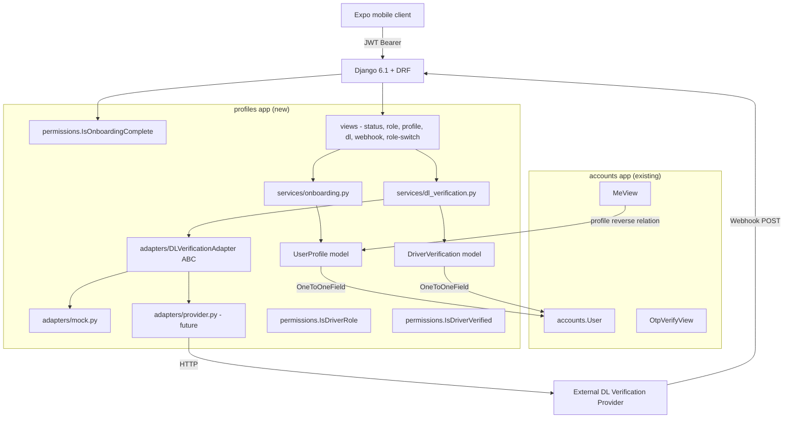

# Architecture: User Onboarding Flow

**ID:** ARCH-002
**Type:** architecture
**Feature:** FEAT-002
**Version:** 1
**Status:** ready
**Date:** 2026-09-23

---

## Context

FEAT-001 established a passwordless phone/OTP authentication layer that produces a `User` row keyed on E.164 phone number and issues a JWT pair. After successful OTP verification a user has only a phone number on record: no role, no name, no demographic data, and no mechanism to vet driving licences. The main Spot Rides experience cannot function without knowing whether the user intends to be a Passenger or a Driver ("Rider" in UI copy), and Driver accounts require a verified Indian driving licence before they can offer rides.

FEAT-002 adds the complete onboarding flow: role selection, personal profile collection, optional DL verification for Drivers, server-side progress persistence (resumable across devices), and a server-enforced gate that blocks any non-onboarding API call until onboarding is complete.

ADR decisions made during design are recorded in `docs/decisions/2026-09-23-arch-feat-002-user-onboarding.md`.

---

## Current State

- `backend/` contains two apps: `accounts` (custom `AUTH_USER_MODEL`, OTP/phone auth, JWT) and `core` (envelope, exceptions, renderers — no models).
- `accounts.User` has fields: `phone_number`, `is_active`, `is_staff`, `date_joined`. No role or profile data.
- `config/settings.py` `DEFAULT_PERMISSION_CLASSES` is `[IsAuthenticated]`.
- `config/urls.py` wires `api/auth/` to `accounts.urls` and `api/health/`.
- No `profiles` app exists. No migrations beyond `accounts` 0001/0002.
- `accounts/serializers.py` `UserSerializer` exposes `id`, `phone_number`, `date_joined` only.
- `core.exceptions.ApiError` is the base for all domain errors; `core.exceptions.envelope_exception_handler` is the DRF exception handler.
- Redis is available (used by `accounts` for rate-limiting).
- `python-decouple` is used throughout for env var loading.
- `cryptography` is not yet in `requirements.txt` — it must be added.

---

## Proposed Solution

Introduce a single new Django app **`profiles`** (created via `python manage.py startapp profiles`) that owns the entire onboarding domain: `UserProfile` and `DriverVerification` models, the onboarding state machine, the DL verification adapter interface, DRF permission classes for the gate, and all onboarding/profile API endpoints.

The `accounts` app is modified minimally: `UserSerializer` gains two nullable `SerializerMethodField` values (`onboarding_status`, `active_role`) that read the `profiles.UserProfile` reverse relation without importing any symbol from `profiles`. The `DEFAULT_PERMISSION_CLASSES` in `settings.py` gains `profiles.permissions.IsOnboardingComplete` as a second entry after `IsAuthenticated`.

Key design decisions (all detailed in the ADR):
1. **DL normalisation** — input is stripped and uppercased before regex validation.
2. **`UserProfile` creation** — lazy, via `get_or_create` in the onboarding service on first contact.
3. **DL storage** — Fernet symmetric encryption (`DL_ENCRYPTION_KEY` env var) for the full DL number; last-4 plaintext in `dl_number_display`.
4. **Onboarding gate** — DRF permission class `IsOnboardingComplete`; onboarding views opt out by declaring `permission_classes = [IsAuthenticated]`.
5. **`DriverVerification` placement** — inside `profiles` app.
6. **DL adapter interface** — abstract class `DLVerificationAdapter` with a concrete mock adapter for dev/test; provider-specific adapters added when OQ-01 is resolved.

---

## Diagram



---

## Module Layout

```
backend/
  requirements.txt          # +cryptography
  config/
    settings.py             # modified: INSTALLED_APPS, DEFAULT_PERMISSION_CLASSES, DL_* env vars
    urls.py                 # modified: include('profiles.urls')
  accounts/
    serializers.py          # modified: UserSerializer gains onboarding_status, active_role fields
  profiles/                 # NEW app
    __init__.py
    apps.py
    admin.py                # UserProfile (staff-only), DriverVerification (staff-only)
    models.py               # UserProfile, DriverVerification
    serializers.py          # OnboardingStatusSerializer, RoleSelectSerializer,
                            # ProfileSubmitSerializer, DLSubmitSerializer,
                            # DLStatusSerializer, RoleSwitchSerializer
    views.py                # OnboardingStatusView, RoleSelectView, ProfileSubmitView,
                            # DLSubmitView, DLStatusView, DLWebhookView, RoleSwitchView
    urls.py                 # mounts all routes under api/onboarding/ and api/profile/
    permissions.py          # IsOnboardingComplete, IsDriverRole, IsDriverVerified
    exceptions.py           # OnboardingIncomplete, NotADriver, InvalidAge, InvalidGender,
                            # InvalidDLFormat, DLAlreadyVerified, DLProviderError,
                            # MaxDLAttemptsExceeded, RoleAlreadySet, ProfileAlreadySet
    crypto.py               # encrypt_dl(), decrypt_dl() using Fernet + DL_ENCRYPTION_KEY
    services/
      __init__.py
      onboarding.py         # get_or_create_profile, set_role, set_profile_details,
                            # switch_role, compute_next_step
      dl_verification.py    # validate_dl_format, submit_dl, process_webhook,
                            # get_dl_adapter (factory)
    adapters/
      __init__.py           # get_dl_adapter() factory
      base.py               # DLVerificationAdapter ABC, DLVerificationResult dataclass
      mock.py               # MockDLVerificationAdapter (dev/test)
    migrations/
      0001_initial.py       # depends: [('accounts', '0002_alter_otpcode_phone_number')]
```

---

## Components

| ID | Name | Responsibility | Changes |
|----|------|----------------|---------|
| COMP-001 | `profiles.models.UserProfile` | Stores onboarding state machine status, active role, and personal profile fields for every user. OneToOneField on `accounts.User`. | New |
| COMP-002 | `profiles.models.DriverVerification` | Stores DL submission state, encrypted DL number, last-4 display, provider reference ID, attempt count, and verification timestamps. OneToOneField on `accounts.User`. | New |
| COMP-003 | `profiles.services.onboarding` | State machine transitions: get-or-create profile, set role, set profile details, switch role, derive next_step. No HTTP concerns. | New |
| COMP-004 | `profiles.services.dl_verification` | DL format normalisation and validation, adapter invocation, timeout handling, webhook processing (idempotent), attempt counting. No HTTP concerns. | New |
| COMP-005 | `profiles.adapters.base` | `DLVerificationAdapter` ABC + `DLVerificationResult` dataclass. Defines the contract the service uses; concrete providers implement this. | New |
| COMP-006 | `profiles.adapters.mock` | `MockDLVerificationAdapter` returns a configurable result (`verified`, `pending`, `rejected`) without calling any external service. Used in dev and tests. | New |
| COMP-007 | `profiles.permissions` | `IsOnboardingComplete` (gate for all protected non-onboarding endpoints), `IsDriverRole` (driver-only endpoints), `IsDriverVerified` (ride-offer endpoints). | New |
| COMP-008 | `profiles.exceptions` | Domain error subclasses of `core.exceptions.ApiError`, covering every error code defined in the API contract. | New |
| COMP-009 | `profiles.crypto` | `encrypt_dl(plaintext) -> str` and `decrypt_dl(ciphertext) -> str` using Fernet with key from `DL_ENCRYPTION_KEY` env var. | New |
| COMP-010 | `profiles.views` | Thin DRF `APIView` subclasses. Validate input with serializers, delegate business logic to service layer, return bare data for envelope rendering. | New |
| COMP-011 | `profiles.urls` | URL routing for all onboarding and profile endpoints. | New |
| COMP-012 | `accounts.serializers.UserSerializer` | Extended with `onboarding_status` and `active_role` as nullable `SerializerMethodField` values reading the `profile` reverse relation. | Modified |
| COMP-013 | `config.settings` | `INSTALLED_APPS` gains `profiles`. `DEFAULT_PERMISSION_CLASSES` gains `IsOnboardingComplete`. New env vars: `DL_ENCRYPTION_KEY`, `DL_ADAPTER_CLASS`, `DL_WEBHOOK_SECRET`, `DL_PROVIDER_TIMEOUT_SECONDS`, `DL_MAX_ATTEMPTS`. | Modified |
| COMP-014 | `config.urls` | `include('profiles.urls')` added under `api/`. | Modified |

---

## Data Model

### `profiles.UserProfile`

```
Column               Type                              Notes
─────────────────────────────────────────────────────────────────────────────
id                   BigAutoField                      PK
user                 OneToOneField → accounts.User     CASCADE, related_name="profile"
active_role          CharField(10, nullable)            choices: DRIVER | PASSENGER; null until step 1
first_name           CharField(50, nullable)            null until step 2; Unicode letters/space/hyphen/apostrophe
last_name            CharField(50, nullable)            null until step 2; same charset
age                  PositiveSmallIntegerField(null)   18–80 inclusive; null until step 2
gender               CharField(20, nullable)            choices: MALE | FEMALE | OTHER | PREFER_NOT_TO_SAY; null until step 2
onboarding_status    CharField(30)                     choices: NOT_STARTED | ROLE_SELECTED | AWAITING_DL |
                                                        PENDING_VERIFICATION | COMPLETE
                                                        default: NOT_STARTED
created_at           DateTimeField(auto_now_add)
updated_at           DateTimeField(auto_now)
```

Constraints and indexes:
- `UNIQUE (user_id)` — enforced by `OneToOneField`; prevents duplicate profiles from concurrent requests
- Index on `onboarding_status` is not required for current load but may be added for admin queries

### `profiles.DriverVerification`

```
Column                   Type                              Notes
─────────────────────────────────────────────────────────────────────────────
id                       BigAutoField                      PK
user                     OneToOneField → accounts.User     CASCADE, related_name="driver_verification"
dl_number                CharField(256)                    Fernet-encrypted ciphertext of normalised DL;
                                                            length 256 accommodates base64-encoded Fernet token
dl_number_display        CharField(4)                      Last 4 chars of normalised plaintext DL; always plaintext
dl_key_version           PositiveSmallIntegerField         Default 1; reserved for future key rotation
dl_verification_status   CharField(20)                     choices: PENDING | VERIFIED | REJECTED
dl_verification_ref      CharField(100, nullable)          Provider-issued reference ID (async path)
dl_submitted_at          DateTimeField                     Timestamp of most recent submission
dl_verified_at           DateTimeField(nullable)           Timestamp of verification confirmation
dl_rejection_reason      TextField(nullable)               Provider-supplied reason; sanitised before storage
attempt_count            PositiveSmallIntegerField         Default 0; incremented on each POST /api/onboarding/driver/dl/
created_at               DateTimeField(auto_now_add)
updated_at               DateTimeField(auto_now)
```

Constraints and indexes:
- `UNIQUE (user_id)` — enforced by `OneToOneField`
- `UNIQUE (dl_verification_ref)` where not null — prevents duplicate webhook processing; implemented as a partial unique index in the migration: `UniqueConstraint(fields=['dl_verification_ref'], condition=Q(dl_verification_ref__isnull=False), name='uq_dl_verification_ref')`

### `accounts.User` — no schema change

`onboarding_status` and `active_role` are derived from `UserProfile` at serialization time. No new columns on `accounts_user`.

---

## API Contracts

All contracts from the requirements document are adopted without change. The refinements and ambiguity resolutions below are the only delta.

| Method | Path | Auth | Permission | Notes |
|--------|------|------|------------|-------|
| GET | `/api/onboarding/status/` | JWT | `IsAuthenticated` only | Creates profile lazily if absent |
| POST | `/api/onboarding/role/` | JWT | `IsAuthenticated` only | Only valid in `NOT_STARTED` state |
| POST | `/api/onboarding/profile/` | JWT | `IsAuthenticated` only | Only valid in `ROLE_SELECTED` state |
| POST | `/api/onboarding/driver/dl/` | JWT | `IsAuthenticated`, `IsDriverRole` | Only valid in `AWAITING_DL` or `REJECTED` states |
| GET | `/api/onboarding/driver/dl/status/` | JWT | `IsAuthenticated`, `IsDriverRole` | |
| POST | `/api/onboarding/driver/dl/webhook/` | None (signature) | `AllowAny` + in-view signature check | Exempt from `IsOnboardingComplete` |
| PATCH | `/api/profile/role/` | JWT | `IsAuthenticated`, `IsOnboardingComplete` | Only callable after full onboarding |
| GET | `/api/auth/me/` | JWT | `IsAuthenticated` only (existing endpoint) | Amended: adds `onboarding_status`, `active_role` |

### Contract refinements vs requirements doc

1. **`POST /api/onboarding/driver/dl/` on timeout** — The provider adapter wraps all provider calls in a configurable timeout (`DL_PROVIDER_TIMEOUT_SECONDS`, default 5s). On timeout, the service saves `dl_verification_status=PENDING`, `onboarding_status=PENDING_VERIFICATION` and returns `202 Accepted` (same as the async path). No `500` reaches the client (NFR-REL-01, AC-19).

2. **Webhook `403` before any DB read** — `DLWebhookView.post()` calls `self.adapter.validate_webhook(request.headers, request.body)` as the very first operation. If it returns `False`, the view raises `403` before any query (NFR-SEC-02, AC-18).

3. **`PATCH /api/profile/role/` — partial response for `dl_required`** — The requirements doc shows this as `400` with an error body. In the DEC-011 envelope this maps to an `ApiError` with `error_code = "dl_required"` and `status_code = 400`. No change to the contract; just confirming the error flows through the existing exception handler.

4. **`dl_rejection_reason` sanitisation** — Provider-supplied strings are truncated to 500 characters and stripped of HTML before storage. The exact sanitisation function is in `profiles/services/dl_verification.py::_sanitise_rejection_reason()`.

5. **`409 already_processed` on duplicate webhook** — When a webhook arrives for a `reference_id` already in a terminal state (`VERIFIED` or `REJECTED`), `process_webhook()` returns early and the view responds `409`. This satisfies NFR-REL-02 and AC-09.

---

## Service Layer

### `profiles/services/onboarding.py`

```
get_or_create_profile(user) -> (UserProfile, created: bool)
    Wraps UserProfile.objects.get_or_create(user=user, defaults={onboarding_status: NOT_STARTED})

set_role(profile, role: str) -> UserProfile
    Guards: status must be NOT_STARTED, raises RoleAlreadySet if ROLE_SELECTED or beyond.
    Sets active_role and onboarding_status = ROLE_SELECTED. Saves.

set_profile_details(profile, first_name, last_name, age, gender) -> UserProfile
    Guards: status must be ROLE_SELECTED, raises ProfileAlreadySet otherwise.
    Validates age 18–80, gender choices, name charset/length.
    If active_role == PASSENGER: sets onboarding_status = COMPLETE.
    If active_role == DRIVER: sets onboarding_status = AWAITING_DL.
    Saves in a single atomic write.

switch_role(profile, new_role: str) -> UserProfile
    Guards: status must be COMPLETE.
    PASSENGER → active_role = PASSENGER immediately.
    DRIVER:
      - If DriverVerification.dl_verification_status == VERIFIED: active_role = DRIVER.
      - If PENDING: active_role = DRIVER, onboarding_status = PENDING_VERIFICATION.
      - If REJECTED or no record: raises DLRequired.

compute_next_step(profile: UserProfile | None) -> str
    Pure function: maps onboarding_status + active_role to next_step string.
```

### `profiles/services/dl_verification.py`

```
validate_dl_format(raw: str) -> str
    strip() → upper() → regex match.
    Returns normalised string on success. Raises InvalidDLFormat on failure.

submit_dl(user, raw_dl_number: str) -> DLVerificationResult
    1. validate_dl_format → normalised DL.
    2. get_or_create DriverVerification row for user.
    3. Check dl_verification_status != VERIFIED (raises DLAlreadyVerified).
    4. Check attempt_count < DL_MAX_ATTEMPTS (raises MaxDLAttemptsExceeded).
    5. Increment attempt_count. Encrypt DL → dl_number. Store last-4 → dl_number_display.
    6. Save reference_id placeholder, set status = PENDING, dl_submitted_at = now.
       (All of steps 2–6 in transaction.atomic)
    7. Call adapter.submit(normalised_dl). On DLProviderError or timeout, result.status = "pending".
    8. If result.status == "verified": update dl_verification_status = VERIFIED,
       update UserProfile.onboarding_status = COMPLETE.
       If result.status == "pending": update dl_verification_ref = result.provider_ref,
       update UserProfile.onboarding_status = PENDING_VERIFICATION.
       If result.status == "rejected": update dl_verification_status = REJECTED,
       store rejection_reason, UserProfile.onboarding_status stays AWAITING_DL.
    9. Return result.

process_webhook(reference_id, status, rejection_reason) -> None
    Idempotent. Fetches DriverVerification by dl_verification_ref.
    If already in terminal state: raises AlreadyProcessed (→ 409).
    If status == "verified": set VERIFIED, set UserProfile.onboarding_status = COMPLETE.
    If status == "rejected": set REJECTED, store sanitised reason,
      UserProfile.onboarding_status = PENDING_VERIFICATION (not COMPLETE; user must resubmit).
    If status unrecognised: log error, raise DLProviderError.
    All writes in transaction.atomic.
```

---

## Frontend / Backend Responsibilities

| Concern | Backend | Frontend (Expo) |
|---------|---------|-----------------|
| DL format validation | Authoritative: normalise + regex, reject `400 invalid_dl_format` | Recommended: client-side regex for instant UX feedback; server validation is the gate |
| Onboarding state persistence | Owns the state machine; returns `onboarding_status` + `next_step` on every step response | Reads `next_step` to determine which screen to show next |
| Role label (`driver` vs "Rider") | Uses `driver` / `passenger` in all API contracts | Maps `driver` → "Rider" in all UI copy |
| Resume mid-flow | Endpoint `GET /api/onboarding/status/` returns current state | On app open, call status endpoint and route to the appropriate screen |
| DL verification polling | `GET /api/onboarding/driver/dl/status/` returns `dl_verification_status` | Poll this endpoint while status is `pending` (suggested: exponential back-off starting at 5s) |
| Onboarding gate enforcement | `IsOnboardingComplete` returns `403 onboarding_incomplete` with `next_step` | On `403 onboarding_incomplete`, navigate to the step indicated by `next_step` |
| Age validation range | Enforces 18–80; may reject boundary with `400 invalid_age` | Apply same 18–80 range in client form validation |

---

## Failure Modes

| Scenario | Behaviour | Recovery |
|----------|-----------|----------|
| DL provider returns error (5xx or network timeout) | Service treats as `pending`; returns `202` with `dl_verification_status=pending`. `DriverVerification` row saved in PENDING state with no `dl_verification_ref`. | Client polls `/api/onboarding/driver/dl/status/`. Operator retries via manual review or provider dashboard. |
| DL provider returns unrecognised `status` value in webhook | Logs raw payload at ERROR level, raises `DLProviderError`. View returns `400`. Provider retries. | Operator alerted via log; manual review required. State unchanged. |
| Webhook arrives before client receives `202` | `process_webhook` sets state to VERIFIED/REJECTED. Client polls and discovers final state. State transitions are idempotent. | No action needed. Client receives correct state on next poll or app open. |
| Duplicate webhook delivery | `process_webhook` checks for terminal state; returns `409 already_processed`. No state change. | No action needed. |
| Concurrent `POST /api/onboarding/role/` calls | `get_or_create` + DB unique constraint on `UserProfile.user` ensures one row. Second call gets `409 role_already_set` or sees existing role. | No action needed. |
| `DL_ENCRYPTION_KEY` misconfigured / missing | `crypto.py` raises `ImproperlyConfigured` at startup; Django fails to start. | Fix env var before deployment. |
| `DL_ADAPTER_CLASS` points to non-existent class | `get_dl_adapter()` raises `ImportError` at first DL submission call; view returns `422 dl_verification_provider_error`. | Fix env var. |
| User calls onboarding endpoint with expired JWT | `IsAuthenticated` returns `401` before any profile lookup. | Client refreshes token via `/api/auth/token/refresh/`. |
| `UserProfile` row not yet created when `/api/onboarding/status/` called | `get_or_create_profile` creates the row lazily; always returns `200`. | No special handling needed. |

---

## Security Considerations

### Authentication
- All onboarding endpoints require a valid JWT Bearer token (`IsAuthenticated`).
- The webhook endpoint (`POST /api/onboarding/driver/dl/webhook/`) is exempt from JWT auth; it authenticates via `adapter.validate_webhook(headers, body)` which checks an HMAC-SHA256 signature (or provider equivalent). The view calls this before any DB operation and returns `403` on failure.
- `DL_WEBHOOK_SECRET` env var holds the shared secret; loaded via `python-decouple`, never committed.

### DL number PII
- Full DL number encrypted at rest (Fernet, `DL_ENCRYPTION_KEY`).
- Only last-4 chars stored in plaintext (`dl_number_display`).
- DL number never logged. Log records contain only `dl_number_display` and `dl_verification_ref`.
- Admin access to `DriverVerification` restricted to `is_staff=True` users (NFR-SEC-06).

### Onboarding gate
- `IsOnboardingComplete` is server-enforced (NFR-SEC-04). The Expo client redirect is a UX supplement only.
- `IsDriverVerified` independently checks `dl_verification_status == VERIFIED` for ride-offer endpoints; `active_role == driver` alone is not sufficient (FR-25, AC-26).

### Webhook security
- Signature validated before any DB access.
- `DL_WEBHOOK_SECRET` is a separate env var from `DL_ENCRYPTION_KEY`.
- Webhook endpoint is intentionally unauthenticated by JWT; its URL is not secret but its signature requirement makes replays and spoofing difficult.

### Environment variables (all loaded via `python-decouple`)
```
DL_ENCRYPTION_KEY          # Fernet key; generate with: python -c "from cryptography.fernet import Fernet; print(Fernet.generate_key().decode())"
DL_WEBHOOK_SECRET          # Shared secret for webhook HMAC validation
DL_ADAPTER_CLASS           # default: profiles.adapters.mock.MockDLVerificationAdapter
DL_PROVIDER_TIMEOUT_SECONDS  # default: 5
DL_MAX_ATTEMPTS            # default: 3
```
These must be added to `backend/.env.example` with placeholder values.

---

## Observability

### Key log events (`logger = logging.getLogger('profiles')`)

| Event | Level | Extra fields |
|-------|-------|--------------|
| `onboarding.profile.created` | INFO | `user_id`, `request_id` |
| `onboarding.role.set` | INFO | `user_id`, `role`, `request_id` |
| `onboarding.profile.submitted` | INFO | `user_id`, `onboarding_status`, `request_id` |
| `onboarding.dl.submitted` | INFO | `user_id`, `dl_number_display`, `attempt_count`, `request_id` |
| `onboarding.dl.result` | INFO | `user_id`, `dl_verification_status`, `provider_ref`, `request_id` |
| `onboarding.webhook.received` | INFO | `reference_id`, `status` |
| `onboarding.webhook.processed` | INFO | `reference_id`, `dl_verification_status`, `user_id` |
| `onboarding.webhook.duplicate` | WARNING | `reference_id`, `existing_status` |
| `onboarding.dl.provider_error` | ERROR | `user_id`, `error`, `request_id` |
| `onboarding.webhook.unknown_status` | ERROR | `reference_id`, `raw_status` |
| `onboarding.role.switch` | INFO | `user_id`, `from_role`, `to_role`, `request_id` |

The `profiles` logger must be registered in `settings.py` `LOGGING` config with the same `accounts_console` handler (phone redaction filter applies).

### Metrics (structured log fields for external aggregation)

- `dl_verification_provider_error_rate` — count of `onboarding.dl.provider_error` events / total DL submissions
- `onboarding_completion_rate_passenger` — users reaching `COMPLETE` from `NOT_STARTED` with `active_role=PASSENGER`
- `onboarding_completion_rate_driver` — users reaching `COMPLETE` from `NOT_STARTED` with `active_role=DRIVER`
- `dl_attempt_count_distribution` — histogram of `attempt_count` on `DriverVerification` rows

---

## Performance

- `GET /api/onboarding/status/` and `GET /api/onboarding/driver/dl/status/`: single indexed row reads (`SELECT ... WHERE user_id = ?`). Expected p95 well within 100 ms at 50 rps (NFR-PERF-01).
- `POST /api/onboarding/profile/` and `POST /api/onboarding/role/`: single atomic DB write + a read to retrieve the profile. Expected p95 well within 200 ms (NFR-PERF-02).
- `POST /api/onboarding/driver/dl/` (sync provider): DB write + outbound HTTP to provider. Provider timeout set to 5s. Expected p95 ≤ 3 s (NFR-PERF-03). Django's request thread is blocked for the duration; async provider paths return in < 500 ms after dispatch.
- No caching layer is required at this stage. Profile rows are tiny (< 1 KB), indexed by PK, and not shared across users.

---

## Migration / Rollout

### Migration dependency

`profiles/migrations/0001_initial.py` must declare:

```python
dependencies = [
    ('accounts', '0002_alter_otpcode_phone_number'),
]
```

This ensures the `accounts_user` table exists before the `profiles_userprofile.user_id` FK is created.

### New migration checklist

1. Add `cryptography` to `backend/requirements.txt`.
2. `python manage.py startapp profiles` inside `backend/`.
3. Register `profiles` in `INSTALLED_APPS`.
4. Add new env vars to `backend/.env.example` (placeholders only, never real keys).
5. `python manage.py makemigrations profiles` — produces `0001_initial.py`.
6. `python manage.py migrate` in dev, then in staging before deploying app code.
7. Existing `accounts.User` rows have no `UserProfile`; they will get profiles lazily on first onboarding endpoint call (no bulk backfill required).

### Rollout strategy

Feature is entirely additive (new app, new models, new endpoints). The only changes to existing code are:
- `accounts/serializers.py` — new nullable fields on `UserSerializer`; existing clients receive `null` for both fields if no profile exists, which is backwards-compatible.
- `config/settings.py` `DEFAULT_PERMISSION_CLASSES` gains `IsOnboardingComplete` — this is a gating change. It must be deployed when the Expo client is ready to handle `403 onboarding_incomplete` responses. Deploy behind a feature flag or coordinate with the frontend release.

### Rollback

Rollback consists of:
1. Revert `DEFAULT_PERMISSION_CLASSES` to `[IsAuthenticated]` only.
2. Remove `profiles` from `INSTALLED_APPS` and `config/urls.py`.
3. Remove the two new fields from `UserSerializer`.
4. Run `python manage.py migrate profiles zero` to drop the `profiles_*` tables.

No `accounts` schema changes to roll back.

---

## Alternatives Considered

### Alternative: separate `verification` app for `DriverVerification`

A `verification` app would have its own migration history and service layer, giving a cleaner conceptual boundary between "profile data" and "credential verification". Rejected for v1 because DL verification is tightly coupled to the onboarding state machine in `profiles`, and the added app registration + inter-app FK dependency graph complexity is not justified until the verification domain grows beyond DL.

### Alternative: proactive `UserProfile` creation via Django signal

A `post_save` signal on `accounts.User` would create the profile immediately on user creation, eliminating the `get_or_create` in every onboarding endpoint. Rejected because it couples `accounts` to `profiles` at the signal connection level and makes unit tests of the `accounts` app aware of `profiles`. Lazy creation via `get_or_create` with a DB unique constraint achieves the same safety guarantee without coupling.

### Alternative: Django middleware for the onboarding gate

Process-request middleware could check `request.user.profile.onboarding_status` and return a `403` before the view fires. Rejected because middleware runs before DRF's JWT authentication resolves `request.user`, requiring a re-authentication step inside the middleware. A DRF permission class integrates cleanly with the existing auth chain and benefits from DRF's established error-handling pipeline.

### Alternative: hash-only DL storage

Storing only a HMAC-SHA256 hash + last-4 chars would eliminate the need for key management. Rejected because India's legal landscape may require the platform to produce the full DL on government demand, and because re-verification scenarios (OQ-02 not yet resolved) may require the full plaintext to re-submit to a provider. Symmetric encryption preserves this optionality.

### Alternative: global `IsOnboardingComplete` via a custom DRF authentication class

Using a custom authentication class that injects onboarding state into the request would be less visible and harder to test than a named permission class. Rejected: permission classes are the established DRF extension point for access control.

---

## Risks

| ID | Description | Severity | Mitigation |
|----|-------------|----------|-----------|
| RISK-001 | OQ-01 (provider selection) is blocking for concrete adapter and webhook auth implementation. | high | Design isolates all provider-specific code behind the adapter interface. Unblock by selecting provider before implementation begins. |
| RISK-002 | `DL_ENCRYPTION_KEY` loss makes all stored DL numbers permanently irrecoverable. | high | Key must be backed up to a secrets manager (AWS Secrets Manager or equivalent) before any DL is stored in production. Document in runbook. |
| RISK-003 | Adding `IsOnboardingComplete` to `DEFAULT_PERMISSION_CLASSES` gates all existing API users (currently none in production, but any future endpoint must either complete onboarding or explicitly override `permission_classes`). | medium | Document the convention: all non-onboarding views that should be accessible pre-onboarding must declare `permission_classes = [IsAuthenticated]`. Add this to the project CLAUDE.md. |
| RISK-004 | Provider webhook delivery delay (hours to days) leaves Drivers in `PENDING_VERIFICATION` with no automatic escalation path. OQ-09 (timeout policy) is unresolved. | medium | Accept for v1: client polls on app open. A periodic task to auto-escalate stale `PENDING` records can be added in a follow-up. |
| RISK-005 | `cryptography` Fernet adds ~10 ms per DL encrypt/decrypt operation. Under 50 rps DL submission load this is negligible. | low | Acceptable. Monitor if DL submission rate grows significantly. |

---

## Open Decisions

- **OQ-01**: DL verification provider not yet selected. Blocks `profiles/adapters/<provider>.py` implementation and the concrete `validate_webhook()` logic.
- **OQ-02**: Whether the provider supports synchronous responses or only async (webhook). Both code paths exist; product should confirm which is primary.
- **OQ-04**: Webhook signature mechanism (HMAC-SHA256, shared secret, IP allowlist, mTLS) depends on provider.
- **OQ-06**: Minimum age for Passengers (currently 18 for both roles per requirements). Product must confirm before implementation.
- **OQ-07**: Vehicle registration in v1 Driver onboarding is out of scope per current requirements; confirm with product.
- **OQ-09**: Auto-rejection of stale `PENDING_VERIFICATION` drivers after N hours — requires a Celery beat task and a product policy decision. Deferred.

---

## Assumptions

- The `cryptography` package is available for installation (no OS-level build dependency issues in the deployment environment).
- The DL verification provider will communicate a definitive result either synchronously or via an inbound webhook. The business flow has no path for a provider that never responds.
- `DriverVerification.dl_verification_ref` is unique per provider call; the partial unique index on this column is sufficient for idempotency.
- Fernet encryption (AES-128-CBC with HMAC-SHA256) meets the data-at-rest protection requirement. If a future compliance audit requires AES-256, migrating the encryption library is an internal concern with no API contract impact.
- Age is self-reported; the product team accepts the risk that users may enter inaccurate values.
- `active_role = null` in `UserSerializer` output is an acceptable response for brand-new users (before any onboarding step). Expo clients must handle `null` for `onboarding_status` and `active_role`.
