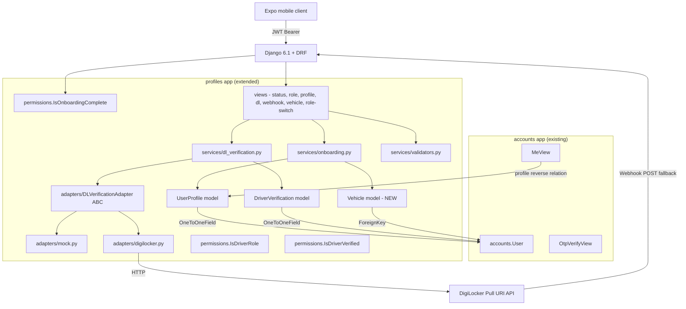
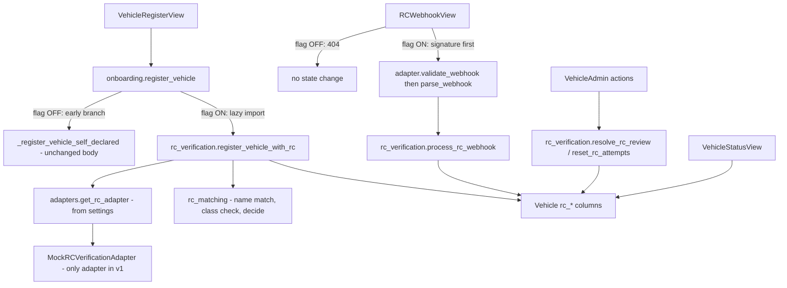

# Architecture: User Onboarding Flow

**ID:** ARCH-002
**Type:** architecture
**Feature:** FEAT-002
**Version:** 5
**Status:** ready
**Date:** 2026-10-17

---

## Context

FEAT-001 established a passwordless phone/OTP authentication layer that produces a `User` row keyed on E.164 phone number and issues a JWT pair. After successful OTP verification a user has only a phone number on record: no role, no name, no demographic data, and no mechanism to vet driving licences. The main Spot Rides experience cannot function without knowing whether the user intends to be a Passenger or a Driver ("Rider" in UI copy), and Driver accounts require a verified Indian driving licence before they can offer rides.

FEAT-002 adds the complete onboarding flow: role selection, personal profile collection, DL verification for Drivers, vehicle registration for Drivers, server-side progress persistence (resumable across devices), and a server-enforced gate that blocks any non-onboarding API call until onboarding is complete.

**v2 changes (2026-10-10):** Requirements v3 added a vehicle registration step to the Driver onboarding flow. Drivers must register a vehicle (registration number + type) after DL verification and before onboarding is complete. This introduces a new `AWAITING_VEHICLE` onboarding state, a new `Vehicle` model, a new API endpoint, and corresponding service/serializer/validator additions.

**v3 changes (2026-10-15):** Requirements v4 (FR-27..FR-50, AC-27..AC-52) adds optional vehicle RC (Registration Certificate) verification behind the feature flag `RC_VERIFICATION_ENABLED`, default OFF. This revision adds the `RCVerificationAdapter` seam (mock only; no real provider), the `pending_rc_verification` state, Vehicle RC columns, an RC status endpoint, an RC webhook, admin review tooling, a `switch_role` fix, and a single shared `next_step` map. It also resolves OQ-R12 (ADR Decisions 16, 20, 21). The v2 statements "no third-party verification of vehicle registration numbers" and "future enhancement could flag duplicates" are superseded by section "v3: Vehicle RC verification" below. The overriding constraint of this revision is that **with the flag OFF the vehicle endpoint behaves exactly as in v2** (ADR Decision 11).

**v4 changes (2026-10-17):** Requirements v6 (FR-43, AC-48, AC-54) replaces the inferred grandfather rule ("no vehicle row while currently `COMPLETE`") with an explicit marker, `UserProfile.vehicle_step_exempt`, added by migration `0004_userprofile_vehicle_step_exempt` (ADR Decision 27). The inferred rule was bypassable through FR-52 (a driver in `awaiting_vehicle` who never submitted a vehicle could switch to passenger, which sets `complete`, and back to driver and become `COMPLETE` without a vehicle). This is a documentation alignment with the implementation; sections changed: Data Model (`UserProfile`), `switch_role`, Admin, Migration / Rollout, Alternatives Considered and Open Decisions (U1).

**v5 changes (2026-10-17):** A gap in the role switch was fixed in code: a `COMPLETE` passenger with no verified DL could not become a driver. `PATCH /api/profile/role/` to `driver` returned `400 dl_required`, but the DL endpoint requires `active_role = driver` and a status of `awaiting_dl` / `pending_verification`, so the user had no way to reach DL submission (a dead end). `switch_role` now starts driver setup instead (`active_role = driver`, `onboarding_status = awaiting_dl`, `next_step = dl_submission`). The same change makes `switch_role` a single implementation for both flag modes (the separate RC-enabled variant was removed), allows the switch to passenger from every non-initial status in both modes, takes a row lock in both modes, and makes a verified-DL webhook advance only a profile that is `pending_verification`. This is a documentation alignment with the implementation (ADR Decision 28). It deliberately changes flag-OFF **role-switch** edge cases; initial onboarding and the vehicle endpoint with the flag OFF are unchanged, so the v3 constraint above still holds for the vehicle endpoint. Sections changed: Onboarding State Machine (role switch), Components (COMP-003, COMP-004), API Contracts (PATCH row, refinements 3 and 5), Service Layer (`switch_role`, `process_webhook_result`), Frontend / Backend Responsibilities, Failure Modes, Security, Migration / Rollout, Alternatives Considered, Risks (RISK-015) and Open Decisions (U3 closed).

ADR decisions made during design are recorded in `docs/decisions/2026-09-23-arch-feat-002-user-onboarding.md` (Decisions 11-26 added for v3, Decision 27 for v4, Decision 28 for v5).

---

## Current State

- `backend/` contains two apps: `accounts` (custom `AUTH_USER_MODEL`, OTP/phone auth, JWT) and `core` (envelope, exceptions, renderers — no models).
- `accounts.User` has fields: `phone_number`, `is_active`, `is_staff`, `date_joined`. No role or profile data.
- `config/settings.py` `DEFAULT_PERMISSION_CLASSES` is `[IsAuthenticated]`.
- `config/urls.py` wires `api/auth/` to `accounts.urls` and `api/health/`.
- The `profiles` app has been partially implemented: `UserProfile`, `DriverVerification` models, onboarding service, DL verification service, validators, adapters, and views for the first 7 endpoints exist.
- (v2 note, superseded) The `Vehicle` model, vehicle registration endpoint and `AWAITING_VEHICLE` status are now implemented in the working tree; migration `0002_add_vehicle.py` is staged but uncommitted.
- `accounts/serializers.py` `UserSerializer` exposes `id`, `phone_number`, `date_joined` only.
- `core.exceptions.ApiError` is the base for all domain errors; `core.exceptions.envelope_exception_handler` is the DRF exception handler.
- Redis is available (used by `accounts` for rate-limiting).
- `python-decouple` is used throughout for env var loading.
- `cryptography` is in `requirements.txt`.

### Verified code facts relevant to v3 (read 2026-10-15)

- **Vehicle step (flag-off path to preserve).** `services/onboarding.py::register_vehicle` requires `AWAITING_VEHICLE`, a verified DL and no active vehicle, creates the `Vehicle`, sets `COMPLETE`, and raises bare `ValueError`. `views.py::VehicleRegisterView` maps those errors by substring (`'dl'` / `'verified'` -> `DLNotVerified`) and hard-codes `next_step: 'none'`. Any new message containing "dl" or "verified" would be mis-mapped.
- **Duplicated `next_step` maps** exist in `OnboardingStatusView`, `ProfileSubmitView` and `DLSubmitView`; `RoleSelectView` and `VehicleRegisterView` hard-code a literal. There is no `compute_next_step` in code although v2 specified one.
- **DL module wiring (not changed by v3).** `dl_verification.py` holds a module-global `_adapter = MockDLVerificationAdapter(...)` that `views.py` imports directly; the adapter call runs inside `@transaction.atomic`; the attempt limit `3` is hardcoded; `DL_*` settings are absent from `config/settings.py`; there is no `_sanitise_rejection_reason`; `MockDLVerificationAdapter.validate_webhook` uses `==` with a guessable default secret.
- **Gate.** `DEFAULT_PERMISSION_CLASSES` uses `core.permissions.ConditionalOnboardingGate`, active only when `ONBOARDING_GATE_ENABLED` is True (default False), and it returns `False`, which DRF renders as a generic `403 permission_denied`. FR-14's `403 onboarding_incomplete` carrying `onboarding_status` and `next_step` is therefore not delivered today. The vehicle views override `permission_classes`, so they are not gated.
- **Envelope.** `core.envelope.error_envelope` emits a closed `error` object `{code, detail, fields, retry_after}`; `core.exceptions.ApiError` cannot carry extra data; DEC-011 requires `data = null` on failure.
- **Logging.** No `profiles` logger is registered in `LOGGING`; records fall through to the root `console` handler (JSON, request-id filter, no redaction). `accounts.logging.JsonFormatter` writes every `extra=` key verbatim, so anything passed as `extra` reaches the log.
- **Migrations.** `profiles/migrations/0002_add_vehicle.py` is staged but uncommitted.
- **`backend/.env.example`.** PLAN-003 states it does not exist. This session could not read or list it (access denied), so existence is unverified; the backend engineer must check and either append to it or create it.
- **Pre-existing flag-off contract discrepancies** (preserved by v3, see ADR Decision 26): serializer validation errors surface as `400 invalid_request` with `error.fields` instead of `invalid_registration_format` / `invalid_vehicle_type` (the exception classes exist but are unused); a Passenger gets `403 permission_denied` from `IsDriverRole` instead of `not_a_driver`; a `COMPLETE` Driver posting a vehicle gets `403 dl_not_verified` (substring match on "DL") instead of `409 vehicle_already_registered`; the response returns the stored upper-case `vehicle_type` ("SEDAN") whereas the contract example is lower-case.

---

## Proposed Solution

Extend the existing **`profiles`** Django app to support vehicle registration as the final step in Driver onboarding. The existing `UserProfile`, `DriverVerification`, service layer, and adapter architecture remain unchanged. The additions are:

1. **New model `Vehicle`** in `profiles/models.py` — ForeignKey to `accounts.User` (not OneToOneField) to support future multi-vehicle, with v1 enforcing max 1 active vehicle at the application layer.
2. **New onboarding status `AWAITING_VEHICLE`** — added to `UserProfile.ONBOARDING_STATUS_CHOICES`, inserted between `PENDING_VERIFICATION`/`AWAITING_DL` and `COMPLETE` in the state machine.
3. **New service function `register_vehicle()`** in `profiles/services/onboarding.py` — validates state, normalizes registration number, creates `Vehicle`, transitions to `COMPLETE`.
4. **New validator `validate_registration_number()`** in `profiles/services/validators.py` — strips spaces/hyphens, uppercases, validates against Indian format `^[A-Z]{2}[0-9]{2}[A-Z]{1,3}[0-9]{1,4}$`.
5. **New serializers** `VehicleRegistrationSerializer` (request) and `VehicleRegistrationResponseSerializer` (response) in `profiles/serializers.py`.
6. **New view `VehicleRegisterView`** in `profiles/views.py` — `POST /api/onboarding/driver/vehicle/`.
7. **Updated URL routing** in `profiles/urls.py` — adds the vehicle endpoint.
8. **New exception classes** `InvalidRegistrationFormat`, `InvalidVehicleType`, `DLNotVerified`, `VehicleAlreadyRegistered` in `profiles/exceptions.py`.
9. **Updated state transitions** in `submit_dl_verification()` and `process_webhook_result()` — DL verified now transitions to `AWAITING_VEHICLE` instead of `COMPLETE`.
10. **Updated `next_step` mapping** — adds `vehicle_registration` for `AWAITING_VEHICLE` state.

Key design decisions (all detailed in the ADR):
1. **DL normalisation** — input is stripped and uppercased before regex validation.
2. **`UserProfile` creation** — lazy, via `get_or_create` in the onboarding service on first contact.
3. **DL storage** — Fernet symmetric encryption (`DL_ENCRYPTION_KEY` env var) for the full DL number; last-4 plaintext in `dl_number_display`.
4. **Onboarding gate** — DRF permission class `IsOnboardingComplete`; onboarding views opt out by declaring `permission_classes = [IsAuthenticated]`.
5. **`DriverVerification` placement** — inside `profiles` app.
6. **DL adapter interface** — abstract class `DLVerificationAdapter` with concrete mock adapter for dev/test and `DigiLockerDLVerificationAdapter` for production.
7. **Vehicle model uses ForeignKey** (not OneToOneField) — allows future multi-vehicle support while v1 enforces max 1 active vehicle at the application layer.
8. **Vehicle registration numbers stored plaintext** — they are publicly visible on vehicles; no encryption needed.
9. **Vehicle registration number normalisation** — strip spaces/hyphens, uppercase before validation (same normalisation philosophy as DL numbers, see ADR Decision 1).

### v3: Vehicle RC verification

Add an optional, provider-agnostic RC verification step to the existing vehicle step. Everything RC-specific lives in new modules (`adapters` additions, `services/rc_verification.py`, `services/rc_matching.py`, `services/sanitise.py`); the existing modules gain only small, additive changes.

**Design rules**

1. **Flag-off isolation.** `register_vehicle()` in `services/onboarding.py` becomes a two-line dispatcher: if `settings.RC_VERIFICATION_ENABLED` is falsy, call `_register_vehicle_self_declared()` (the current function body, moved verbatim, same `@transaction.atomic`, same `ValueError` messages, same `(profile, vehicle)` return); otherwise lazily import and call `rc_verification.register_vehicle_with_rc()`. The RC module is not imported, no RC setting other than the flag is read, no adapter is built, and no RC column is written on the flag-off path. The flag is read at call time (never cached at import) so `override_settings` works and a restart-free toggle is not required in tests.
2. **Same return type, no view branching.** The flag-on path also returns `(profile, vehicle)`. RC results travel on the `Vehicle` row (`rc_verification_status`, `rc_rejection_reason`, `rc_verification_ref`), which are `NULL` on the flag-off path, so the view builds one response shape (the additive fields are `null` when the flag is off). The only flag-on exception is a rejection, raised as a domain error (rule 5).
3. **RC rules live in the service layer.** Name matching, class mapping and the verified/pending/rejected decision are pure functions in `rc_matching.py`, independent of any provider.
4. **Provider call outside the DB transaction.** The flag-on service uses three phases: guard (short transaction), provider call (no transaction open), decide-and-persist (short transaction). Views must not be wrapped in a transaction (`ATOMIC_REQUESTS` stays False).
5. **Domain exceptions only.** New code raises `ApiError` subclasses with stable codes. `ApiError` is not a `ValueError`, so the legacy `except ValueError` substring mapping in the vehicle view is never reached by RC errors and is left untouched.
6. **Adapter obtained from settings** via `get_rc_adapter()` (a factory), never from a module global.
7. **No PII in logs or responses.** Owner name is stored for staff review only; logging uses an allow-list of fields.
8. **Existing drivers untouched.** No backfill, no state change; `rc_verification_status = NULL` means legacy/self-declared and is treated as acceptable for `COMPLETE`.

Key v3 decisions are recorded in ADR Decisions 11-26.

---

## Diagram


```mermaid
graph TD
    Client[Expo mobile client] -->|JWT Bearer| DRF[Django 6.1 + DRF]

    subgraph "accounts app (existing)"
        User[accounts.User]
        OtpVerifyView
        MeView
    end

    subgraph "profiles app (extended)"
        UP[UserProfile model]
        DV[DriverVerification model]
        VH[Vehicle model - NEW]
        OnboardingService[services/onboarding.py]
        DLService[services/dl_verification.py]
        Validators[services/validators.py]
        Adapter[adapters/DLVerificationAdapter ABC]
        MockAdapter[adapters/mock.py]
        DigiLockerAdapter[adapters/digilocker.py]
        IsOnboardingComplete[permissions.IsOnboardingComplete]
        IsDriverRole[permissions.IsDriverRole]
        IsDriverVerified[permissions.IsDriverVerified]
        OnboardingViews[views - status, role, profile, dl, webhook, vehicle, role-switch]
    end

    DRF --> IsOnboardingComplete
    DRF --> OnboardingViews
    OnboardingViews --> OnboardingService
    OnboardingViews --> DLService
    OnboardingViews --> Validators
    OnboardingService --> UP
    OnboardingService --> VH
    DLService --> DV
    DLService --> Adapter
    Adapter --> MockAdapter
    Adapter --> DigiLockerAdapter
    DigiLockerAdapter -->|HTTP| DigiLocker[DigiLocker Pull URI API]
    DigiLocker -->|Webhook POST fallback| DRF
    UP -->|OneToOneField| User
    DV -->|OneToOneField| User
    VH -->|ForeignKey| User
    MeView -->|profile reverse relation| UP
```

### Onboarding State Machine

**Passenger path (unchanged):**
```
NOT_STARTED → (role selected) → ROLE_SELECTED → (profile submitted) → COMPLETE
```

**Driver path (synchronous DL verification — primary flow with DigiLocker):**
```
NOT_STARTED
  → (role selected) →
ROLE_SELECTED
  → (profile submitted) →
AWAITING_DL
  → (DL verified synchronously) →
AWAITING_VEHICLE
  → (vehicle registered) →
COMPLETE
```

**Driver path (async/timeout fallback):**
```
AWAITING_DL
  → (DL submitted, provider timeout) →
PENDING_VERIFICATION
  → (DL verified via webhook or retry) →
AWAITING_VEHICLE
  → (vehicle registered) →
COMPLETE
```


### v3 state machine: vehicle step

New onboarding status `PENDING_RC_VERIFICATION` (`pending_rc_verification`, 24 chars, fits `CharField(30)`), `next_step = "awaiting_rc_verification"`. It is reachable only while the flag is ON. The Driver-path states before the vehicle step are unchanged.

**Flag OFF (identical to v2):**
```
AWAITING_VEHICLE --POST vehicle--> COMPLETE        (next_step = "none", rc_verification_status = NULL)
```

**Flag ON:**
```
AWAITING_VEHICLE --POST vehicle: provider verified + name match + class ok/unknown--> COMPLETE
AWAITING_VEHICLE --POST vehicle: provider pending | timeout | verified-but-name-not-match--> PENDING_RC_VERIFICATION
AWAITING_VEHICLE --POST vehicle: provider rejected | class conflict--> AWAITING_VEHICLE   (same Vehicle row reused on resubmit)
AWAITING_VEHICLE --POST vehicle: provider error--> AWAITING_VEHICLE   (no Vehicle row written, no attempt consumed)
PENDING_RC_VERIFICATION --webhook verified (name match, class ok) | admin approve--> COMPLETE
PENDING_RC_VERIFICATION --webhook rejected | class conflict | admin reject--> AWAITING_VEHICLE
AWAITING_VEHICLE (attempts exhausted) --admin reset attempts--> AWAITING_VEHICLE (resubmit allowed)
AWAITING_VEHICLE (attempts exhausted) --admin approve--> COMPLETE
```

**Resolution rule shared by webhook and admin.** A resolution changes `onboarding_status` only if the profile is currently `PENDING_RC_VERIFICATION` (or `AWAITING_VEHICLE` for an admin approve of a rejected vehicle). If the user has since switched to passenger and is `COMPLETE`, the vehicle status changes but `onboarding_status` is left alone, so a passenger is never moved into `awaiting_vehicle` by a driver-side resolution.

**Vehicle-level status (`Vehicle.rc_verification_status`):** `NULL` (legacy / flag off) | `pending` | `verified` | `rejected`. `NULL` is never produced by the flag-on path and is treated as acceptable-for-`COMPLETE` by `switch_role`.

### v5 state machine: role switch (`PATCH /api/profile/role/`)

Entry guard: the profile must be in one of `complete`, `awaiting_dl`, `pending_verification`, `awaiting_vehicle`, `pending_rc_verification` (`_SWITCH_ELIGIBLE_STATUSES`). `not_started` and `role_selected` get `403 onboarding_incomplete`. Every non-initial status is included so that a user who started driver setup can always get back to passenger. Behaviour is the same with `RC_VERIFICATION_ENABLED` ON or OFF except where stated.

**To passenger (both flag modes):**
```
{complete | awaiting_dl | pending_verification | awaiting_vehicle | pending_rc_verification}
  --PATCH role=passenger--> COMPLETE     (active_role = passenger; DriverVerification and Vehicle rows kept)
```

**To driver (from `active_role = passenger`):**
```
no DriverVerification row, or DL rejected  --> AWAITING_DL            (200, next_step = dl_submission)
DL pending                                 --> PENDING_VERIFICATION   (202, next_step = awaiting_verification)
DL verified, status derived from vehicle   --> COMPLETE | PENDING_RC_VERIFICATION | AWAITING_VEHICLE   (200)
```

After `AWAITING_DL` the normal driver path applies unchanged (`AWAITING_DL --DL submitted--> AWAITING_VEHICLE | PENDING_VERIFICATION`, then the vehicle and, flag ON, RC states above). The DL attempt limit still applies and toggling roles does not reset `DriverVerification.attempt_count`.

**Webhook interplay.** A verified DL webhook sets the `DriverVerification` row to verified and advances the profile to `AWAITING_VEHICLE` only if the profile is currently `PENDING_VERIFICATION`. A `COMPLETE` passenger who still has a pending DL stays `COMPLETE` (not pushed behind the onboarding gate); a later switch to driver then derives the status from the vehicle.


```mermaid
graph TD
    VV[VehicleRegisterView] --> OB[onboarding.register_vehicle]
    OB -->|flag OFF: early branch| SD[_register_vehicle_self_declared - unchanged body]
    OB -->|flag ON: lazy import| RCS[rc_verification.register_vehicle_with_rc]
    RCS --> F[adapters.get_rc_adapter - from settings]
    F --> MK[MockRCVerificationAdapter - only adapter in v1]
    RCS --> RM[rc_matching - name match, class check, decide]
    RCS --> VH[Vehicle rc_* columns]
    WH[RCWebhookView] -->|flag OFF: 404| X[no state change]
    WH -->|flag ON: signature first| AD[adapter.validate_webhook then parse_webhook]
    AD --> RCW[rc_verification.process_rc_webhook]
    ADM[VehicleAdmin actions] --> RCR[rc_verification.resolve_rc_review / reset_rc_attempts]
    RCW --> VH
    RCR --> VH
    SV[VehicleStatusView] --> VH
```

---

## Module Layout

```
backend/
  requirements.txt          # +cryptography (already added)
  config/
    settings.py             # modified: INSTALLED_APPS, DEFAULT_PERMISSION_CLASSES, DL_* env vars
    urls.py                 # modified: include('profiles.urls')
  accounts/
    serializers.py          # modified: UserSerializer gains onboarding_status, active_role fields
  profiles/                 # EXTENDED app
    __init__.py
    apps.py
    admin.py                # UserProfile (staff-only), DriverVerification (staff-only), Vehicle (staff-only)
    models.py               # UserProfile (modified: +AWAITING_VEHICLE), DriverVerification, Vehicle (NEW)
    serializers.py          # Existing serializers + VehicleRegistrationSerializer (NEW),
                            # VehicleRegistrationResponseSerializer (NEW)
    views.py                # Existing views + VehicleRegisterView (NEW)
    urls.py                 # existing routes + vehicle endpoint (NEW)
    permissions.py          # IsOnboardingComplete, IsDriverRole, IsDriverVerified
    exceptions.py           # Existing exceptions + InvalidRegistrationFormat (NEW),
                            # InvalidVehicleType (NEW), DLNotVerified (NEW),
                            # VehicleAlreadyRegistered (NEW)
    services/
      __init__.py
      onboarding.py         # Existing functions + register_vehicle (NEW)
      dl_verification.py    # Modified: DL verified → AWAITING_VEHICLE (not COMPLETE)
      validators.py         # Existing validators + validate_registration_number (NEW)
    adapters/
      __init__.py           # get_dl_adapter() factory
      base.py               # DLVerificationAdapter ABC, DLVerificationResult dataclass
      mock.py               # MockDLVerificationAdapter (dev/test)
      digilocker.py         # DigiLockerDLVerificationAdapter (production)
    utils/
      __init__.py
      crypto.py             # encrypt_dl(), decrypt_dl() using Fernet + DL_ENCRYPTION_KEY
    migrations/
      0001_initial.py       # existing: UserProfile, DriverVerification
      0002_add_vehicle.py   # NEW: Vehicle model + AWAITING_VEHICLE status choice
```

### v3 additions to the module layout

```
backend/
  config/settings.py              # + RC_* settings, RC_MOCK_ADAPTER_FORBIDDEN, startup validation (flag ON only)
  core/
    envelope.py                   # error_envelope(..., extra=None)  (additive, DEC-011 amendment)
    exceptions.py                 # ApiError(detail, retry_after, extra=None); handler passes extra through
    permissions.py                # ConditionalOnboardingGate raises OnboardingIncomplete with status + next_step
  profiles/
    models.py                     # Vehicle: +12 rc_* columns, indexes, constraint, permission; UserProfile: +PENDING_RC_VERIFICATION
    permissions.py                # + RequireDriverRole (raises NotADriver)
    exceptions.py                 # + RC domain errors (see "Exceptions")
    serializers.py                # extended response serializers, + VehicleStatusSerializer
    views.py                      # VehicleRegisterView (response fields, 202), + VehicleStatusView, + RCWebhookView; shared next_step
    urls.py                       # + vehicle/status/, + vehicle/rc/webhook/
    admin.py                      # VehicleAdmin review queue and actions
    adapters/
      __init__.py                 # + get_rc_adapter()
      base.py                     # + RCVerificationResult, RCVerificationAdapter, RCAdapterError
      mock.py                     # + MockRCVerificationAdapter
    services/
      onboarding.py               # register_vehicle dispatcher, _register_vehicle_self_declared, switch_role, NEXT_STEP_BY_STATUS, compute_next_step
      rc_verification.py          # NEW: submit, webhook, admin resolution, status, derive_driver_status
      rc_matching.py              # NEW: pure functions (owner-name match, class check, decision)
      sanitise.py                 # NEW: sanitise_reason()
    migrations/
      0003_vehicle_rc_verification.py   # NEW, generated by makemigrations (not squashed into 0002)
      0004_userprofile_vehicle_step_exempt.py   # NEW (v4): AddField + RunPython marking grandfathered drivers
```

---

## Components

| ID | Name | Responsibility | Changes |
|----|------|----------------|---------|
| COMP-001 | `profiles.models.UserProfile` | Stores onboarding state machine status, active role, and personal profile fields for every user. OneToOneField on `accounts.User`. | Modified: add `AWAITING_VEHICLE` to `ONBOARDING_STATUS_CHOICES`; v4: add `vehicle_step_exempt` grandfather marker |
| COMP-002 | `profiles.models.DriverVerification` | Stores DL submission state, encrypted DL number, last-4 display, provider reference ID, attempt count, and verification timestamps. OneToOneField on `accounts.User`. | Unchanged |
| COMP-003 | `profiles.services.onboarding` | State machine transitions: get-or-create profile, set role, set profile details, register vehicle, switch role, derive next_step. No HTTP concerns. | Modified: add `register_vehicle()` function; v5: single `switch_role` for both flag modes (row lock, driver setup start, `_SWITCH_ELIGIBLE_STATUSES`) |
| COMP-004 | `profiles.services.dl_verification` | DL format normalisation and validation, adapter invocation, timeout handling, webhook processing (idempotent), attempt counting. No HTTP concerns. | Modified: DL verified transitions to `AWAITING_VEHICLE` instead of `COMPLETE`; v5: the webhook advances only a `PENDING_VERIFICATION` profile |
| COMP-005 | `profiles.adapters.base` | `DLVerificationAdapter` ABC + `DLVerificationResult` dataclass. Defines the contract the service uses; concrete providers implement this. | Unchanged |
| COMP-006 | `profiles.adapters.mock` | `MockDLVerificationAdapter` returns a configurable result (`verified`, `pending`, `rejected`) without calling any external service. Used in dev and tests. | Unchanged |
| COMP-007 | `profiles.permissions` | `IsOnboardingComplete` (gate for all protected non-onboarding endpoints), `IsDriverRole` (driver-only endpoints), `IsDriverVerified` (ride-offer endpoints). | Unchanged |
| COMP-008 | `profiles.exceptions` | Domain error subclasses of `core.exceptions.ApiError`, covering every error code defined in the API contract. | Modified: add `InvalidRegistrationFormat`, `InvalidVehicleType`, `DLNotVerified`, `VehicleAlreadyRegistered` |
| COMP-009 | `profiles.utils.crypto` | `encrypt_dl(plaintext) -> str` and `decrypt_dl(ciphertext) -> str` using Fernet with key from `DL_ENCRYPTION_KEY` env var. | Unchanged |
| COMP-010 | `profiles.views` | Thin DRF `APIView` subclasses. Validate input with serializers, delegate business logic to service layer, return bare data for envelope rendering. | Modified: add `VehicleRegisterView` |
| COMP-011 | `profiles.urls` | URL routing for all onboarding and profile endpoints. | Modified: add `onboarding/driver/vehicle/` route |
| COMP-012 | `accounts.serializers.UserSerializer` | Extended with `onboarding_status` and `active_role` as nullable `SerializerMethodField` values reading the `profile` reverse relation. | Modified (from v1, unchanged in v2) |
| COMP-013 | `config.settings` | `INSTALLED_APPS` gains `profiles`. `DEFAULT_PERMISSION_CLASSES` gains `IsOnboardingComplete`. New env vars: `DL_ENCRYPTION_KEY`, `DL_ADAPTER_CLASS`, `DL_WEBHOOK_SECRET`, `DL_PROVIDER_TIMEOUT_SECONDS`, `DL_MAX_ATTEMPTS`. | Modified (from v1, unchanged in v2) |
| COMP-014 | `config.urls` | `include('profiles.urls')` added under `api/`. | Modified (from v1, unchanged in v2) |
| COMP-015 | `profiles.models.Vehicle` | Stores vehicle registration number (plaintext), vehicle type, and active status. ForeignKey on `accounts.User` (supports future multi-vehicle). | New |
| COMP-016 | `profiles.services.validators` | Input validation functions for DL format, age, name, and vehicle registration number. | Modified: add `validate_registration_number()` |
| COMP-017 | `profiles.adapters.base` (RC additions) | `RCVerificationResult` dataclass, `RCVerificationAdapter` ABC (`from_settings`, `verify`, `validate_webhook`, `parse_webhook`), `RCAdapterError`. | New |
| COMP-018 | `profiles.adapters.mock.MockRCVerificationAdapter` | Six configurable modes, HMAC-verified webhook, no network. Dev/test only. | New |
| COMP-019 | `profiles.adapters.get_rc_adapter` | Settings-driven factory (`RC_ADAPTER_CLASS` -> `from_settings`), refuses the mock when `RC_MOCK_ADAPTER_FORBIDDEN`. | New |
| COMP-020 | `profiles.services.rc_verification` | Flag-on vehicle submission (three phases), webhook processing, admin resolution/reset, status read, `derive_driver_status`. | New |
| COMP-021 | `profiles.services.rc_matching` | Pure functions: owner-name classification, vehicle-class check, outcome decision. | New |
| COMP-022 | `profiles.services.sanitise` | `sanitise_reason()`: strip markup/control chars, redact owner name, truncate to 500. | New |
| COMP-023 | `core.envelope` / `core.exceptions` | Optional `extra` data on `ApiError`, merged into the `error` object. | Modified (additive) |
| COMP-024 | `core.permissions.ConditionalOnboardingGate` | Raises `OnboardingIncomplete` carrying `onboarding_status` and `next_step` instead of returning `False`. | Modified |
| COMP-025 | `profiles.admin.VehicleAdmin` | RC review queue: filters, duplicate indicator, approve/reject/reset actions, audit via admin `LogEntry`. | Modified |

**v3 changes to existing components:** COMP-001 (`UserProfile`: +`PENDING_RC_VERIFICATION`), COMP-003 (`onboarding`: dispatcher, `switch_role`, shared `NEXT_STEP_BY_STATUS`/`compute_next_step`), COMP-008 (`exceptions`: RC errors), COMP-010/COMP-011 (`views`/`urls`: status and webhook endpoints, response fields), COMP-013 (`settings`: RC settings and startup validation), COMP-015 (`Vehicle`: RC columns). COMP-002, COMP-004, COMP-005, COMP-006, COMP-009 are untouched (the DL module's global adapter, in-transaction provider call and missing `DL_*` settings are explicitly NOT fixed here, ADR Decision 26).

---

## Data Model

### `profiles.UserProfile`

```
Column               Type                              Notes
----------------------------------------------------------------------
id                   BigAutoField                      PK
user                 OneToOneField -> accounts.User    CASCADE, related_name="profile"
active_role          CharField(10, nullable)           choices: DRIVER | PASSENGER; null until step 1
first_name           CharField(50, nullable)           null until step 2; Unicode letters/space/hyphen/apostrophe
last_name            CharField(50, nullable)           null until step 2; same charset
age                  PositiveSmallIntegerField(null)   18-80 inclusive; null until step 2
gender               CharField(20, nullable)           choices: MALE | FEMALE | OTHER | PREFER_NOT_TO_SAY; null until step 2
onboarding_status    CharField(30)                     choices: NOT_STARTED | ROLE_SELECTED | AWAITING_DL |
                                                        PENDING_VERIFICATION | AWAITING_VEHICLE | COMPLETE
                                                        default: NOT_STARTED
vehicle_step_exempt  BooleanField                      default=False, db_default=False (v4, migration 0004);
                                                        grandfathered-driver marker, see below
created_at           DateTimeField(auto_now_add)
updated_at           DateTimeField(auto_now)
```

**v2 change:** `AWAITING_VEHICLE` added to `onboarding_status` choices between `PENDING_VERIFICATION` and `COMPLETE`.

**v4 change (`vehicle_step_exempt`).** Marks a driver who completed onboarding before the vehicle step existed (FR-43). It is set only by the data step in migration `0004` (profiles that are `complete`, have a `DriverVerification` row and have no `is_active` `Vehicle` row); no application code path and no admin form sets it (read-only in `UserProfileAdmin`). It is read only by `derive_driver_status` when the driver has no active vehicle row. `db_default=False` keeps a still-running older process safe between migrate and deploy.

Constraints and indexes:
- `UNIQUE (user_id)` — enforced by `OneToOneField`; prevents duplicate profiles from concurrent requests
- Index on `onboarding_status` (`idx_profile_status`) for admin queries

### `profiles.DriverVerification`

```
Column                   Type                              Notes
----------------------------------------------------------------------
id                       BigAutoField                      PK
user                     OneToOneField -> accounts.User    CASCADE, related_name="driver_verification"
dl_number                CharField(256)                    Fernet-encrypted ciphertext of normalised DL;
                                                            length 256 accommodates base64-encoded Fernet token
dl_number_display        CharField(4)                      Last 4 chars of normalised plaintext DL; always plaintext
dl_verification_status   CharField(20)                     choices: PENDING | VERIFIED | REJECTED
dl_verification_ref      CharField(100, nullable)          Provider-issued reference ID (async path)
dl_submitted_at          DateTimeField                     Timestamp of most recent submission
dl_verified_at           DateTimeField(nullable)           Timestamp of verification confirmation
dl_rejection_reason      TextField(nullable)               Provider-supplied reason; sanitised before storage
attempt_count            PositiveSmallIntegerField         Default 0; incremented on each POST /api/onboarding/driver/dl/
created_at               DateTimeField(auto_now_add)
updated_at               DateTimeField(auto_now)
```

Constraints and indexes:
- `UNIQUE (user_id)` — enforced by `OneToOneField`
- `UNIQUE (dl_verification_ref)` where not null — prevents duplicate webhook processing; implemented as a partial unique index: `UniqueConstraint(fields=['dl_verification_ref'], condition=Q(dl_verification_ref__isnull=False), name='uq_dl_verification_ref')`

### `profiles.Vehicle` (NEW in v2)

```python
class Vehicle(models.Model):
    class VehicleType(models.TextChoices):
        CAR = 'CAR', 'Car'
        SUV = 'SUV', 'SUV'
        HATCHBACK = 'HATCHBACK', 'Hatchback'
        SEDAN = 'SEDAN', 'Sedan'
        AUTO_RICKSHAW = 'AUTO_RICKSHAW', 'Auto Rickshaw'
        BIKE = 'BIKE', 'Bike'

    user = models.ForeignKey(settings.AUTH_USER_MODEL, on_delete=models.CASCADE, related_name='vehicles')
    registration_number = models.CharField(max_length=15)
    vehicle_type = models.CharField(max_length=20, choices=VehicleType.choices)
    is_active = models.BooleanField(default=True)
    created_at = models.DateTimeField(auto_now_add=True)
    updated_at = models.DateTimeField(auto_now=True)

    class Meta:
        indexes = [models.Index(fields=['user', 'is_active'])]
```

```
Column               Type                              Notes
----------------------------------------------------------------------
id                   BigAutoField                      PK
user                 ForeignKey -> accounts.User       CASCADE, related_name="vehicles"
registration_number  CharField(15)                     Indian vehicle registration number; stored plaintext (FR-31)
vehicle_type         CharField(20)                     choices: CAR | SUV | HATCHBACK | SEDAN | AUTO_RICKSHAW | BIKE
is_active            BooleanField                      default True; for future multi-vehicle support
created_at           DateTimeField(auto_now_add)
updated_at           DateTimeField(auto_now)
```

Design notes:
- **ForeignKey (not OneToOneField)**: Allows future multi-vehicle support. In v1, max 1 active vehicle per user is enforced at the application layer (service function checks `user.vehicles.filter(is_active=True).exists()` before creating). See ADR Decision 8.
- **Plaintext storage**: Vehicle registration numbers are publicly visible on vehicles. No encryption needed (FR-31).
- **No uniqueness constraint on `registration_number`**: Two different Drivers may submit the same registration number. (v3: a non-unique index, a flag-on WARNING log and an admin duplicate indicator are added; see v3 data changes.)
- **Composite index on `(user, is_active)`**: Optimizes the common query pattern of "get active vehicles for a user".

### v3 data changes

**`UserProfile.onboarding_status`** gains `PENDING_RC_VERIFICATION = 'pending_rc_verification'` ("Pending RC Verification"). Choices change only; no data migration.

**`Vehicle` RC columns** (all nullable or defaulted; additive; supersedes the v2 note "no uniqueness constraint ... future enhancement could flag duplicates"):

```
Column                    Type                         Notes
----------------------------------------------------------------------------------------------
rc_verification_status    CharField(20, null)          pending | verified | rejected; NULL = legacy / flag off
rc_verification_ref       CharField(100, null)         provider reference; partial unique when not null
rc_submitted_at           DateTimeField(null)          most recent submission
rc_verified_at            DateTimeField(null)          provider or staff verification time
rc_rejection_reason       TextField(null)              sanitised, max 500 chars; driver-visible
rc_attempt_count          PositiveSmallIntegerField    default=0 AND db_default=0 (see migration notes)
rc_owner_name             CharField(100, null)         PII, staff-only; written only when needed for review
rc_name_match             CharField(15, null)          match | partial | mismatch | not_checked
rc_vehicle_class          CharField(50, null)          provider class string (clipped to 50)
rc_fuel_type              CharField(30, null)          clipped to 30
rc_fitness_valid_upto     DateField(null)              informational only (FR-48)
rc_insurance_valid_upto   DateField(null)              informational only (FR-48)
```

Constants on `Vehicle`: `RC_PENDING/RC_VERIFIED/RC_REJECTED`, `NAME_MATCH/NAME_PARTIAL/NAME_MISMATCH/NAME_NOT_CHECKED`, with `*_CHOICES` lists.

Meta additions:
- `Index(fields=['registration_number'], name='idx_vehicle_regno')` (non-unique, FR-46; also serves the admin duplicate count).
- `Index(fields=['rc_verification_status'], name='idx_vehicle_rc_status')` (review queue).
- `UniqueConstraint(fields=['rc_verification_ref'], condition=Q(rc_verification_ref__isnull=False), name='uq_vehicle_rc_verification_ref')` (mirrors `uq_dl_verification_ref`).
- `permissions = [('review_rc', 'Can review and resolve RC verification')]` (gates the admin actions to a reviewer group rather than all staff).
- Existing `Index(['user', 'is_active'])` retained.

**Data handling.** The raw provider payload is never stored. `rc_owner_name` is written only when the vehicle goes to name review (outcome `pending` with `rc_name_match != match`); for a `match` the name is redundant and is not stored; for a provider rejection no owner is stored. All provider strings are clipped to their column width before saving so an over-long value can never cause a 500. A provider `reference_id` longer than 100 characters is treated as a provider error (it cannot be stored faithfully for webhook lookup). Retention of `rc_owner_name` is open (OQ-R7); the code keeps a single call site (`_clear_owner_data(vehicle)`) so a purge-on-resolution policy is a one-line change.

**Why `db_default`.** The migration runs before the new code is deployed. `AddField(default=0)` alone makes Django drop the DB default after back-filling, so a still-running v2 process inserting a `Vehicle` would hit a `NOT NULL` violation on `rc_attempt_count`. `db_default=0` keeps the default in PostgreSQL. All other new columns are nullable.

**Migration `0003_vehicle_rc_verification`** (generated with `makemigrations profiles`, depends on `0002_add_vehicle`): `AlterField(userprofile.onboarding_status)`, 12 `AddField`, 2 `AddIndex`, 1 `AddConstraint`, `AlterModelOptions(vehicle, permissions)`. No `RunPython`; legacy rows keep `NULL` / `0`. Reversible. **Decision: do not squash into 0002** (ADR Decision 22).

### `accounts.User` — no schema change

`onboarding_status` and `active_role` are derived from `UserProfile` at serialization time. No new columns on `accounts_user`.

---

## API Contracts

All contracts from the requirements document are adopted without change. The refinements and ambiguity resolutions below are the only delta.

| Method | Path | Auth | Permission | Notes |
|--------|------|------|------------|-------|
| GET | `/api/onboarding/status/` | JWT | `IsAuthenticated` only | Creates profile lazily if absent |
| POST | `/api/onboarding/role/` | JWT | `IsAuthenticated` only | Only valid in `NOT_STARTED` state |
| POST | `/api/onboarding/profile/` | JWT | `IsAuthenticated` only | Only valid in `ROLE_SELECTED` state |
| POST | `/api/onboarding/driver/dl/` | JWT | `IsAuthenticated`, `IsDriverRole` | Only valid in `AWAITING_DL` or `REJECTED` states |
| GET | `/api/onboarding/driver/dl/status/` | JWT | `IsAuthenticated`, `IsDriverRole` | |
| POST | `/api/onboarding/driver/dl/webhook/` | None (signature) | `AllowAny` + in-view signature check | Exempt from `IsOnboardingComplete` |
| POST | `/api/onboarding/driver/vehicle/` | JWT | `IsAuthenticated`, `IsDriverRole` | **NEW** — only valid in `AWAITING_VEHICLE` state |
| PATCH | `/api/profile/role/` | JWT | `IsAuthenticated` only (`IsOnboardingComplete` is deliberately not applied so users mid-driver-setup can switch back) | v5: callable from `complete`, `awaiting_dl`, `pending_verification`, `awaiting_vehicle`, `pending_rc_verification`; `403 onboarding_incomplete` from `not_started` / `role_selected`. Always returns `next_step`. See "`switch_role`" |
| GET | `/api/auth/me/` | JWT | `IsAuthenticated` only (existing endpoint) | Amended: adds `onboarding_status`, `active_role` |

### Contract refinements vs requirements doc

1. **`POST /api/onboarding/driver/dl/` on sync verified** — DL verified now transitions to `onboarding_status=AWAITING_VEHICLE` with `next_step="vehicle_registration"` (not `COMPLETE`). The Driver must still complete vehicle registration.

2. **`POST /api/onboarding/driver/dl/` on timeout** — The provider adapter wraps all provider calls in a configurable timeout (`DL_PROVIDER_TIMEOUT_SECONDS`, default 5s). On timeout, the service saves `dl_verification_status=PENDING`, `onboarding_status=PENDING_VERIFICATION` and returns `202 Accepted` (same as the async path). No `500` reaches the client (NFR-REL-01, AC-19).

3. **Webhook verified result** — `process_webhook_result()` on verified now sets `onboarding_status=AWAITING_VEHICLE` (not `COMPLETE`), but (v5) only when the profile is currently `PENDING_VERIFICATION`; a profile in any other status (for example a `COMPLETE` passenger who still had a pending DL) keeps its status while the `DriverVerification` row becomes verified. The Driver must still complete vehicle registration before onboarding is fully complete.

4. **Webhook `403` before any DB read** — `DLWebhookView.post()` calls `self.adapter.validate_webhook(request.headers, request.body)` as the very first operation. If it returns `False`, the view raises `403` before any query (NFR-SEC-02, AC-18).

5. **`PATCH /api/profile/role/` — no more `dl_required` (v5)** — Earlier revisions returned `400 dl_required` (`DLRequired`) when a user without a verified DL asked for `driver`. That was a dead end, because the DL endpoint requires the driver role and status `awaiting_dl` / `pending_verification`, which such a user could not reach. The endpoint now sets `active_role = driver`, `onboarding_status = awaiting_dl` and returns `200` with `next_step = dl_submission` (a pending DL keeps `pending_verification` and returns `202`). `DLRequired` is no longer raised anywhere (the class remains in `profiles/exceptions.py`, unused) and `dl_required` is no longer a response code. `next_step` is always present in this response. `400 invalid_onboarding_state` remains for one inconsistent legacy case (see `switch_role`). ADR Decision 28.

6. **`dl_rejection_reason` sanitisation** — Provider-supplied strings are truncated to 500 characters and stripped of HTML before storage. The exact sanitisation function is in `profiles/services/dl_verification.py::_sanitise_rejection_reason()`.

7. **`409 already_processed` on duplicate webhook** — When a webhook arrives for a `reference_id` already in a terminal state (`VERIFIED` or `REJECTED`), `process_webhook()` returns early and the view responds `409`. This satisfies NFR-REL-02 and AC-09.

8. **`POST /api/onboarding/driver/vehicle/` validation** — Registration number is normalised (strip spaces/hyphens, uppercase) before regex validation. Invalid format returns `400 invalid_registration_format`. Invalid vehicle type returns `400 invalid_vehicle_type`. Driver without verified DL returns `403 dl_not_verified`. Already-registered vehicle returns `409 vehicle_already_registered`.

### Vehicle endpoint detail

**`POST /api/onboarding/driver/vehicle/`**

Request:
```json
{
  "registration_number": "MH01AB1234",
  "vehicle_type": "sedan"
}
```

Response `200 OK`:
```json
{
  "onboarding_status": "complete",
  "next_step": "none",
  "vehicle": {
    "registration_number": "MH01AB1234",
    "vehicle_type": "sedan"
  }
}
```

Errors:
- `400 invalid_registration_format` — registration number does not match `^[A-Z]{2}[0-9]{2}[A-Z]{1,3}[0-9]{1,4}$`
- `400 invalid_vehicle_type` — value not in allowed set
- `403 not_a_driver` — endpoint called by a Passenger account
- `403 dl_not_verified` — Driver's DL is not in `verified` state
- `409 vehicle_already_registered` — Driver has already registered a vehicle during onboarding


### v3 API additions

| Method | Path | Auth | Permission | Notes |
|--------|------|------|------------|-------|
| POST | `/api/onboarding/driver/vehicle/` | JWT | `IsAuthenticated`, `IsDriverRole` (unchanged) | Flag OFF: unchanged. Flag ON: RC flow, may return 202 / 422 / 429. Response gains nullable `rc_verification_status`, `rejection_reason`, `reference_id`. |
| GET | `/api/onboarding/driver/vehicle/status/` | JWT | `IsAuthenticated`, `RequireDriverRole` | New. Not blocked by the onboarding gate (explicit `permission_classes`). Flag OFF: `rc_verification_status` and `rc_attempts_remaining` are `null`. |
| POST | `/api/onboarding/driver/vehicle/rc/webhook/` | None (HMAC signature) | `AllowAny`, `authentication_classes = []` | New. Flag OFF: `404`, nothing read, nothing changed. Flag ON: signature checked before any DB access. |
| GET | `/api/onboarding/status/` | JWT | unchanged | Gains nullable `rc_verification_status` (always `null` when the flag is OFF; no vehicle query is made in that case). |
| PATCH | `/api/profile/role/` | JWT | unchanged | May return `onboarding_status` `awaiting_dl` / `pending_verification` / `awaiting_vehicle` / `pending_rc_verification` / `complete`; `next_step` is always returned (v5). Same behaviour in both flag modes except that `pending_rc_verification` is only derived with the flag ON. |

**Outcome mapping for `POST /api/onboarding/driver/vehicle/` with the flag ON** (the authoritative table for the backend and test engineers; field-level contract is in the requirements document):

| Situation | HTTP / code | `onboarding_status` after | `Vehicle.rc_verification_status` | Attempt consumed |
|-----------|-------------|---------------------------|----------------------------------|------------------|
| Provider `verified`, name `match`, class compatible or unknown | 200 | `complete` | `verified` | yes |
| Provider `verified`, name `partial` / `mismatch` / `not_checked`, class ok or unknown | 202 | `pending_rc_verification` | `pending` (`rc_name_match` set) | yes |
| Provider `pending` | 202 | `pending_rc_verification` | `pending` | yes |
| `TimeoutError` from adapter | 202 | `pending_rc_verification` | `pending`, no reference | yes |
| Provider `rejected` (not found, blacklisted, blocked) | 422 `rc_verification_rejected` | `awaiting_vehicle` | `rejected` | yes |
| Provider `verified` but class conflicts with `vehicle_type` | 422 `rc_verification_rejected` | `awaiting_vehicle` | `rejected` | yes |
| Adapter raised any other exception, or returned an unknown status | 422 `rc_verification_provider_error` | unchanged | unchanged (no row created for a first submission) | no |
| `rc_attempt_count >= RC_MAX_ATTEMPTS` (checked before the provider call) | 429 `max_rc_attempts_exceeded` | unchanged | unchanged | no |
| Profile is `pending_rc_verification` | 409 `rc_verification_pending` | unchanged | unchanged | no |
| Profile is `complete` and active vehicle is `verified` | 409 `rc_already_verified` | unchanged | unchanged | no |
| Profile is `complete` and vehicle is legacy (`NULL`) or absent | 409 `vehicle_already_registered` | unchanged | unchanged | no |
| Profile is `not_started` ... `pending_verification` (DL not verified) | 403 `dl_not_verified` | unchanged | unchanged | no |

The `202` body never states whether the cause is a provider delay or a name review (FR-38). The `422 rc_verification_rejected` body carries `rc_attempts_remaining = max(0, RC_MAX_ATTEMPTS - rc_attempt_count)`; `0` tells the client to show a contact-support message.

**Error `extra` payload (OQ-R12a, ADR Decision 16).** `422 rc_verification_rejected` stays a `422` with the exact `error` keys the requirements specify (`onboarding_status`, `next_step`, `rc_verification_status`, `rc_attempts_remaining`). Concrete conflict found: DEC-011's `error` object is closed (`code`, `detail`, `fields`, `retry_after`) and `ApiError` cannot carry additional data, so the specified body is not producible today. Resolution: a backward-compatible, optional extension of the envelope. `ApiError.__init__` gains `extra: dict | None`; `error_envelope(..., extra=...)` merges those keys flat into `error`; keys that collide with `code`, `detail`, `fields`, `retry_after` are rejected at construction. Existing errors are unaffected (`extra` defaults to `None`). The same mechanism delivers `next_step` for `onboarding_incomplete`, which the requirements already specify (it was also specified for `dl_required`, which is no longer returned since v5, ADR Decision 28). The alternative (a `200` with `rc_verification_status = "rejected"`, PLAN-003/DL style) is not adopted because product chose an error code and a `200` would hide a failure from generic client error handling. Note the existing `DLSubmitView` returns `202` for a synchronous DL rejection; that inconsistency is left as is.

**Webhook behaviour.** Order of checks in `RCWebhookView.post`: (1) flag OFF -> `NotFound` (`404 not_found`), before reading the body; (2) `adapter.validate_webhook(headers, request.body)` -> `403 invalid_webhook_signature`; (3) `adapter.parse_webhook(request.body)` -> `400 invalid_webhook_payload` on malformed input; (4) `process_rc_webhook()` -> `404 rc_reference_not_found`, `409 already_processed` (reference already `verified` or `rejected`), else `200`. Because the provider payload shape is provider-specific, the adapter, not a fixed serializer, turns the body into an `RCVerificationResult` so a verified webhook can carry owner/class data for FR-38/FR-39. A verified webhook without owner data classifies as `not_checked` and the vehicle stays `pending` (admin review); the call still returns `200` and is idempotent.

---

## Service Layer

### `profiles/services/onboarding.py`

```
get_or_create_profile(user) -> UserProfile
    Wraps UserProfile.objects.get_or_create(user=user, defaults={onboarding_status: NOT_STARTED})

set_role(user, role: str) -> UserProfile
    Guards: status must be NOT_STARTED, raises RoleAlreadySet if ROLE_SELECTED or beyond.
    Sets active_role and onboarding_status = ROLE_SELECTED. Saves.

set_profile_details(user, first_name, last_name, age, gender) -> UserProfile
    Guards: status must be ROLE_SELECTED, raises ProfileAlreadySet otherwise.
    Validates age 18-80, gender choices, name charset/length.
    If active_role == PASSENGER: sets onboarding_status = COMPLETE.
    If active_role == DRIVER: sets onboarding_status = AWAITING_DL.
    Saves in a single atomic write.

register_vehicle(user, registration_number, vehicle_type) -> (UserProfile, Vehicle)      [NEW]
    Guards:
      - profile.active_role must be DRIVER, raises NotADriver otherwise.
      - profile.onboarding_status must be AWAITING_VEHICLE, raises InvalidOnboardingState otherwise.
      - user.vehicles.filter(is_active=True).exists() must be False, raises VehicleAlreadyRegistered otherwise.
    Normalises registration_number: strip whitespace, remove hyphens, uppercase.
    Validates via validate_registration_number().
    Creates Vehicle(user=user, registration_number=normalised, vehicle_type=vehicle_type.upper(), is_active=True).
    Sets profile.onboarding_status = COMPLETE.
    All writes in transaction.atomic.
    Returns (updated profile, created vehicle).

switch_role(user, new_role: str) -> UserProfile                                            [CHANGED v5]
    One implementation for both flag modes; @transaction.atomic; the UserProfile row is read with
    select_for_update (and the active vehicle is locked after it).
    Guards: status must be in _SWITCH_ELIGIBLE_STATUSES (COMPLETE, AWAITING_DL, PENDING_VERIFICATION,
            AWAITING_VEHICLE, PENDING_RC_VERIFICATION), else OnboardingNotEligibleForSwitch.
    PASSENGER -> active_role = PASSENGER, onboarding_status = COMPLETE (DriverVerification and Vehicle kept).
    DRIVER:
      - already DRIVER: no-op.
      - status AWAITING_VEHICLE (passenger row; inconsistent legacy data): flag ON raises
        VehicleStepIncomplete (-> 400 invalid_onboarding_state); flag OFF raises
        OnboardingNotEligibleForSwitch (-> 403 onboarding_incomplete). Recoverable via switch to passenger.
      - DL VERIFIED: onboarding_status = _status_for_verified_driver(profile, active vehicle).
      - DL PENDING: onboarding_status = PENDING_VERIFICATION.
      - no DriverVerification row, or REJECTED: onboarding_status = AWAITING_DL (starts driver setup).
      - active_role = DRIVER. (DLRequired is no longer raised.)

compute_next_step(profile: UserProfile | None) -> str
    Pure function: maps onboarding_status + active_role to next_step string.
    Updated mapping:
      NOT_STARTED         -> "role_selection"
      ROLE_SELECTED       -> "profile"
      AWAITING_DL         -> "dl_submission"
      PENDING_VERIFICATION -> "awaiting_verification"
      AWAITING_VEHICLE    -> "vehicle_registration"      [NEW]
      COMPLETE            -> "none"
```

### `profiles/services/dl_verification.py`

```
validate_dl_format(raw: str) -> str
    strip() -> upper() -> regex match.
    Returns normalised string on success. Raises InvalidDLFormat on failure.

submit_dl(user, raw_dl_number: str) -> DLVerificationResult
    1. validate_dl_format -> normalised DL.
    2. get_or_create DriverVerification row for user.
    3. Check dl_verification_status != VERIFIED (raises DLAlreadyVerified).
    4. Check attempt_count < DL_MAX_ATTEMPTS (raises MaxDLAttemptsExceeded).
    5. Increment attempt_count. Encrypt DL -> dl_number. Store last-4 -> dl_number_display.
    6. Save reference_id placeholder, set status = PENDING, dl_submitted_at = now.
       (All of steps 2-6 in transaction.atomic)
    7. Call adapter.submit(normalised_dl). On DLProviderError or timeout, result.status = "pending".
    8. If result.status == "verified": update dl_verification_status = VERIFIED,
       update UserProfile.onboarding_status = AWAITING_VEHICLE.              [CHANGED from COMPLETE]
       If result.status == "pending": update dl_verification_ref = result.provider_ref,
       update UserProfile.onboarding_status = PENDING_VERIFICATION.
       If result.status == "rejected": update dl_verification_status = REJECTED,
       store rejection_reason, UserProfile.onboarding_status stays AWAITING_DL.
    9. Return result.

process_webhook(reference_id, status, rejection_reason) -> None
    Idempotent. Fetches DriverVerification by dl_verification_ref.
    If already in terminal state: raises AlreadyProcessed (-> 409).
    If status == "verified": set VERIFIED; set UserProfile.onboarding_status = AWAITING_VEHICLE only if the
      profile is currently PENDING_VERIFICATION (a user who switched to passenger and is COMPLETE is left alone).   [CHANGED from COMPLETE; v5 guard]
    If status == "rejected": set REJECTED, store sanitised reason,
      UserProfile.onboarding_status = PENDING_VERIFICATION (not COMPLETE; user must resubmit).
    If status unrecognised: log error, raise DLProviderError.
    All writes in transaction.atomic.
```

### `profiles/services/validators.py`

```
validate_dl_format(dl_number: str) -> Tuple[bool, str]
    Validates normalised DL number against ^[A-Z]{2}[0-9]{2}[0-9]{4}[0-9]{7}$.

validate_age(age: int) -> Tuple[bool, str]
    Validates age range 18-80 inclusive.

validate_name(name: str, field_name: str) -> Tuple[bool, str]
    Validates name charset and length.

validate_registration_number(number: str) -> Tuple[bool, str]                              [NEW]
    Normalises input: strip whitespace, remove hyphens, uppercase.
    Validates against ^[A-Z]{2}[0-9]{2}[A-Z]{1,3}[0-9]{1,4}$.
    Returns (True, normalised_number) on success or (False, error_message) on failure.
    Note: returns the normalised value in the error_message position on success for
    convenience, or the service function can normalise separately and call validate.
```

Implementation detail for `validate_registration_number`:
```python
import re

VEHICLE_REG_PATTERN = re.compile(r'^[A-Z]{2}[0-9]{2}[A-Z]{1,3}[0-9]{1,4}$')

def normalize_registration_number(number: str) -> str:
    """Strip spaces, hyphens, and uppercase."""
    return number.strip().replace(' ', '').replace('-', '').upper()

def validate_registration_number(number: str) -> Tuple[bool, str]:
    """Validate Indian vehicle registration number format after normalisation."""
    normalized = normalize_registration_number(number)
    if not VEHICLE_REG_PATTERN.match(normalized):
        return False, "Invalid registration number format. Expected: XX00XX0000"
    return True, ""
```


### v3 service layer: RC verification

#### Adapter contract (`profiles/adapters/base.py`)

```python
@dataclass(frozen=True)
class RCVerificationResult:
    status: str                                  # 'verified' | 'pending' | 'rejected'
    reference_id: Optional[str] = None
    rejection_reason: Optional[str] = None       # short, non-PII, provider-agnostic text
    owner_name: Optional[str] = field(default=None, repr=False)   # repr=False: never leaks via logging a result
    vehicle_class: Optional[str] = None
    fuel_type: Optional[str] = None
    fitness_valid_upto: Optional[date] = None
    insurance_valid_upto: Optional[date] = None

class RCAdapterError(Exception):
    """Any non-timeout provider failure. The message must not contain payloads or owner data."""

class RCVerificationAdapter(ABC):
    def __init__(self, *, timeout_seconds: float): self.timeout_seconds = timeout_seconds

    @classmethod
    @abstractmethod
    def from_settings(cls, settings) -> "RCVerificationAdapter": ...

    @abstractmethod
    def verify(self, registration_number: str, user_id: int) -> RCVerificationResult:
        """Raises TimeoutError on timeout, RCAdapterError on any other failure."""

    @abstractmethod
    def validate_webhook(self, headers: dict, body: bytes) -> bool: ...   # headers keys lower-case

    @abstractmethod
    def parse_webhook(self, body: bytes) -> RCVerificationResult: ...     # raises RCAdapterError if malformed
```

Contract rules for every adapter: (a) provider outcomes "not found", "blacklisted", "blocked" map to `status='rejected'` with a fixed human-readable reason (never free provider text containing owner data); (b) every provider-derived field is optional; (c) `timeout_seconds` must be applied to the adapter's own HTTP calls (the service does not use threads or signals to cut a call short) and a timeout must surface as `TimeoutError`; (d) the raw payload is not retained or logged by the adapter beyond what its own security review allows.

#### Factory (`profiles/adapters/__init__.py`)

```python
def get_rc_adapter() -> RCVerificationAdapter:
    cls = import_string(settings.RC_ADAPTER_CLASS)            # ImproperlyConfigured/ImportError -> surfaced as provider error
    if settings.RC_MOCK_ADAPTER_FORBIDDEN and issubclass(cls, MockRCVerificationAdapter):
        raise ImproperlyConfigured("Mock RC adapter is not allowed when RC verification is enabled with DEBUG=False")
    return cls.from_settings(settings)
```

A new instance is built per call (adapters are cheap and stateless; a real adapter may keep its own module-level HTTP session). No module global; no private `_adapter` imported by views. Tests use `override_settings(RC_ADAPTER_CLASS=..., RC_ADAPTER_MOCK_RESULT=...)` or patch `profiles.services.rc_verification.get_rc_adapter`. The DL equivalent (`get_dl_adapter`) is not created here.

#### `MockRCVerificationAdapter` (`profiles/adapters/mock.py`)

`from_settings` reads `RC_ADAPTER_MOCK_RESULT`; an unknown mode raises `ImproperlyConfigured` (the DL mock's silent fallback is not copied). The mock does no network I/O and ignores `timeout_seconds`.

| Mode (`RC_ADAPTER_MOCK_RESULT`) | `verify()` behaviour | Resulting driver state |
|---|---|---|
| `sync_verified` (default) | `verified`, `reference_id = mock-rc-<8hex>`, `owner_name` = the user's profile `first_name last_name` (read from `UserProfile` via `user_id`), `vehicle_class = None` (so the class check is skipped and every declared type passes), `fuel_type = 'PETROL'`, fitness and insurance dates one year ahead | 200 `complete` |
| `sync_verified_name_mismatch` | `verified`, same as above but `owner_name = "MOCK OTHER OWNER"` | 202 `pending_rc_verification`, `rc_name_match = mismatch` |
| `async_pending` | `pending`, `reference_id = mock-rc-<8hex>`, no owner data | 202 `pending_rc_verification`; resolved by the webhook or admin |
| `sync_rejected` | `rejected`, `reference_id`, `rejection_reason = "Mock rejection for testing"` | 422 `rc_verification_rejected` |
| `timeout` | raises `TimeoutError` | 202 `pending_rc_verification`, no reference |
| `provider_error` | raises `RCAdapterError("mock provider error")` | 422 `rc_verification_provider_error` |

Note: the mock returns no vehicle class so every `vehicle_type` can be exercised in development. The class-conflict path (AC-45) is covered by unit tests of `check_vehicle_class` and by integration tests that patch the adapter result.

`validate_webhook`: fail closed. If `RC_WEBHOOK_SECRET` is empty return `False`. Otherwise compute `HMAC-SHA256(secret, raw_body)` hex and compare to the `x-rc-signature` header (optional `sha256=` prefix) with `hmac.compare_digest` on bytes. (PLAN-003 D3 proposed a static `X-Mock-Signature` header equal to the secret; replaced by a body HMAC so the mock exercises the same mechanism a real provider uses.) `parse_webhook`: `json.loads`; requires `reference_id` (str), `status` in `{verified, rejected}`; optional `rejection_reason`, `owner_name`, `vehicle_class`, `fuel_type`, `fitness_valid_upto`, `insurance_valid_upto` (ISO dates); anything else -> `RCAdapterError`.

#### Pure rules (`profiles/services/rc_matching.py`)

**Owner-name classification** `classify_owner_match(profile_first, profile_last, rc_owner) -> 'match'|'partial'|'mismatch'|'not_checked'`:
1. `not_checked` if `rc_owner` is empty/None, contains `*`, or contains a run of 3+ `X` characters (masked owner).
2. Normalise both sides: Unicode NFKC, casefold; cut a relation tail (`S/O`, `D/O`, `W/O`, `C/O`, `SON OF`, `DAUGHTER OF`, `WIFE OF`) and everything after it; replace non-letters with spaces; drop honorifics `MR MRS MS MISS SHRI SMT SRI SHREE KUMARI DR` (not `MD`, which is a common name prefix); split into tokens. Profile tokens are those of `first_name` and `last_name`.
3. A profile token matches an RC token if equal, or if one of them is a single letter and the other starts with it (initial). Each RC token can satisfy only one profile token.
4. `match`: every profile token is matched, at most one of them only by initial, and at least one match is a full-token match. `partial`: at least one profile token matched but not `match`. `mismatch`: none matched.
5. Profile names in a non-Latin script cannot match a Latin RC owner and therefore always go to review in v1 (transliteration is out of scope).

**Vehicle-class check** `check_vehicle_class(declared_vehicle_type, rc_vehicle_class) -> Optional[bool]` (`None` = skip). Normalise the RC class (upper-case, non-alphanumerics -> spaces) and assign the first matching category, top to bottom:

| Order | Category | Whole-word / phrase keywords (after normalisation) |
|---|---|---|
| 1 | `NON_PASSENGER` | `GOODS`, `TRUCK`, `LORRY`, `TRACTOR`, `TRAILER`, `TIPPER`, `BUS`, `OMNIBUS`, `HMV`, `HGV`, `LGV`, `EARTH MOVING`, `CONSTRUCTION EQUIPMENT` |
| 2 | `THREE_WHEELER` | `THREE WHEELER`, `3 WHEELER`, `3W`, `E RICKSHAW`, `ERICKSHAW`, `AUTO RICKSHAW`, `AUTORICKSHAW`, `RICKSHAW` |
| 3 | `TWO_WHEELER` | `M CYCLE`, `MCYCLE`, `MOTOR CYCLE`, `MOTORCYCLE`, `SCOOTER`, `MOPED`, `TWO WHEELER`, `2 WHEELER`, `2W` |
| 4 | `FOUR_WHEELER` | `MOTOR CAR`, `LMV`, `LIGHT MOTOR VEHICLE`, `MOTOR CAB`, `MAXI CAB`, `CAB`, `TAXI`, `JEEP`, `CAR` |
| - | no hit, or class empty | unknown -> skip (never rejects) |

Mapping from the declared `vehicle_type` (this is the exact mapping required by FR-39 / OQ-R8):

| `vehicle_type` | Compatible RC category | Clear conflict (rejects) | Unknown / missing class |
|---|---|---|---|
| `car`, `suv`, `hatchback`, `sedan` | `FOUR_WHEELER` | `TWO_WHEELER`, `THREE_WHEELER`, `NON_PASSENGER` | skip |
| `auto_rickshaw` | `THREE_WHEELER` | `TWO_WHEELER`, `FOUR_WHEELER`, `NON_PASSENGER` | skip |
| `bike` | `TWO_WHEELER` | `THREE_WHEELER`, `FOUR_WHEELER`, `NON_PASSENGER` | skip |

The four car-family types are deliberately not distinguished from each other: an RC class does not reliably encode sedan vs hatchback vs SUV, so declaring `sedan` for an RC that is a hatchback is never a conflict. Because the order is top-down, `Three Wheeler (Goods)` is `NON_PASSENGER` and conflicts with every type, including `auto_rickshaw`. The keyword lists are module constants, covered by a table test; provider class strings are unverified (PLAN-003), so unrecognised strings skip rather than reject, and the lists are extended as real provider data appears.

**Decision** `decide_rc_outcome(result, name_match, class_ok) -> Decision(outcome, reason)`, evaluated in this order:
1. `result.status == 'rejected'` -> `REJECTED` (reason: sanitised provider reason, else a fixed default).
2. `class_ok is False` -> `REJECTED` with the fixed reason "The vehicle type does not match the registration certificate." (an objective failure wins over name review).
3. `result.status == 'pending'` -> `PENDING`.
4. `result.status == 'verified'`: `name_match == 'match'` -> `VERIFIED`; otherwise `PENDING` (admin review).
Anything else is rejected earlier as a provider error.

#### `profiles/services/sanitise.py`

`sanitise_reason(text, *, redact=(), max_len=500) -> str`: strip HTML tags and control characters, collapse whitespace, replace case-insensitive occurrences of each `redact` string (the owner name) with `[redacted]`, truncate to `max_len`. Used for every provider-supplied or staff-supplied reason before it is stored or returned.

#### `profiles/services/rc_verification.py` (flag-on; imported lazily by `onboarding.py`)

```
register_vehicle_with_rc(user, registration_number, vehicle_type) -> (UserProfile, Vehicle)
process_rc_webhook(result: RCVerificationResult) -> None
resolve_rc_review(vehicle_id, *, approve: bool, reason: str | None, staff_user) -> Vehicle
reset_rc_attempts(vehicle_id, *, staff_user) -> Vehicle
get_vehicle_status(user) -> dict
derive_driver_status(profile, vehicle) -> str            # used by switch_role (flag ON)
```

**`register_vehicle_with_rc`** (inputs already normalised/validated by the existing serializer; `vehicle_type` is upper-cased for storage):

- **Phase 1, guard (short `transaction.atomic`).** Lock order is always `UserProfile` then `Vehicle`: `select_for_update` the profile, then the user's active vehicle (if any). `_assert_can_submit(user, profile, vehicle)` raises, in this order: `NotADriver` (role not driver); by status: `AWAITING_VEHICLE` -> continue, `PENDING_RC_VERIFICATION` -> `RCVerificationPending`, `COMPLETE` -> `RCAlreadyVerified` if the vehicle is `verified`, else `VehicleAlreadyRegistered`, any other status -> `DLNotVerified`; DL not `verified` -> `DLNotVerified`; if a vehicle exists in `AWAITING_VEHICLE`: `pending` -> `RCVerificationPending`, `verified` -> `RCAlreadyVerified` (defensive, inconsistent data), `rejected` or `NULL` -> resubmission allowed; `rc_attempt_count >= RC_MAX_ATTEMPTS` -> `MaxRCAttemptsExceeded`. Nothing is written in phase 1.
- **Phase 2, provider call (no transaction open).** `adapter = get_rc_adapter()` (any construction error -> `RCProviderError`); `result = adapter.verify(reg, user.id)`. `TimeoutError` -> `result = RCVerificationResult(status='pending')`, `timed_out = True`. Any other exception, or `result.status` outside the allowed set, or a `reference_id` longer than 100 chars -> log (exception type name only, no message, no `exc_info`) and raise `RCProviderError` (nothing written, attempt not consumed).
- **Phase 3, decide and persist (short `transaction.atomic`).** Re-lock profile then vehicle and re-run `_assert_can_submit` (a concurrent double-submit that already advanced the state therefore gets a 409 instead of creating a second row; the wasted provider call is accepted). Compute `name_match = classify_owner_match(profile.first_name, profile.last_name, result.owner_name)` and `class_ok = check_vehicle_class(vehicle_type, result.vehicle_class)`, then `decide_rc_outcome`. Create the `Vehicle` (first submission) or update the existing row in place (replacing `registration_number`, `vehicle_type`; `rc_attempt_count` preserved). Always: `rc_attempt_count += 1`, `rc_submitted_at = now`, `rc_vehicle_class`, `rc_fuel_type`, fitness/insurance dates, `rc_name_match`. By outcome: `VERIFIED` -> `rc_verification_status='verified'`, `rc_verified_at=now`, profile `COMPLETE`, owner name not stored; `PENDING` -> `'pending'`, profile `PENDING_RC_VERIFICATION`, `rc_owner_name` stored only if `name_match != 'match'`; `REJECTED` -> `'rejected'`, `rc_rejection_reason = sanitise_reason(reason, redact=[owner_name])`, profile stays/returns `AWAITING_VEHICLE`. `rc_verification_ref = result.reference_id`; a unique-constraint `IntegrityError` on the reference (a provider reusing a reference) is caught in a nested savepoint, the reference is saved as `NULL`, and `onboarding.rc.ref_collision` is logged at ERROR (the vehicle then resolves via admin).
- **After commit.** Emit log events; if another user already has this `registration_number`, log `onboarding.vehicle.duplicate_registration` at WARNING with `user_id` and `duplicate_count` only. For `REJECTED`, raise `RCVerificationRejected(extra={...})` *after* the transaction has committed (raising inside `atomic` would roll back the persisted rejection and attempt count). Otherwise return `(profile, vehicle)`.

**`process_rc_webhook(result)`:** look up the vehicle by `rc_verification_ref` without a lock to find the user (`RCReferenceNotFound` if absent), then in one transaction lock the profile, then the vehicle, and re-check the reference. If `rc_verification_status` is `verified` or `rejected` -> `AlreadyProcessed`. If `result.status == 'rejected'` -> reject (sanitised reason). If `'verified'` -> compute name match and class check from the webhook result (falling back to the stored `rc_vehicle_class`) and apply `decide_rc_outcome`: `VERIFIED` -> verified; `PENDING` (name not `match`) -> stays `pending` with `rc_name_match` and owner name recorded; `REJECTED` (class conflict) -> rejected. Profile transitions follow the resolution rule in the state machine section. Does not change `rc_attempt_count`.

**`resolve_rc_review(vehicle_id, approve, reason, staff_user)`:** lock profile then vehicle. Approve is valid for a `pending` vehicle and for a `rejected` vehicle (FR-40 manual approval after the attempt limit); reject is valid for a `pending` vehicle only; otherwise `RCReviewStateError` (`409 rc_review_invalid_state`). Approve sets `verified`, `rc_verified_at`, clears `rc_rejection_reason`, keeps `rc_name_match` as the audit trail, and moves a `PENDING_RC_VERIFICATION` or `AWAITING_VEHICLE` profile to `COMPLETE`. Reject requires a non-empty reason, stores it sanitised, sets `rejected`, and moves a `PENDING_RC_VERIFICATION` profile to `AWAITING_VEHICLE`. Logs `staff_user_id`; the admin layer additionally writes a `LogEntry`. **`reset_rc_attempts`** sets `rc_attempt_count = 0` only. These functions do not check the flag: staff must be able to recover stranded drivers after a rollback.

**`get_vehicle_status(user)`:** flag OFF -> `rc_verification_status = None`, `rc_attempts_remaining = None`, vehicle fields from the active vehicle if any. Flag ON -> `rc_attempts_remaining = max(0, RC_MAX_ATTEMPTS - rc_attempt_count)` (`RC_MAX_ATTEMPTS` when there is no vehicle); `rejection_reason` only when the vehicle is `rejected`. Owner name and all `rc_*` provider data other than status are never returned. Vehicle fields use the same representation as the existing `POST` response.

**`derive_driver_status(profile, vehicle)`** (flag ON, DL verified) is defined under "`switch_role`" below.

#### `profiles/services/onboarding.py` changes

```python
NEXT_STEP_BY_STATUS = {
    NOT_STARTED: 'role_selection', ROLE_SELECTED: 'profile', AWAITING_DL: 'dl_submission',
    PENDING_VERIFICATION: 'awaiting_verification', AWAITING_VEHICLE: 'vehicle_registration',
    PENDING_RC_VERIFICATION: 'awaiting_rc_verification', COMPLETE: 'none',
}
def compute_next_step(profile) -> str            # NEXT_STEP_BY_STATUS.get(profile.onboarding_status, 'none')

def register_vehicle(user, registration_number, vehicle_type):
    if not settings.RC_VERIFICATION_ENABLED:
        return _register_vehicle_self_declared(user, registration_number, vehicle_type)   # current body, verbatim
    from profiles.services import rc_verification
    return rc_verification.register_vehicle_with_rc(user, registration_number, vehicle_type)
```

The three duplicated view-local maps and the literals in `RoleSelectView`/`VehicleRegisterView` are replaced by `compute_next_step(profile)`; for every existing status the value is identical, so existing responses are unchanged. `ConditionalOnboardingGate` uses the same function when it builds the `onboarding_incomplete` error.

**`switch_role` (OQ-R12b, ADR Decisions 20, 27 and 28).** v5: one implementation for both flag modes (the former flag-ON variant was removed), `@transaction.atomic`, with `select_for_update` on the profile in both modes. State diagrams: "v5 state machine: role switch". Summary:
- Guard: `_SWITCH_ELIGIBLE_STATUSES` = `complete`, `awaiting_dl`, `pending_verification`, `awaiting_vehicle`, `pending_rc_verification`; otherwise `OnboardingNotEligibleForSwitch` (`403 onboarding_incomplete` with `onboarding_status` and `next_step`).
- Switching to `passenger` (both flag modes): `active_role = passenger`, `onboarding_status = COMPLETE`; `DriverVerification` and `Vehicle` rows are kept. A passenger needs no vehicle, and a passenger left in a non-complete status would stay gated out of the app. (Before v5 this exit worked from `awaiting_vehicle` only with the flag ON, and `pending_verification` was left unchanged.)
- Switching to `driver` when already `driver`: no-op.
- Switching to `driver` from `awaiting_vehicle` (only reachable with inconsistent legacy data, a passenger row in `awaiting_vehicle`): never derives `COMPLETE`. Flag ON: `VehicleStepIncomplete` -> `400 invalid_onboarding_state` ("Finish vehicle registration first, or switch to passenger"). Flag OFF: `OnboardingNotEligibleForSwitch` -> `403 onboarding_incomplete`. Either way the user recovers by switching to passenger first.
- Switching to `driver` with **no verified DL** (no `DriverVerification` row, or a rejected one): `active_role = driver`, `onboarding_status = AWAITING_DL`, `200`, `next_step = dl_submission`. The user then submits a DL through the existing endpoint (`POST /api/onboarding/driver/dl/`, which now passes its role and status checks) and the DL -> vehicle -> (RC) flow applies unchanged. The DL attempt limit still applies and toggling roles does not reset `attempt_count`. This replaces the former `400 dl_required` dead end (ADR Decision 28).
- Switching to `driver` with a **pending** DL: `onboarding_status = PENDING_VERIFICATION`, `202`.
- Switching to `driver` with a **verified** DL no longer hard-codes `COMPLETE`. It sets `onboarding_status = _status_for_verified_driver(profile, vehicle)` in both flag modes, where `vehicle` is the user's newest `is_active` vehicle. `COMPLETE` is reachable only with an active vehicle or the grandfathered `vehicle_step_exempt` marker; otherwise the user is `awaiting_vehicle` with `next_step = vehicle_registration`. Flag ON delegates to `derive_driver_status` (RC status of the vehicle decides, table below). Flag OFF ignores the RC columns: any active vehicle gives `complete`; no vehicle gives `complete` if `vehicle_step_exempt` is set, else `awaiting_vehicle`. This deliberately changes flag-OFF role-switch edge cases (before v5 a flag-OFF switch with a verified DL always gave `complete`); initial onboarding with the flag OFF is unchanged.

| Vehicle state (flag ON) | Derived `onboarding_status` | Note |
|---|---|---|
| `verified` | `complete` | |
| `rc_verification_status IS NULL` (legacy self-declared) | `complete` | grandfathered, FR-45 |
| `pending` | `pending_rc_verification` | |
| `rejected` | `awaiting_vehicle` | |
| no vehicle row, `vehicle_step_exempt` set | `complete` | grandfathered driver (see below) |
| no vehicle row, `vehicle_step_exempt` not set | `awaiting_vehicle` | `next_step = vehicle_registration`; reachable, e.g. a driver who never submitted a vehicle and round-trips through passenger |

Flag OFF derivation (v5): an active vehicle of any state gives `complete` (the `rc_*` columns are ignored, and are `NULL` on the flag-OFF path anyway); no vehicle row gives `complete` when `vehicle_step_exempt` is set, otherwise `awaiting_vehicle`.

**Why an explicit marker (`vehicle_step_exempt`) is used instead of inferring the grandfathered case.** An earlier revision (v3) inferred it from "no vehicle row while the current status is `COMPLETE`" and argued no column was needed. That argument was wrong because of FR-52: a driver in `awaiting_vehicle` who never submitted a vehicle can switch to passenger (which sets `complete`) and back to driver, and would then match the inferred rule and become `COMPLETE` without a vehicle. From v4 the case is recorded by `UserProfile.vehicle_step_exempt`, set only by the data step of migration `0004` for profiles that are `complete`, have a `DriverVerification` row and have no `is_active` `Vehicle` row. Nothing else ever sets it (application code never writes it; it is read-only in admin), so passenger round trips cannot create it, and deleting a vehicle row cannot create it either. Rows that exist keep the derivation in the table above. Accepted edge cases of the marking rule (ADR Decision 27): a profile whose only vehicle is inactive is marked; a `complete` profile with a pending or rejected DL record is marked, which is harmless because switching to driver still requires a verified DL. This matches FR-43 / AC-48 / AC-54 as amended in requirements v6.
- The response always includes `next_step` (v5; before, only for `awaiting_vehicle` / `pending_rc_verification`) via `compute_next_step(profile)`. HTTP `202` only when the resulting status is `pending_verification`, otherwise `200`. `RoleSwitchView` maps the dedicated exception classes (`OnboardingNotEligibleForSwitch`, `VehicleStepIncomplete`, both `ValueError` subclasses caught before the generic `ValueError` branch) explicitly, so no error is derived from message text. `DLRequired` is no longer raised anywhere.

#### Exceptions (`profiles/exceptions.py`, all subclass `core.exceptions.ApiError`)

| Class | HTTP | `error_code` | Used by |
|---|---|---|---|
| `RCVerificationPending` | 409 | `rc_verification_pending` | submit while pending |
| `RCAlreadyVerified` | 409 | `rc_already_verified` | submit when verified |
| `RCProviderError` | 422 | `rc_verification_provider_error` | adapter failure, no attempt consumed |
| `MaxRCAttemptsExceeded` | 429 | `max_rc_attempts_exceeded` | limit reached (no `retry_after`; staff action required) |
| `RCVerificationRejected` | 422 | `rc_verification_rejected` | rejection, carries `extra` |
| `RCReferenceNotFound` | 404 | `rc_reference_not_found` | webhook, unknown reference |
| `MalformedWebhookPayload` | 400 | `invalid_webhook_payload` | webhook, unparsable body |
| `RCReviewStateError` | 409 | `rc_review_invalid_state` | admin action on a vehicle in the wrong state |

Reused: `NotADriver`, `DLNotVerified`, `VehicleAlreadyRegistered`, `AlreadyProcessed`, `InvalidWebhookSignature`, `OnboardingIncomplete`. Flag-OFF webhook uses DRF `NotFound` (`404 not_found`). No code in the RC path derives an error from `str(exc)`.

#### Serializers, views, URLs

- `VehicleRegistrationResponseSerializer`: add `rc_verification_status`, `rejection_reason`, `reference_id` (all `allow_null`; the view always supplies them, `None` on the flag-off path). `VehicleRegistrationSerializer` (request) unchanged.
- `VehicleStatusSerializer` (new): `onboarding_status`, `next_step`, `rc_verification_status`, `rejection_reason`, `registration_number`, `vehicle_type`, `rc_attempts_remaining`. `OnboardingStatusSerializer`: add nullable `rc_verification_status`. `RoleSwitchResponseSerializer`: add optional `next_step`.
- Response serializers for vehicle data are plain `Serializer`s fed explicit dicts; `ModelSerializer` must not be used for `Vehicle`, so `rc_owner_name` can never be exposed by a field-list slip.
- `VehicleRegisterView`: replace the literal `next_step` with `compute_next_step(profile)`; add the three fields from `vehicle`; HTTP `202` when `profile.onboarding_status == PENDING_RC_VERIFICATION`, else `200`. The `except ValueError` block is unchanged.
- `VehicleStatusView` (`permission_classes = [IsAuthenticated, RequireDriverRole]`), `RCWebhookView` (`[AllowAny]`, `authentication_classes = []`).
- `RequireDriverRole(IsDriverRole)` in `permissions.py` raises `NotADriver` instead of returning `False`, giving the specified `403 not_a_driver`. The existing `IsDriverRole` is not changed (ADR Decision 26).
- URLs: `onboarding/driver/vehicle/status/` (`vehicle-status`), `onboarding/driver/vehicle/rc/webhook/` (`vehicle-rc-webhook`).

#### Gate (`core/permissions.py`)

`ConditionalOnboardingGate` keeps its flag check and lazy import, but when the profile is not `COMPLETE` (or absent) it raises `OnboardingIncomplete(extra={'onboarding_status': ..., 'next_step': compute_next_step(profile)})`. This delivers FR-14/AC-41 (`403 onboarding_incomplete` with `next_step = awaiting_rc_verification`) and is dormant while `ONBOARDING_GATE_ENABLED` is False. A user with no profile row is reported as `not_started` / `role_selection`. It does not affect the vehicle endpoints (they override `permission_classes`).

#### Admin (`profiles/admin.py`, OQ-R13 stays an operations item)

`VehicleAdmin` is the review queue:
- **List:** registration number, user phone, `vehicle_type`, `rc_verification_status`, `rc_name_match`, `rc_attempt_count`, `rc_submitted_at`, and a computed `other_drivers_with_same_reg` (queryset annotated with a `Subquery` count of vehicles with the same `registration_number` and a different `user`; served by `idx_vehicle_regno`). Default ordering: `rc_submitted_at` ascending (oldest pending first). `rc_owner_name` is not in `list_display`, `list_filter` or `search_fields`.
- **Filters:** `rc_verification_status`, `rc_name_match`, a "needs review" filter (`pending`), `is_active`, and "has duplicate registration". **Search:** registration number, user phone.
- **Detail view:** all `rc_*` fields and `registration_number` are read-only; `rc_owner_name` is displayed here only. State changes happen exclusively through actions.
- **Actions** (each guarded by `permissions=['review_rc']` backed by `has_review_rc_permission` -> `request.user.has_perm('profiles.review_rc')`): *Approve*, *Reject* (reason from an `ActionForm` text field beside the action selector; empty -> error message, no change), *Reset RC attempts*. Each calls the service function, catches `ApiError` and reports it with `message_user`, and calls `self.log_change(request, obj, message)` so the acting staff user is recorded in Django's `LogEntry` (no new audit table). The message never contains the owner name.
- `has_add_permission` and `has_delete_permission` return `False` (vehicles are created by the API and should not be removed by staff). Since v4, deleting a row cannot make a driver look grandfathered, because that is decided only by `UserProfile.vehicle_step_exempt`, which is read-only in `UserProfileAdmin`.
- Recommended small follow-up, not required: make `UserProfileAdmin.onboarding_status` read-only for non-superusers; today any staff user with change permission can edit it and bypass the state machine and the review audit.
- Review ownership, SLA and queue monitoring are operations decisions (OQ-R13) and are not designed here.

#### Configuration and startup checks (`config/settings.py`)

| Setting / env var | Default | Notes |
|---|---|---|
| `RC_VERIFICATION_ENABLED` | `False` | master flag, read at call time everywhere |
| `RC_ADAPTER_CLASS` | `profiles.adapters.mock.MockRCVerificationAdapter` | dotted path, loaded by `import_string` |
| `RC_ADAPTER_MOCK_RESULT` | `sync_verified` | one of the six modes; validated by `MockRCVerificationAdapter.from_settings` |
| `RC_PROVIDER_TIMEOUT_SECONDS` | `5` (float) | passed to `adapter.__init__(timeout_seconds=...)` |
| `RC_MAX_ATTEMPTS` | `3` (int) | read at call time |
| `RC_WEBHOOK_SECRET` | `''` (empty = webhook fails closed) | placeholder in `.env.example`; never committed |
| `RC_MOCK_ADAPTER_FORBIDDEN` (derived, not an env var) | `RC_VERIFICATION_ENABLED and not DEBUG` | computed once at import from the *environment* `DEBUG`, so Django's test runner forcing `DEBUG=False` cannot trip it |

Startup validation, placed after `ONBOARDING_GATE_ENABLED` in `settings.py` and executed **only when `RC_VERIFICATION_ENABLED` is true**, collects problems and raises one `ImproperlyConfigured`:
1. `RC_MAX_ATTEMPTS < 1` or `RC_PROVIDER_TIMEOUT_SECONDS <= 0`.
2. If `not DEBUG`: `'mock' in RC_ADAPTER_CLASS.lower()` (production with the mock and the flag ON is refused, NFR-SEC-08 / AC-51).
3. If `not DEBUG`: `RC_WEBHOOK_SECRET` empty or starting with `PLACEHOLDER`.
4. If `not DEBUG`: `ONBOARDING_GATE_ENABLED` is False (otherwise FR-14/FR-15 are not enforced and `pending_rc_verification` drivers would not be gated).

A settings-time check is used instead of a Django system check because `manage.py check` does not run when gunicorn/WSGI starts; only an import-time raise protects every entry point. `get_rc_adapter()` adds a second layer: it refuses any `MockRCVerificationAdapter` subclass when `RC_MOCK_ADAPTER_FORBIDDEN` (catches an alias or subclass whose dotted path does not contain "mock"). With the flag OFF none of these checks run, `manage.py check` passes with no RC variables set, and no RC setting can fail startup. Environment changes take effect only after a process restart.
---

## Frontend / Backend Responsibilities

| Concern | Backend | Frontend (Expo) |
|---------|---------|-----------------|
| DL format validation | Authoritative: normalise + regex, reject `400 invalid_dl_format` | Recommended: client-side regex for instant UX feedback; server validation is the gate |
| Vehicle registration format validation | Authoritative: normalise + regex, reject `400 invalid_registration_format` | Recommended: client-side regex for instant UX feedback; server validation is the gate |
| Vehicle type validation | Authoritative: reject `400 invalid_vehicle_type` if not in allowed set | Client shows dropdown/picker restricted to allowed types |
| Onboarding state persistence | Owns the state machine; returns `onboarding_status` + `next_step` on every step response | Reads `next_step` to determine which screen to show next |
| Role label (`driver` vs "Rider") | Uses `driver` / `passenger` in all API contracts | Maps `driver` -> "Rider" in all UI copy |
| Resume mid-flow | Endpoint `GET /api/onboarding/status/` returns current state | On app open, call status endpoint and route to the appropriate screen |
| DL verification polling | `GET /api/onboarding/driver/dl/status/` returns `dl_verification_status` | Poll this endpoint while status is `pending` (suggested: exponential back-off starting at 5s) |
| Onboarding gate enforcement | `IsOnboardingComplete` returns `403 onboarding_incomplete` with `next_step` | On `403 onboarding_incomplete`, navigate to the step indicated by `next_step` |
| Age validation range | Enforces 18-80; may reject boundary with `400 invalid_age` | Apply same 18-80 range in client form validation |
| Vehicle registration normalisation | Strips spaces/hyphens, uppercases before validation | May show normalised preview to user before submission |
| RC verification (flag-gated) | Owns the flag, the state machine, name matching, class mapping, attempt limits and all decisions; adapter only fetches provider facts. Returns `onboarding_status`, `next_step`, `rc_verification_status` on every vehicle response. | Reads `next_step` (must handle `vehicle_registration` and `awaiting_rc_verification`, with a safe default for unknown values). Polls `GET /api/onboarding/driver/vehicle/status/` while `pending`. Shows a neutral "your vehicle is being verified" message (never mentions a name mismatch). Shows `rejection_reason` and offers resubmission on `422 rc_verification_rejected`; shows a contact-support message when `rc_attempts_remaining = 0` or on `429 max_rc_attempts_exceeded`. |
| Flag-off redirect to home | Guarantees `onboarding_status = complete` and `next_step = none` on the vehicle response and on `/api/auth/me/`. | Redirects on `complete` / `none`; if it does not, that is a frontend defect. |
| Role switch to Driver without a verified DL (v5) | `PATCH /api/profile/role/` sets `active_role = driver`, `onboarding_status = awaiting_dl`, returns `200` with `next_step = dl_submission`. Switch to passenger is always available from any non-initial status and returns `complete`. | Confirms with the user before switching (while `ONBOARDING_GATE_ENABLED` is on the user is gated out of normal features until driver setup is finished or they switch back), routes by `next_step`, and offers a "switch back to Rider/Passenger" action on every driver-setup screen. No longer needs to handle `400 dl_required`. |
| Rollout ordering | Flag stays OFF until the client release that handles the two new `next_step` values is live. | Ships the vehicle and RC-pending screens first. |

---

## Failure Modes

| Scenario | Behaviour | Recovery |
|----------|-----------|----------|
| DL provider returns error (5xx or network timeout) | Service treats as `pending`; returns `202` with `dl_verification_status=pending`. `DriverVerification` row saved in PENDING state with no `dl_verification_ref`. | Client polls `/api/onboarding/driver/dl/status/`. Operator retries via manual review or provider dashboard. |
| DL provider returns unrecognised `status` value in webhook | Logs raw payload at ERROR level, raises `DLProviderError`. View returns `400`. Provider retries. | Operator alerted via log; manual review required. State unchanged. |
| Webhook arrives before client receives `202` | `process_webhook` sets state to VERIFIED/AWAITING_VEHICLE. Client polls and discovers `AWAITING_VEHICLE` state with `next_step=vehicle_registration`. State transitions are idempotent. | No action needed. Client receives correct state on next poll or app open. |
| Duplicate webhook delivery | `process_webhook` checks for terminal state; returns `409 already_processed`. No state change. | No action needed. |
| Concurrent `POST /api/onboarding/role/` calls | `get_or_create` + DB unique constraint on `UserProfile.user` ensures one row. Second call gets `409 role_already_set` or sees existing role. | No action needed. |
| `DL_ENCRYPTION_KEY` misconfigured / missing | `crypto.py` raises `ImproperlyConfigured` at startup; Django fails to start. | Fix env var before deployment. |
| `DL_ADAPTER_CLASS` points to non-existent class | `get_dl_adapter()` raises `ImportError` at first DL submission call; view returns `422 dl_verification_provider_error`. | Fix env var. |
| User calls onboarding endpoint with expired JWT | `IsAuthenticated` returns `401` before any profile lookup. | Client refreshes token via `/api/auth/token/refresh/`. |
| `UserProfile` row not yet created when `/api/onboarding/status/` called | `get_or_create_profile` creates the row lazily; always returns `200`. | No special handling needed. |
| Driver calls vehicle endpoint before DL verified | `VehicleRegisterView` checks `onboarding_status == AWAITING_VEHICLE`; returns `403 dl_not_verified` if DL not verified. | Client should only show vehicle screen when `next_step=vehicle_registration`. |
| Driver calls vehicle endpoint after onboarding already complete | Service checks `user.vehicles.filter(is_active=True).exists()`; returns `409 vehicle_already_registered`. | No action needed. Client should not show vehicle form after completion. |
| Concurrent vehicle registration calls | `register_vehicle()` runs in `transaction.atomic`. Second call sees existing active vehicle and returns `409 vehicle_already_registered`. | No action needed. |
| Duplicate vehicle registration number across users | Allowed (no uniqueness constraint, FR-46). With the flag ON a WARNING `onboarding.vehicle.duplicate_registration` is logged (count only) and admin shows the duplicate count. | Reviewers use the admin indicator. A future partial unique constraint on verified active vehicles is the upgrade path. |
| RC provider returns an error (non-timeout) or an unknown status (flag ON) | `422 rc_verification_provider_error`; no `Vehicle` row for a first submission; `rc_attempt_count` unchanged; ERROR log with exception type only. | Client retries. Operators alerted on the error-rate log event. |
| RC provider times out (flag ON) | Adapter raises `TimeoutError`; treated as `pending` with no reference; `202`; attempt consumed. | Cannot be resolved by webhook (no reference): staff approve/reject in admin. A flaky provider will therefore feed the review queue (see RISK-010). |
| RC adapter class path wrong / import error (flag ON) | `get_rc_adapter()` raises; surfaced as `422 rc_verification_provider_error` at request time; no startup failure unless the mock-in-production rule trips. | Fix env var and restart. |
| Concurrent double-submit of the vehicle form (flag ON) | Profile row lock serialises phases 1 and 3; the second request re-validates in phase 3 and gets `409` (`rc_verification_pending` or `vehicle_already_registered`). The provider may be called twice. | Client disables the button; accepted cost with the mock, revisit with a paid provider (optional per-user cache lock). |
| Provider reuses a `reference_id` already stored (unique constraint) | Reference saved as `NULL`, ERROR log `onboarding.rc.ref_collision`, vehicle resolves through admin. | Staff resolve. |
| RC webhook with a valid signature while the flag is OFF | `404 not_found`, body not read, no state change. | None. |
| RC webhook for a reference already `verified` / `rejected` | `409 already_processed`, no change. | None. |
| RC webhook `verified` with no owner data | `rc_name_match = not_checked`, vehicle stays `pending`, `200`. | Staff resolve in admin. |
| Admin action on a vehicle in the wrong state | `RCReviewStateError`, reported via `message_user`, no change. | None. |
| Flag turned ON then OFF with drivers in `pending_rc_verification` or with a `rejected` row | Not automatic. A rejected or pending active row makes the flag-off path return `409 vehicle_already_registered`. | Operational data patch in Migration / Rollout. |
| Driver switched to passenger while `pending_rc_verification` | Status becomes `complete` (passenger); a later webhook/admin resolution updates only the vehicle. | None. |
| Passenger (`complete`) starts driver setup (v5) | `PATCH /api/profile/role/` role `driver` with no verified DL: `active_role = driver`, `awaiting_dl`, `200`, `next_step = dl_submission`. With `ONBOARDING_GATE_ENABLED` on the user is gated out of normal features until done. | Finish DL/vehicle, or `PATCH role=passenger` (returns `complete`; DL and vehicle rows kept). |
| Role toggling to get around the DL attempt limit (v5) | `attempt_count` is not reset by a role switch; the DL endpoint's `max_dl_attempts_exceeded` still applies in `awaiting_dl`. | User can switch back to passenger; staff action needed for more attempts. |
| DL webhook `verified` arrives after the user switched back to passenger (v5) | `DriverVerification` becomes verified; the profile stays `complete` (advance happens only from `pending_verification`). | A later switch to driver derives the status from the vehicle. |
| Concurrent role switch and webhook / vehicle resolution (v5) | `switch_role` locks the profile row (then the vehicle) in both flag modes; webhook and RC paths use the same lock order. | None. |

---

## Security Considerations

### Authentication
- All onboarding endpoints require a valid JWT Bearer token (`IsAuthenticated`).
- The webhook endpoint (`POST /api/onboarding/driver/dl/webhook/`) is exempt from JWT auth; it authenticates via `adapter.validate_webhook(headers, body)` which checks an HMAC-SHA256 signature (or provider equivalent). The view calls this before any DB operation and returns `403` on failure.
- `DL_WEBHOOK_SECRET` env var holds the shared secret; loaded via `python-decouple`, never committed.

### DL number PII
- Full DL number encrypted at rest (Fernet, `DL_ENCRYPTION_KEY`).
- Only last-4 chars stored in plaintext (`dl_number_display`).
- DL number never logged. Log records contain only `dl_number_display` and `dl_verification_ref`.
- Admin access to `DriverVerification` restricted to `is_staff=True` users (NFR-SEC-06).

### Vehicle registration number
- Stored plaintext — registration numbers are publicly visible on vehicles (FR-31). No encryption needed.
- No uniqueness constraint — same registration number may be submitted by different users in v1.
- Admin access to `Vehicle` restricted to `is_staff=True` users.

### Onboarding gate
- `IsOnboardingComplete` is server-enforced (NFR-SEC-04). The Expo client redirect is a UX supplement only.
- `IsDriverVerified` independently checks `dl_verification_status == VERIFIED` for ride-offer endpoints; `active_role == driver` alone is not sufficient (FR-25, AC-26).

### Vehicle endpoint authorization
- `POST /api/onboarding/driver/vehicle/` requires `IsAuthenticated` + `IsDriverRole`.
- Service layer additionally checks `onboarding_status == AWAITING_VEHICLE` (ensures DL is verified and vehicle not yet registered).
- A Passenger calling this endpoint receives `403 not_a_driver` from the permission class.
- A Driver whose DL is not verified receives `403 dl_not_verified` from the service layer.

### Role switch (v5)
- `PATCH /api/profile/role/` requires only `IsAuthenticated` (so a user mid-driver-setup can always switch back) and is guarded by `_SWITCH_ELIGIBLE_STATUSES`; `not_started` / `role_selected` users cannot use it to skip profile collection.
- Switching to `driver` grants no driver privileges by itself: `IsDriverVerified` still requires `dl_verification_status == VERIFIED`, and the gate still requires `onboarding_status == COMPLETE`, which is only reachable through a verified DL plus an active vehicle (or the explicit `vehicle_step_exempt` marker).
- Accepted side effect: while `ONBOARDING_GATE_ENABLED` is on, a passenger who starts driver setup is gated out of normal features until they finish or switch back (RISK-015).
- The profile row is locked (`select_for_update`) in both flag modes, so concurrent switches and webhook/RC resolutions cannot interleave status writes.

### Webhook security
- Signature validated before any DB access.
- `DL_WEBHOOK_SECRET` is a separate env var from `DL_ENCRYPTION_KEY`.
- Webhook endpoint is intentionally unauthenticated by JWT; its URL is not secret but its signature requirement makes replays and spoofing difficult.

### Environment variables (all loaded via `python-decouple`)
```
DL_ENCRYPTION_KEY            # Fernet key; generate with: python -c "from cryptography.fernet import Fernet; print(Fernet.generate_key().decode())"
DL_WEBHOOK_SECRET            # Shared secret for webhook HMAC validation
DL_ADAPTER_CLASS             # default: profiles.adapters.mock.MockDLVerificationAdapter
DL_PROVIDER_TIMEOUT_SECONDS  # default: 5
DL_MAX_ATTEMPTS              # default: 3
DIGILOCKER_CLIENT_ID         # DigiLocker OAuth 2.0 client ID
DIGILOCKER_CLIENT_SECRET     # DigiLocker OAuth 2.0 client secret
DIGILOCKER_API_URL           # DigiLocker base URL (sandbox or production)
```
These must be added to `backend/.env.example` with placeholder values.

### v3: RC verification security

- **Flag-off attack surface.** With the flag OFF the RC webhook returns `404` before reading the body, the status endpoint exposes only `null` RC values, and no adapter is built; no new unauthenticated behaviour is reachable except the 404.
- **RC owner name (third-party PII, DPDP Act 2023).** Stored only in `Vehicle.rc_owner_name` and only when a vehicle goes to name review; staff-only (admin detail view guarded by the `review_rc` permission for actions and staff status for viewing); absent from every Driver-facing serializer (plain serializers with explicit fields); absent from logs; never included in `message_user` or `LogEntry` text; redacted out of any stored rejection reason by `sanitise_reason(redact=[owner_name])`. The raw provider payload is never persisted. Retention (OQ-R7) is open for legal; the purge hook is `_clear_owner_data(vehicle)`. Database backups contain the column, so the retention decision also governs backup handling.
- **Webhook.** Signature verified (HMAC-SHA256 over the raw body, `hmac.compare_digest`, fail closed on empty secret) before any DB access and before the payload is parsed; the flag check precedes it and costs no I/O. Replays are harmless because processing is idempotent (`409 already_processed` once terminal). `RC_WEBHOOK_SECRET` is separate from `DL_WEBHOOK_SECRET` and `DL_ENCRYPTION_KEY`, loaded through `python-decouple`, placeholder only in `.env.example`.
- **Mock adapter cannot run in production with the flag ON.** Layer 1: `settings.py` raises `ImproperlyConfigured` at import when `RC_VERIFICATION_ENABLED and not DEBUG` and the adapter path contains "mock" (also checks webhook secret and `ONBOARDING_GATE_ENABLED`). Layer 2: `get_rc_adapter()` refuses any `MockRCVerificationAdapter` subclass when `RC_MOCK_ADAPTER_FORBIDDEN`. Layer 3: the mock's `validate_webhook` fails closed without a secret. Residual gap: a production deployment run with `DEBUG=True` bypasses all three; `DEBUG=True` in production is already a critical misconfiguration (CORS allow-all, debug pages) and is out of scope here.
- **Authorization.** Vehicle and status endpoints require authenticated, driver-role users; the new status view raises `403 not_a_driver` via `RequireDriverRole`. Admin actions require `profiles.review_rc`. Driver-facing `rejection_reason` can contain staff-typed text, so the admin action form carries a help text forbidding personal data.
- **Information leakage.** The `202` response never distinguishes provider delay from name review; `rc_name_match` is not returned to drivers; unknown webhook references return `404` only after a valid signature.
- **Injection / size.** Provider strings are clipped to column widths and sanitised before storage; webhook body size is bounded by Django's `DATA_UPLOAD_MAX_MEMORY_SIZE`.
- **Locking.** Fixed lock order (`UserProfile` then `Vehicle`) in submit, webhook and admin paths to avoid deadlocks.

---

## Observability

### Key log events (`logger = logging.getLogger('profiles')`)

| Event | Level | Extra fields |
|-------|-------|--------------|
| `onboarding.profile.created` | INFO | `user_id`, `request_id` |
| `onboarding.role.set` | INFO | `user_id`, `role`, `request_id` |
| `onboarding.profile.submitted` | INFO | `user_id`, `onboarding_status`, `request_id` |
| `onboarding.dl.submitted` | INFO | `user_id`, `dl_number_display`, `attempt_count`, `request_id` |
| `onboarding.dl.result` | INFO | `user_id`, `dl_verification_status`, `provider_ref`, `request_id` |
| `onboarding.vehicle.registered` | INFO | `user_id`, `vehicle_type`, `request_id` |
| `onboarding.vehicle.duplicate_attempt` | WARNING | `user_id`, `request_id` |
| `onboarding.webhook.received` | INFO | `reference_id`, `status` |
| `onboarding.webhook.processed` | INFO | `reference_id`, `dl_verification_status`, `user_id` |
| `onboarding.webhook.duplicate` | WARNING | `reference_id`, `existing_status` |
| `onboarding.dl.provider_error` | ERROR | `user_id`, `error`, `request_id` |
| `onboarding.webhook.unknown_status` | ERROR | `reference_id`, `raw_status` |
| `onboarding.role.switch` | INFO | `user_id`, `from_role`, `to_role`, `request_id` |

The `profiles` logger must be registered in `settings.py` `LOGGING` config with the same `accounts_console` handler (phone redaction filter applies).

### Metrics (structured log fields for external aggregation)

- `dl_verification_provider_error_rate` — count of `onboarding.dl.provider_error` events / total DL submissions
- `onboarding_completion_rate_passenger` — users reaching `COMPLETE` from `NOT_STARTED` with `active_role=PASSENGER`
- `onboarding_completion_rate_driver` — users reaching `COMPLETE` from `NOT_STARTED` with `active_role=DRIVER`
- `dl_attempt_count_distribution` — histogram of `attempt_count` on `DriverVerification` rows
- `vehicle_registration_rate` — users reaching `COMPLETE` from `AWAITING_VEHICLE` (driver funnel completion)

### v3: RC observability

All RC log calls go through one helper, `_log_event(level, event, **fields)`, in `rc_verification.py`, which drops any field not in this allow-list: `user_id`, `vehicle_id`, `attempt_count`, `rc_status`, `outcome`, `cause`, `name_match`, `onboarding_status`, `reference_id`, `adapter`, `error_type`, `duplicate_count`, `staff_user_id`, `timed_out`. Because `JsonFormatter` writes every `extra` key verbatim, a free-form `extra=` is forbidden in RC code. Never logged: owner name, raw provider payload or the result object, provider/staff free-text reasons, exception messages from adapters (type name only, no `exc_info`), and the registration number alongside a user id.

| Event | Level | Fields |
|-------|-------|--------|
| `onboarding.rc.submitted` | INFO | `user_id`, `vehicle_id`, `attempt_count` |
| `onboarding.rc.verified` | INFO | `user_id`, `vehicle_id`, `name_match`, `reference_id` |
| `onboarding.rc.pending` | INFO | `user_id`, `vehicle_id`, `cause` (`provider_pending` / `timeout` / `name_review`), `name_match` |
| `onboarding.rc.rejected` | INFO | `user_id`, `vehicle_id`, `cause` (`provider` / `class_conflict` / `staff`) |
| `onboarding.rc.provider_error` | ERROR | `user_id`, `adapter`, `error_type` |
| `onboarding.rc.attempts_exhausted` | WARNING | `user_id`, `vehicle_id`, `attempt_count` |
| `onboarding.rc.ref_collision` | ERROR | `user_id`, `vehicle_id` |
| `onboarding.rc.webhook.received` | INFO | `reference_id` |
| `onboarding.rc.webhook.processed` | INFO | `reference_id`, `outcome`, `vehicle_id` |
| `onboarding.rc.webhook.duplicate` | WARNING | `reference_id` |
| `onboarding.rc.webhook.invalid_signature` | WARNING | (none; no body content) |
| `onboarding.rc.webhook.unknown_reference` | WARNING | `reference_id` |
| `onboarding.rc.review.approved` / `.rejected` / `.attempts_reset` | INFO | `vehicle_id`, `staff_user_id` |
| `onboarding.vehicle.duplicate_registration` | WARNING | `user_id`, `duplicate_count` (flag ON only) |

**Metrics (derived from logs/DB):** RC first-attempt auto-verify rate; share routed to review (`cause=name_review`); `pending_rc_verification` count and p50/p95 age (`rc_submitted_at`); provider error and timeout rate; attempts-exhausted count; webhook invalid-signature rate.
**Alerts (suggested):** any `provider_error` burst; any `ref_collision`; pending queue older than the SLA once OQ-R13 defines one; `invalid_signature` spike; any occurrence of `onboarding.rc.*` events while the flag is documented OFF (indicates misconfiguration).

---

## Performance

- `GET /api/onboarding/status/` and `GET /api/onboarding/driver/dl/status/`: single indexed row reads (`SELECT ... WHERE user_id = ?`). Expected p95 well within 100 ms at 50 rps (NFR-PERF-01).
- `POST /api/onboarding/profile/` and `POST /api/onboarding/role/`: single atomic DB write + a read to retrieve the profile. Expected p95 well within 200 ms (NFR-PERF-02).
- `POST /api/onboarding/driver/dl/` (sync provider): DB write + outbound HTTP to provider. Provider timeout set to 5s. Expected p95 <= 3 s (NFR-PERF-03). Django's request thread is blocked for the duration; async provider paths return in < 500 ms after dispatch.
- `POST /api/onboarding/driver/vehicle/`: single atomic DB write (create Vehicle + update UserProfile). No external calls. Expected p95 well within 200 ms (same category as profile/role writes).
- No caching layer is required at this stage. Profile and vehicle rows are tiny (< 1 KB), indexed by PK, and not shared across users.

### v3: RC performance

- Flag OFF: `POST /api/onboarding/driver/vehicle/` is the same single transaction as v2 (one lock-free code path, no extra query). `GET /api/onboarding/status/` makes no vehicle query when the flag is OFF.
- Flag ON: two short transactions plus one provider call. Bounded by `RC_PROVIDER_TIMEOUT_SECONDS` (5 s) in the worst case; NFR-PERF-04 targets 3 s p95 for synchronous responses. During the provider call no DB connection is held in a transaction and no row lock is held.
- Worker occupancy: a synchronous worker is blocked for the provider duration. At onboarding volumes this is acceptable; size gunicorn workers against peak concurrent vehicle submissions if a slow provider is adopted. Async/task-queue submission is a possible later change and is not needed with the mock.
- Admin duplicate count is one indexed subquery per page (`idx_vehicle_regno`).

---

## Migration / Rollout

### Migration dependency

`profiles/migrations/0001_initial.py` declares:
```python
dependencies = [
    ('accounts', '0002_alter_otpcode_phone_number'),
]
```

The new `0002_add_vehicle.py` migration depends on `0001_initial`:
```python
dependencies = [
    ('profiles', '0001_initial'),
]
```

### New migration: `profiles/migrations/0002_add_vehicle.py`

This migration:
1. Adds `AWAITING_VEHICLE` to `UserProfile.onboarding_status` choices (AlterField).
2. Creates the `profiles_vehicle` table with all columns, the composite index on `(user, is_active)`, and the ForeignKey to `accounts.User`.

### Migration checklist (v2 additions)

1. Update `profiles/models.py`: add `AWAITING_VEHICLE` to `ONBOARDING_STATUS_CHOICES`, add `Vehicle` model.
2. `python manage.py makemigrations profiles` — produces `0002_add_vehicle.py`.
3. `python manage.py migrate` in dev, then in staging before deploying app code.
4. No data backfill required: existing users in `COMPLETE` state are unaffected (only new Driver sign-ups go through the vehicle step). Existing users who have `onboarding_status=COMPLETE` with `active_role=driver` but no vehicle record are grandfathered in (v4: recorded explicitly by the `vehicle_step_exempt` marker set in migration `0004`; see v3 migration and rollout).

### Rollout strategy

The v2 changes are additive:
- New model `Vehicle` (no existing table modified).
- New choices value `AWAITING_VEHICLE` on `UserProfile.onboarding_status` (backwards-compatible: existing rows never have this value).
- New endpoint `POST /api/onboarding/driver/vehicle/` (new URL, no existing URL changed).
- Modified DL verification flow: sync verified now transitions to `AWAITING_VEHICLE` instead of `COMPLETE`.

**Breaking change for in-flight Drivers:** Any Driver who is currently in `AWAITING_DL` or `PENDING_VERIFICATION` state at deploy time will, upon DL verification, land in `AWAITING_VEHICLE` instead of `COMPLETE`. The Expo client must handle the `vehicle_registration` next step. Coordinate deployment with frontend release that includes the vehicle registration screen.

### Rollback (v2)

If the vehicle registration feature needs to be rolled back independently of the rest of onboarding:
1. Revert the DL verification service to transition to `COMPLETE` on verified (instead of `AWAITING_VEHICLE`).
2. Remove the vehicle endpoint from `profiles/urls.py`.
3. Run `python manage.py migrate profiles 0001_initial` to drop the `profiles_vehicle` table and revert the choices field.
4. Any Drivers stuck in `AWAITING_VEHICLE` state need a data fix: `UPDATE profiles_userprofile SET onboarding_status = 'complete' WHERE onboarding_status = 'awaiting_vehicle'`.

### v3 migration and rollout

**Migration order.**
1. Commit `0002_add_vehicle.py` unchanged (it is staged but uncommitted), then generate `0003_vehicle_rc_verification` with `makemigrations profiles`. Do not edit or regenerate 0002 (ADR Decision 22: any developer database that already applied 0002 would otherwise be out of sync).
2. Apply 0003 (and, from v4, 0004, which depends on 0003, in the same `migrate` run) **before** deploying the v3/v4 code. This is safe with v2 code still serving traffic because every new column is nullable or has a DB-level default (`db_default=0`), and the added choices are Python-side only. Index creation on `profiles_vehicle` takes a brief write lock; the table is small, so `AddIndexConcurrently` is not needed.
   - 0004 adds `vehicle_step_exempt` (`default=False`, `db_default=False`, so older processes keep inserting profiles safely) and then runs one idempotent `RunPython` `UPDATE` that sets the marker for profiles that are `complete`, have a `DriverVerification` row and have no `is_active` `Vehicle` row. The profiles table is small; no lock concerns beyond a single `UPDATE`. Run 0004 only after 0003 is applied and before the flag is enabled anywhere, so the marked set reflects the pre-RC state.
3. Deploy backend with `RC_VERIFICATION_ENABLED=False` everywhere. Behaviour of the vehicle endpoint is identical to v2.
4. Deploy the frontend that handles `vehicle_registration` and `awaiting_rc_verification` (safe default for unknown `next_step`).
5. Staging exercise of the flag against the mock requires `DEBUG=True` (the production guard refuses the mock otherwise) or a real adapter; see open decision U4.
6. Production flag-on prerequisites: a real provider adapter, an ops owner for the review queue (OQ-R13), the legal answer on owner-name retention (OQ-R7), the security review (TASK-125), `ONBOARDING_GATE_ENABLED=True`, and a non-placeholder `RC_WEBHOOK_SECRET`.

**Existing drivers.** `COMPLETE` drivers keep their state; their vehicles keep `rc_verification_status = NULL`; `switch_role` treats `NULL` as acceptable (AC-47). Migration 0003 has no backfill and no `RunPython`; migration 0004 (v4) has one `RunPython` data step that marks drivers who are `complete`, have a `DriverVerification` row and no active vehicle row with `vehicle_step_exempt = True`, and `switch_role` treats exactly those as the grandfathered no-vehicle case (FR-43, AC-48, AC-54). Accepted edge cases: a profile whose only vehicle is inactive is marked; a `complete` profile with a pending or rejected DL record is marked, which is harmless because switching to driver still requires a verified DL (ADR Decision 27).

**In-flight drivers (RISK-005, extended).** (a) Flag turned ON while a driver is in `awaiting_dl` / `pending_verification` / `awaiting_vehicle`: they follow the RC flow at the vehicle step. (b) A client that does not know `awaiting_rc_verification` would strand a driver who lands there: the flag must not be turned ON until the new client is the minimum supported version. (c) Drivers already `complete` are untouched.

**Rollback / flag OFF after ON.** Setting `RC_VERIFICATION_ENABLED=False` immediately restores the v2 vehicle behaviour for new submissions. Drivers left in RC states need an operational data patch, because the flag-off path rejects any user that still has an active vehicle row with `409 vehicle_already_registered`, and `pending_rc_verification` is not a state the flag-off path knows:

```sql
-- run after the flag is OFF
UPDATE profiles_vehicle SET is_active = FALSE
 WHERE rc_verification_status IN ('pending', 'rejected')
   AND user_id IN (SELECT user_id FROM profiles_userprofile
                   WHERE onboarding_status IN ('pending_rc_verification', 'awaiting_vehicle'));
UPDATE profiles_userprofile SET onboarding_status = 'awaiting_vehicle'
 WHERE onboarding_status = 'pending_rc_verification';
-- alternative if product accepts the self-declared vehicle: set onboarding_status = 'complete' instead and keep the rows active
```

Staff can alternatively use the admin approve action per vehicle (works regardless of the flag). Schema rollback after the patch: `migrate profiles 0002_add_vehicle` (drops the RC columns, indexes, constraint and permission; data loss is limited to RC fields). Code rollback must precede the schema rollback. Migration 0004 is reversible: its reverse step first clears `vehicle_step_exempt` on all rows, then the column is dropped (`migrate profiles 0003_vehicle_rc_verification`). Rolling back below 0003 (`migrate profiles 0002_add_vehicle`) therefore passes through 0004's reverse first. Rolling back 0004 discards the grandfather marking; re-applying it recomputes the marking from current data.

### v5 rollout (role switch fix)

No migration and no schema change. Behaviour changes: (1) `PATCH /api/profile/role/` to `driver` without a verified DL returns `200` / `awaiting_dl` / `next_step = dl_submission` instead of `400 dl_required`; (2) switch to passenger is accepted from every non-initial status in both flag modes and always yields `complete`; (3) flag-OFF switch to driver with a verified DL and no active vehicle (and no `vehicle_step_exempt`) now yields `awaiting_vehicle` instead of `complete` (a deliberate change to flag-OFF role-switch edge cases; initial onboarding and the vehicle endpoint with the flag OFF are unchanged); (4) a verified DL webhook advances only `pending_verification` profiles. The Expo client must route on `next_step` from the role-switch response and may drop its `dl_required` handling. No data patch is needed. Rollback is a code revert: the states created by the new behaviour (`active_role = driver` with `awaiting_dl`) are ordinary driver-path states that the previous code also handles.

---

## Alternatives Considered

### Alternative: separate `verification` app for `DriverVerification`

A `verification` app would have its own migration history and service layer, giving a cleaner conceptual boundary between "profile data" and "credential verification". Rejected for v1 because DL verification is tightly coupled to the onboarding state machine in `profiles`, and the added app registration + inter-app FK dependency graph complexity is not justified until the verification domain grows beyond DL.

### Alternative: proactive `UserProfile` creation via Django signal

A `post_save` signal on `accounts.User` would create the profile immediately on user creation, eliminating the `get_or_create` in every onboarding endpoint. Rejected because it couples `accounts` to `profiles` at the signal connection level and makes unit tests of the `accounts` app aware of `profiles`. Lazy creation via `get_or_create` with a DB unique constraint achieves the same safety guarantee without coupling.

### Alternative: Django middleware for the onboarding gate

Process-request middleware could check `request.user.profile.onboarding_status` and return a `403` before the view fires. Rejected because middleware runs before DRF's JWT authentication resolves `request.user`, requiring a re-authentication step inside the middleware. A DRF permission class integrates cleanly with the existing auth chain and benefits from DRF's established error-handling pipeline.

### Alternative: hash-only DL storage

Storing only a HMAC-SHA256 hash + last-4 chars would eliminate the need for key management. Rejected because India's legal landscape may require the platform to produce the full DL on government demand, and because re-verification scenarios may require the full plaintext to re-submit to a provider. Symmetric encryption preserves this optionality.

### Alternative: global `IsOnboardingComplete` via a custom DRF authentication class

Using a custom authentication class that injects onboarding state into the request would be less visible and harder to test than a named permission class. Rejected: permission classes are the established DRF extension point for access control.

### Alternative: OneToOneField for Vehicle model

A OneToOneField would enforce one vehicle per user at the database level. Rejected because the product roadmap includes multi-vehicle support. Using a ForeignKey now avoids a future schema migration from OneToOne to ForeignKey (which requires dropping and recreating the constraint). The v1 "max 1 active vehicle" rule is enforced at the application layer via a check in `register_vehicle()`. See ADR Decision 8.

### Alternative: separate `vehicles` app for Vehicle model

A standalone `vehicles` app would separate vehicle management from onboarding. Rejected for v1 because vehicle registration is currently a step in the onboarding flow, not an independent domain. The `Vehicle` model has no consumers outside onboarding in v1. Extraction to a standalone app remains possible later without a database schema change.

### v3 alternatives considered

- **Two views / two service entry points selected by URL or flag in the router.** Rejected: the endpoint contract is one URL; a single early branch inside `register_vehicle()` is smaller and easier to prove correct.
- **Return a richer result object from the service instead of `(profile, vehicle)`.** Rejected: it would change the flag-off call signature and require the view to branch. The RC outcome is already on the `Vehicle` row.
- **RC rules inside the adapter.** Rejected: name matching and class mapping would differ by provider; FR constraints require identical behaviour across providers.
- **Hold the DB transaction open across the provider call (as the DL module does).** Rejected: a 5 s network call would hold row locks and a connection; the three-phase design costs one extra lock/validate cycle.
- **Redis lock to prevent duplicate provider calls on double-submit.** Not adopted: adds a dependency to the request path; the profile row lock plus phase-3 re-validation is sufficient for correctness. Revisit with a paid provider.
- **Squash 0003 into the uncommitted 0002.** Rejected (ADR Decision 22): gains one file, risks desynchronised developer databases.
- **Derive grandfathered status from a stored marker (new column or `rc_verification_status = 'exempt'`).** Originally rejected in v3 on the claim that "no vehicle row while `COMPLETE`" identifies the case without schema change. **Adopted in v4 (ADR Decision 27)** as the `UserProfile.vehicle_step_exempt` column: the inferred rule is bypassable through FR-52 (switch to passenger sets `complete`, then back to driver). The `rc_verification_status = 'exempt'` variant remains rejected because it would put the marker on a `Vehicle` row that, by definition, does not exist for these drivers.
- **Return rejection as `200` with `rc_verification_status = "rejected"`.** Rejected (OQ-R12a): product chose an error code; the envelope is extended instead.
- **Django system check for the mock-in-production rule.** Rejected as the only guard: checks do not run under WSGI startup. Used only as a pattern reference; the guard is a settings-time raise plus a factory check.
- **Separate audit table for review actions.** Rejected: Django admin `LogEntry` already records the acting staff user and message.

### v5 alternatives considered (role switch fix, ADR Decision 28)

- **Let a `COMPLETE` passenger call `POST /api/onboarding/driver/dl/` directly.** Rejected: it leaves the user in the passenger role while a verification is in flight, so role, `onboarding_status` and DL state disagree; the DL endpoint's `IsDriverRole` and state guards would have to be loosened and the webhook would have to special-case passengers.
- **Keep `400 dl_required` and add a separate "start driver setup" endpoint.** Rejected: a second endpoint and an extra client call to express what the role switch already says.
- **Keep two `switch_role` implementations (flag ON / flag OFF).** Rejected: the divergence (passenger exit from `awaiting_vehicle` only with the flag ON, a row lock in only one variant) was itself part of the gap.
- **Reset `attempt_count` when the role changes.** Rejected: role toggling would bypass the DL attempt limit.
- **Always advance to `awaiting_vehicle` on a verified DL webhook.** Rejected: it would push a `COMPLETE` passenger with a pending DL behind the onboarding gate.

---

## Risks

| ID | Description | Severity | Mitigation |
|----|-------------|----------|-----------|
| RISK-001 | `DL_ENCRYPTION_KEY` loss makes all stored DL numbers permanently irrecoverable. | high | Key must be backed up to a secrets manager (AWS Secrets Manager or equivalent) before any DL is stored in production. Document in runbook. |
| RISK-002 | Adding `IsOnboardingComplete` to `DEFAULT_PERMISSION_CLASSES` gates all existing API users (currently none in production, but any future endpoint must either complete onboarding or explicitly override `permission_classes`). | medium | Document the convention: all non-onboarding views that should be accessible pre-onboarding must declare `permission_classes = [IsAuthenticated]`. Add this to the project CLAUDE.md. |
| RISK-003 | Provider webhook delivery delay (hours to days) leaves Drivers in `PENDING_VERIFICATION` with no automatic escalation path. OQ-09 (timeout policy) is unresolved. | medium | Accept for v1: client polls on app open. A periodic task to auto-escalate stale `PENDING` records can be added in a follow-up. |
| RISK-004 | `cryptography` Fernet adds ~10 ms per DL encrypt/decrypt operation. Under 50 rps DL submission load this is negligible. | low | Acceptable. Monitor if DL submission rate grows significantly. |
| RISK-005 | In-flight Drivers (in `AWAITING_DL` or `PENDING_VERIFICATION` at deploy time) will land in `AWAITING_VEHICLE` instead of `COMPLETE` after DL verification. If the Expo client is not updated to handle `vehicle_registration` next step, these Drivers will be stuck. | medium | Coordinate backend deployment with frontend release. The frontend must ship the vehicle registration screen before or simultaneously with the backend change. |
| RISK-006 | (Updated v3) No uniqueness constraint on `registration_number` allows the same vehicle to be registered by multiple Drivers. | low | Accepted by product (OQ-R4). Non-unique index, WARNING log (flag ON) and admin duplicate indicator added. Upgrade path: partial unique constraint on `(registration_number) WHERE is_active AND rc_verification_status = 'verified'`. |
| RISK-007 | Mock RC adapter enabled in production with the flag ON would verify any vehicle. | high | Three layers (see v3 Security): settings-time `ImproperlyConfigured` when `RC_VERIFICATION_ENABLED and not DEBUG` with a mock adapter path, factory refusal of `MockRCVerificationAdapter` subclasses via `RC_MOCK_ADAPTER_FORBIDDEN`, fail-closed mock webhook. Residual: production run with `DEBUG=True`. |
| RISK-008 | In-flight drivers stranded by an old client or by flag rollback (extends RISK-005): unknown `next_step` values, drivers in `pending_rc_verification`, rejected rows blocking the flag-off path. | high | Flag ON only after the new client is the minimum version; documented rollback SQL and admin approve; `db_default` keeps migrate-then-deploy safe. |
| RISK-009 | Flag-off regression through RC code (import error, shared view/serializer edits). | high | Flag-off path is the old function body moved verbatim behind one `if`; RC module imported lazily; only additive nullable response fields; AC-31 regression test with the adapter patched to raise must be in CI before release. A syntax error in the shared `views.py`/`serializers.py` would still break everything, so CI must run the flag-off integration test. |
| RISK-010 | Review queue pollution and no SLA: timeouts (no reference), non-Latin profile names and family/fleet vehicles all route to `pending`; no auto-escalation (OQ-R13). | medium | Admin ordering by age and filters; metrics on review share and pending age; ops owner required before production enablement; possible later retry job. |
| RISK-011 | Owner-name retention and DPDP exposure (OQ-R7). | medium | Name stored only for review cases, staff-only, never logged; `_clear_owner_data` hook; legal answer required before production flag-on. |
| RISK-012 | Pre-existing flag-off contract discrepancies (wrong error codes, upper-case `vehicle_type`, dormant gate) make several ACs (AC-28, AC-29, AC-41, and "COMPLETE driver posts vehicle") untestable as written. | medium | v3 fixes the ones tied to RC (gate response, new status view); the rest are preserved and listed for a separate approved conformance change (ADR Decision 26). |
| RISK-013 | DL-module gaps remain: global `_adapter` imported by views, provider call inside a transaction, missing `DL_*` settings, hardcoded attempt limit `3`, missing `backend/.env.example` (unverified). | medium | Explicitly NOT fixed by v3; tracked separately. RC does not copy any of them. |
| RISK-014 | Admin staff can edit `UserProfile.onboarding_status` directly, bypassing the state machine and the review audit. | low | Recommended follow-up: read-only for non-superusers. |
| RISK-015 | (v5) A passenger who starts driver setup is gated out of normal features (`403 onboarding_incomplete`) while `ONBOARDING_GATE_ENABLED` is on, until they finish or switch back; an abandoned attempt leaves them stuck until they return to the role switch. | medium | Accepted (ADR Decision 28). Client confirms before switching and offers a visible "switch back" action; switching to passenger is always available from every non-initial status. |

---

## Open Decisions

- **OQ-03**: Should the DL number validator normalise lowercase input to uppercase before validation, or reject it outright? (Resolved in ADR Decision 1: normalise to uppercase.)
- **OQ-05**: Should `UserProfile` be created proactively via Django signal or lazily on first access? (Resolved in ADR Decision 2: lazy creation.)
- **OQ-08**: How should Drivers in `pending_verification` state be notified when their DL result arrives? Push notifications are listed as a non-goal; will the app poll on launch? Deferred.
- **OQ-09**: Auto-rejection of stale `PENDING_VERIFICATION` drivers after N hours — requires a Celery beat task and a product policy decision. Deferred.
- **U1 (product/requirements):** Closed in v4. FR-43 / AC-48 / AC-54 (requirements v6) now say a verified-DL user with no vehicle row becomes `awaiting_vehicle` on switch to driver unless the explicit `vehicle_step_exempt` marker is set, in which case they stay `COMPLETE`; this design matches (ADR Decision 27).
- **U2 (product):** conformance of pre-existing flag-off error codes and `vehicle_type` casing (ADR Decision 26). Fixing them changes flag-off error bodies; not done without approval.
- **U3 (product):** Closed in v5. A user toggled to `awaiting_vehicle` (for example a rejected vehicle with exhausted attempts) can now switch back to passenger in both flag modes (result `complete`); `switch_role` accepts every non-initial status (ADR Decision 28).
- **U4 (security/product):** exercising the mock in a `DEBUG=False` staging environment (PLAN-003 rollout step 4) is refused by the production guard. If staging must run `DEBUG=False`, an explicit, security-approved override (for example `RC_ALLOW_MOCK_ADAPTER`) would be needed; not designed.
- **OQ-R7 (legal):** retention of `rc_owner_name`. **OQ-R13 (operations):** review queue owner and SLA.
- **Provider facts:** all provider field/class/latency assumptions remain unverified until a provider is selected.

---

## Assumptions

- The `cryptography` package is available for installation (no OS-level build dependency issues in the deployment environment).
- The DL verification provider (DigiLocker) will communicate a definitive result either synchronously or via a timeout-recovery path. The business flow has no path for a provider that never responds.
- `DriverVerification.dl_verification_ref` is unique per provider call; the partial unique index on this column is sufficient for idempotency.
- Fernet encryption (AES-128-CBC with HMAC-SHA256) meets the data-at-rest protection requirement. If a future compliance audit requires AES-256, migrating the encryption library is an internal concern with no API contract impact.
- Age is self-reported; the product team accepts the risk that users may enter inaccurate values.
- `active_role = null` in `UserSerializer` output is an acceptable response for brand-new users (before any onboarding step). Expo clients must handle `null` for `onboarding_status` and `active_role`.
- The Indian vehicle registration number format `^[A-Z]{2}[0-9]{2}[A-Z]{1,3}[0-9]{1,4}$` covers the standard format for most Indian vehicles. Older or special-format registrations (e.g., diplomatic, military) are not validated in v1.
- (Revised in v3) At launch RC verification is OFF and the platform relies on format validation and self-declaration (v2 behaviour). RC verification is built and exercised against the mock only; no real provider adapter exists. Enabling it in production is a configuration change once a provider adapter exists.
- Existing Drivers who completed onboarding before the vehicle registration feature is deployed are grandfathered in (their `onboarding_status=COMPLETE` is not reverted). Only new Driver sign-ups go through the vehicle registration step.
- The `vehicle_type` choices use uppercase values in the database (`CAR`, `SUV`, etc.) but the API contract accepts lowercase values (`car`, `suv`, etc.). The serializer/service normalises to uppercase for storage.
