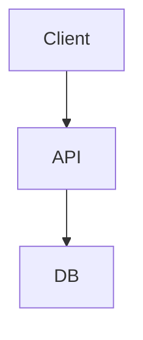

# Architecture: [Title]

**ID:** ARCH-001
**Type:** architecture
**Feature:** FEAT-001
**Version:** 1
**Status:** draft
**Date:** YYYY-MM-DD

---

## Context

[What is the current state of the system, and what situation forces this design decision?]

## Proposed Solution

[Describe the chosen approach. This is the primary field — be specific about what will be built and how.]

## Diagram

## Components

| ID | Name | Responsibility | Changes |
|----|------|---------------|---------|
| COMP-001 | [Component name] | [What it is responsible for] | [New / Modified / Unchanged] |
| COMP-002 | | | |

## Data Changes

| Type | Name | Description |
|------|------|-------------|
| migration | | |

## API Contracts

| Method | Path | Purpose | Auth |
|--------|------|---------|------|
| POST | /api/ | | JWT |

## Security

- **Authentication:** [How requests are authenticated]
- **Authorization:** [What access controls apply]
- **Threats:** [Identified threats]
- **Mitigations:** [How threats are mitigated]

## Observability

- **Logs:** [Key log events]
- **Metrics:** [Key metrics to track]
- **Alerts:** [Alert conditions]

## Performance

- **Expected Load:** [Requests/s or volume]
- **Latency Requirements:** [e.g. p95 < 200ms]
- **Scalability:** [How it scales]

## Migration

- **Required:** true/false
- **Strategy:** [Describe migration steps]
- **Rollback:** [How to roll back if it fails]

## Risks

| ID | Description | Severity | Mitigation |
|----|-------------|---------|-----------|
| RISK-001 | | medium | |

## Decisions

| ID | Decision | Rationale | Alternatives Considered |
|----|----------|----------|------------------------|
| DEC-001 | | | |

## Assumptions

- [Assumption 1]

## Open Decisions

- [Any unresolved technical decision]
